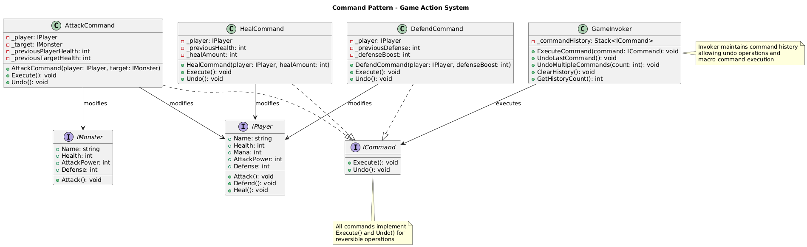
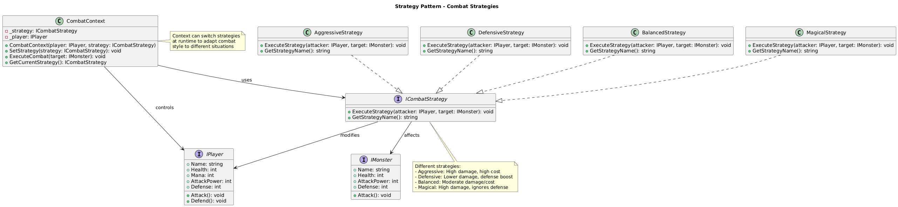
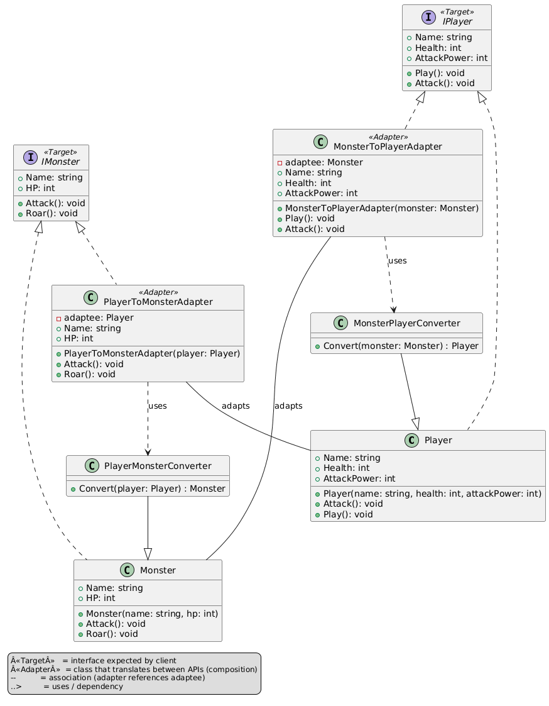

# PlayerMMO Design Patterns Implementation

> A comprehensive C# implementation of 15 essential design patterns demonstrated through a game development context

## 🎯 Overview

This project showcases all major design patterns through a **PlayerMMO** game framework, providing both theoretical understanding and practical implementation. Each pattern is demonstrated with working code, UML diagrams, and real game scenarios.

---

## 🏗️ Creational Patterns
*Patterns that deal with object creation mechanisms*

### Abstract Factory Pattern

**Creates families of related game objects** - Build complete cave or dungeon environments with their associated monsters, items, and terrain.
- [📖 Detailed Implementation](./Summaries/AbstractFactory.md) | [💻 Code](./AbstractFactory/) | [🎨 Generic UML](./AbstractFactory/generic_abstract_factory.png)

### Builder Pattern  

**Constructs complex player objects step-by-step** - Create customized player characters with fluent interface and optional configurations.
- [📖 Detailed Implementation](./Summaries/Builder.md) | [💻 Code](./Builder/) | [🎨 Generic UML](./Builder/generic_builder.png)

### Factory Method Pattern

**Creates player classes through subclass decisions** - Generate different player types (Warrior, Mage, Rogue, Paladin) through specialized factories.
- [📖 Detailed Implementation](./Summaries/FactoryMethod.md) | [💻 Code](./Factory/) | [🎨 Generic UML](./Factory/generic_factory_method.png)

### Singleton Pattern

**Ensures single instance of game state** - Maintain global game configuration and state management throughout the application.
- [📖 Detailed Implementation](./Summaries/Singleton.md) | [💻 Code](./Singleton/) | [🎨 Generic UML](./Singleton/generic_singleton.png)

---

## 🎭 Behavioral Patterns
*Patterns that focus on communication between objects and assignment of responsibilities*

### Command Pattern

**Encapsulates game actions as objects** - Implement undo/redo functionality for player actions like attacks, movements, and item usage.
- [📖 Detailed Implementation](./Summaries/Command.md) | [💻 Code](./Command/) | [🎨 Generic UML](./Command/generic_command.png)

### Iterator Pattern

**Provides sequential access to player collections** - Traverse party members, inventory items, and enemy groups with different iteration strategies.
- [📖 Detailed Implementation](./Summaries/Iterator.md) | [💻 Code](./Iterator/) | [🎨 Generic UML](./Iterator/generic_iterator.png)

### Observer Pattern

**Implements event notification system** - Notify multiple game systems when player events occur (leveling up, dying, collecting items).
- [📖 Detailed Implementation](./Summaries/Observer.md) | [💻 Code](./Observer/) | [🎨 Generic UML](./Observer/generic_observer.png)

### State Pattern

**Changes player behavior based on internal state** - Alter player capabilities based on health, mana, and status conditions.
- [📖 Detailed Implementation](./Summaries/State.md) | [💻 Code](./State/) | [🎨 Generic UML](./State/generic_state.png)

### Strategy Pattern

**Encapsulates interchangeable combat algorithms** - Switch between different attack strategies and combat behaviors dynamically.
- [📖 Detailed Implementation](./Summaries/Strategy.md) | [💻 Code](./Strategy/) | [🎨 Generic UML](./Strategy/generic_strategy.png)

### Template Method Pattern

**Defines game level progression framework** - Create standardized level structures while allowing customization of specific level behaviors.
- [📖 Detailed Implementation](./Summaries/TemplateMethod.md) | [💻 Code](./Template/) | [🎨 Generic UML](./Template/generic_template_method.png)

---

## 🏛️ Structural Patterns
*Patterns that deal with object composition and relationships*

### Adapter Pattern

**Makes incompatible weapon interfaces work together** - Integrate legacy weapon systems with modern game engines seamlessly.
- [📖 Detailed Implementation](./Summaries/Adapter.md) | [💻 Code](./Adapter/) | [🎨 Generic UML](./Adapter/generic_adapter.png)

### Composite Pattern

**Treats individual and composite game objects uniformly** - Build hierarchical structures like inventories, party formations, and game world trees.
- [📖 Detailed Implementation](./Summaries/Composite.md) | [💻 Code](./Composite/) | [🎨 Generic UML](./Composite/generic_composite.png)

### Decorator Pattern

**Adds behavior dynamically to weapons and items** - Stack multiple enhancements on weapons (fire, ice, critical hit) without modifying original objects.
- [📖 Detailed Implementation](./Summaries/Decorator.md) | [💻 Code](./Decorator/) | [🎨 Generic UML](./Decorator/generic_decorator.png)

### Facade Pattern

**Provides simplified interface to complex game subsystems** - Coordinate multiple game engines (audio, graphics, input) through single interface.
- [📖 Detailed Implementation](./Summaries/Facade.md) | [💻 Code](./Facade/) | [🎨 Generic UML](./Facade/generic_facade.png)

### Proxy Pattern

**Controls access to game resources** - Implement lazy loading, caching, and permission systems for expensive game assets.
- [📖 Detailed Implementation](./Summaries/Proxy.md) | [💻 Code](./Proxy/) | [🎨 Generic UML](./Proxy/generic_proxy.png)

---

## 🎮 Core Game Framework

All patterns integrate with a common game foundation:

```csharp
// Core interfaces used throughout all patterns
public interface IPlayer {
    string Name { get; set; }
    int Health { get; set; }
    int Level { get; set; }
    // Additional game-specific properties
}

public interface IMonster {
    string Name { get; set; }
    int Health { get; set; }
    int Level { get; set; }
    // Monster-specific behaviors
}

public class BasePlayer : IPlayer {
    // Default player implementation
    // Used as foundation across all patterns
}
```

## 🛠️ Getting Started

### Prerequisites
- .NET 9.0 SDK
- PlantUML (for diagram generation)
- Python 3.x (for batch UML generation)

### Quick Start
```bash
# Clone and build the entire solution
git clone [repository]
cd PlayerMMO
dotnet build

# Run any pattern demo
cd [PatternName]
dotnet run

# Generate all UML diagrams
python ../generate_all_puml_images.py
```

### Project Structure
```
PlayerMMO/
├── AbstractFactory/       # Abstract Factory implementation
├── Adapter/              # Adapter pattern with legacy weapons
├── Builder/              # Builder pattern for player creation
├── Command/              # Command pattern with undo/redo
├── Composite/            # Composite pattern for hierarchies
├── Decorator/            # Decorator pattern for item enhancement
├── Facade/               # Facade pattern for subsystem coordination
├── Factory/              # Factory Method for player types
├── GameBase/             # Core game interfaces and classes
├── Iterator/             # Iterator pattern for collections
├── Observer/             # Observer pattern for events
├── Proxy/                # Proxy pattern for resource control
├── Singleton/            # Singleton pattern for game state
├── State/                # State pattern for player behavior
├── Strategy/             # Strategy pattern for combat algorithms
├── Template/             # Template Method for level progression
└── Summaries/            # 📚 Comprehensive documentation
    ├── README.md         # Complete pattern index
    ├── AbstractFactory.md
    ├── Builder.md
    ├── [... all patterns].md
    └── [Navigation links]
```

## 📊 Learning Path

1. **📚 [Start with Complete Pattern Overview](./Summaries/README.md)** - Comprehensive guide with all patterns
2. **🎯 Choose by Category** - Pick Creational, Behavioral, or Structural patterns above
3. **💡 Study Generic Implementation** - Each pattern includes generic UML and code structure
4. **🎮 Explore Game Context** - See how patterns solve real game development problems
5. **💻 Run the Code** - Execute working demos and experiment with implementations

## 🔗 Pattern Relationships

Many patterns work together in this implementation:
- **Factory + Singleton**: Factories often implemented as singletons
- **Command + Strategy**: Commands can use different execution strategies  
- **Composite + Iterator**: Traverse complex hierarchical structures
- **Observer + State**: Notify systems when object states change
- **Decorator + Strategy**: Enhanced objects using different algorithms

---

## 📈 Implementation Quality

✅ **15 Complete Pattern Implementations**  
✅ **30+ UML Diagrams** (Generic + Implementation-specific)  
✅ **Comprehensive Documentation** with theory and practice  
✅ **Working Demos** for every pattern  
✅ **Real Game Scenarios** demonstrating practical usage  
✅ **Integration Examples** showing how patterns work together  

---

*This project demonstrates that design patterns are not just academic concepts, but powerful tools for building maintainable, flexible, and robust software systems. Through the game development context, complex patterns become intuitive and practical.*
