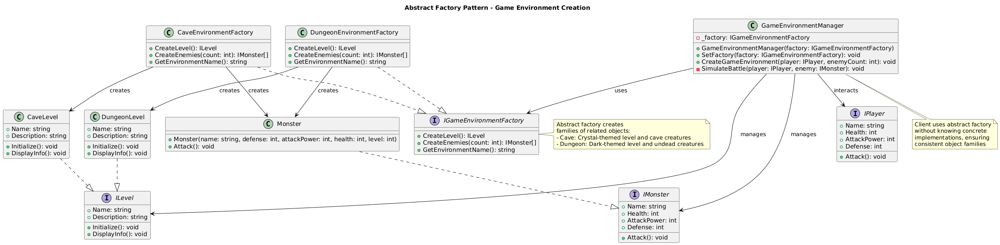

# Abstract Factory Pattern Summary

## 📖 Overview
The Abstract Factory pattern provides an interface for creating families of related or dependent objects without specifying their concrete classes. It ensures that the created objects are compatible with each other.

## 🎯 Purpose
- Create families of related objects
- Ensure object compatibility within families
- Hide concrete implementation details from clients
- Support multiple product families

## 📋 Generic Implementation Guidelines

### Standard Structure
1. **Abstract Factory Interface**
   ```csharp
   interface IAbstractFactory {
       IProductA CreateProductA();
       IProductB CreateProductB();
   }
   ```

2. **Concrete Factories**
   ```csharp
   class ConcreteFactory1 : IAbstractFactory {
       public IProductA CreateProductA() => new ProductA1();
       public IProductB CreateProductB() => new ProductB1();
   }
   ```

3. **Product Families**
   ```csharp
   interface IProductA { }
   interface IProductB { }
   class ProductA1 : IProductA { }
   class ProductB1 : IProductB { }
   ```

4. **Client Usage**
   ```csharp
   class Client {
       private IAbstractFactory factory;
       public Client(IAbstractFactory factory) {
           this.factory = factory;
       }
       public void CreateProducts() {
           var productA = factory.CreateProductA();
           var productB = factory.CreateProductB();
           // Use products together
       }
   }
   ```

### When to Use
- Need to create families of related objects
- Want to ensure compatibility between products
- System should be independent of product creation
- Need to support multiple product lines

## 🏗️ Implementation in PlayerMMO

### Key Components
- **IGameEnvironmentFactory**: Abstract factory interface
- **CaveEnvironmentFactory**: Creates cave-themed environments
- **DungeonEnvironmentFactory**: Creates dungeon-themed environments
- **GameEnvironmentManager**: Client that uses factories

### Code Structure
```
PlayerMMO/AbstractFactory/
├── Pattern/
│   ├── IGameEnvironmentFactory.cs
│   ├── CaveEnvironmentFactory.cs
│   ├── DungeonEnvironmentFactory.cs
│   ├── ILevel.cs
│   ├── CaveLevel.cs
│   ├── DungeonLevel.cs
│   └── GameEnvironmentManager.cs
├── Program.cs
└── abstract_factory.puml
```

## 🎮 Game Integration
- **BaseGame Classes Used**: IPlayer, IMonster, Monster
- **Game Context**: Creating consistent game environments with matching level types and enemy types
- **Demo Features**: Environment switching, enemy spawning, battle simulation

### Actual Implementation Mapping
| Generic Component | PlayerMMO Implementation | Purpose |
|------------------|-------------------------|---------|
| IAbstractFactory | IGameEnvironmentFactory | Creates game environment families |
| ConcreteFactory1 | CaveEnvironmentFactory | Creates cave-themed objects |
| ConcreteFactory2 | DungeonEnvironmentFactory | Creates dungeon-themed objects |
| IProductA | ILevel | Level interface |
| IProductB | IMonster[] | Enemy array interface |
| ProductA1 | CaveLevel | Cave-specific level |
| ProductB1 | Cave Monsters | Cave-themed enemies |
| Client | GameEnvironmentManager | Uses factories to create environments |

### Real Usage Example
```csharp
// Client code (GameEnvironmentManager)
var caveFactory = new CaveEnvironmentFactory();
var level = caveFactory.CreateLevel();          // Creates CaveLevel
var enemies = caveFactory.CreateEnemies(3);     // Creates cave-themed monsters

var dungeonFactory = new DungeonEnvironmentFactory();
var dungeonLevel = dungeonFactory.CreateLevel(); // Creates DungeonLevel
var dungeonEnemies = dungeonFactory.CreateEnemies(5); // Creates dungeon-themed monsters

// All products from same factory work together
level.Initialize();
foreach(var enemy in enemies) {
    // Battle logic with consistent theme
}
```

## ✨ Key Benefits
- **Consistency**: All objects in a family work together
- **Flexibility**: Easy to add new environment types
- **Isolation**: Client code doesn't depend on concrete classes
- **Scalability**: Simple to extend with new factories

## 🔗 Related Patterns
- **Factory Method**: Abstract Factory uses multiple Factory Methods
- **Singleton**: Factories are often implemented as Singletons
- **Prototype**: Can be combined for object creation

## 📊 UML Diagrams

### Generic Pattern Structure


### PlayerMMO Implementation  


---
[← Back to Main Pattern Summary](../Summaries/README.md)
