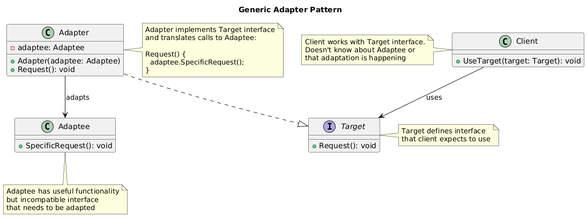
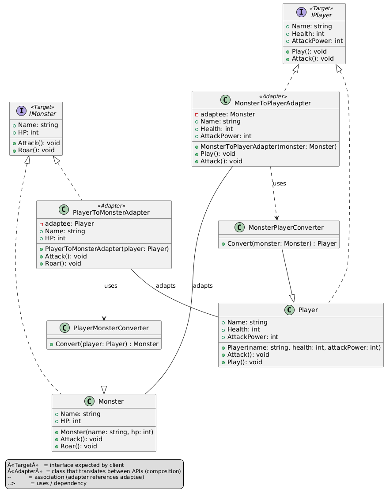

# Adapter Pattern Summary

## 📖 Overview
The Adapter pattern allows incompatible interfaces to work together by converting the interface of a class into another interface that clients expect.

## 🎯 Purpose
- Allow incompatible interfaces to work together
- Convert existing class interface to expected interface
- Reuse existing code with new systems
- Wrap legacy components for modern applications

## 📋 Generic Implementation Guidelines

### Standard Structure
1. **Target Interface**
   ```csharp
   interface ITarget {
       string Request();
   }
   ```

2. **Adaptee (Legacy Class)**
   ```csharp
   class Adaptee {
       public string SpecificRequest() {
           return "Special behavior from legacy system";
       }
   }
   ```

3. **Adapter**
   ```csharp
   class Adapter : ITarget {
       private readonly Adaptee adaptee;
       
       public Adapter(Adaptee adaptee) {
           this.adaptee = adaptee;
       }
       
       public string Request() {
           // Convert adaptee's interface to target interface
           return $"Adapter: {adaptee.SpecificRequest()}";
       }
   }
   ```

4. **Client Usage**
   ```csharp
   // Legacy system
   var adaptee = new Adaptee();
   
   // Adapt legacy system to new interface
   ITarget adapter = new Adapter(adaptee);
   
   // Client uses standard interface
   string result = adapter.Request();
   Console.WriteLine(result); // "Adapter: Special behavior from legacy system"
   ```

### Object vs Class Adapter
- **Object Adapter**: Uses composition (shown above)
- **Class Adapter**: Uses inheritance (not always possible in C#)

### When to Use
- Need to use existing class with incompatible interface
- Want to create reusable class that cooperates with unrelated classes
- Need to use several existing subclasses, but impractical to adapt by subclassing
- Integrating third-party libraries with your application

## 🏗️ Implementation in PlayerMMO

### Key Components
- **INewWeaponSystem**: Modern weapon interface expected by new game engine
- **LegacyWeapon**: Old weapon system with different interface
- **WeaponAdapter**: Converts legacy weapons to new interface
- **AdvancedWeaponAdapter**: Enhanced adapter with additional features
- **Game integration**: Seamless use of old and new weapon systems

### Code Structure
```
PlayerMMO/Adapter/
├── AdapterPattern/
│   ├── INewWeaponSystem.cs
│   ├── LegacyWeapon.cs
│   ├── WeaponAdapter.cs
│   └── AdvancedWeaponAdapter.cs
├── Program.cs
└── Adapter.puml
```

## 🎮 Game Integration
- **BaseGame Classes Used**: IPlayer, IMonster
- **Game Context**: Weapon system compatibility between old and new game versions
- **Demo Features**: Legacy weapon integration, damage calculation, enhanced weapon features

### Actual Implementation Mapping
| Generic Component | PlayerMMO Implementation | Purpose |
|------------------|-------------------------|---------|
| ITarget | INewWeaponSystem | Modern weapon interface |
| Adaptee | LegacyWeapon | Old weapon system |
| Adapter | WeaponAdapter | Basic legacy weapon adapter |
| | AdvancedWeaponAdapter | Enhanced adapter with features |
| Client | Program.cs demo | Game using adapted weapons |
| Request() | Attack(), GetDamage() | Weapon operation methods |

### Real Usage Example
```csharp
// Legacy weapon from old game version
var legacyFireSword = new LegacyWeapon("Fire Sword", 25, "fire");

// New game engine expects INewWeaponSystem interface
// Adapt legacy weapon to new interface
INewWeaponSystem adaptedWeapon = new WeaponAdapter(legacyFireSword);

// Now legacy weapon works with new game engine
var player = new BasePlayer("Hero");
var monster = new BaseMonster("Dragon", 3);

// Use adapted weapon seamlessly
int damage = adaptedWeapon.GetDamage();
string effect = adaptedWeapon.GetSpecialEffect();

Console.WriteLine($"Hero attacks with {adaptedWeapon.GetWeaponName()}");
Console.WriteLine($"Damage: {damage}, Effect: {effect}");

// Enhanced adapter with additional features
var enhancedAdapter = new AdvancedWeaponAdapter(legacyFireSword);
enhancedAdapter.AddEnchantment("Lightning"); // New feature not in legacy

// Attack with enhanced capabilities
monster.Health -= enhancedAdapter.Attack();
if (enhancedAdapter.HasCriticalHit()) {
    Console.WriteLine("💥 CRITICAL HIT! Double damage!");
    monster.Health -= enhancedAdapter.GetDamage(); // Additional damage
}

// Benefits demonstrated:
// - Old weapons work in new game engine
// - No need to rewrite legacy weapon data
// - Enhanced features can be added through adapter
// - Consistent interface for all weapons (old and new)

// Multiple legacy weapon types
var legacyIceBow = new LegacyWeapon("Ice Bow", 20, "ice");
var legacyThunderHammer = new LegacyWeapon("Thunder Hammer", 35, "lightning");

// All adapted to same interface
var weapons = new List<INewWeaponSystem> {
    new WeaponAdapter(legacyFireSword),
    new WeaponAdapter(legacyIceBow),
    new AdvancedWeaponAdapter(legacyThunderHammer)
};

// Uniform handling of all weapons
foreach (var weapon in weapons) {
    Console.WriteLine($"Weapon: {weapon.GetWeaponName()}, " +
                     $"Damage: {weapon.GetDamage()}, " +
                     $"Effect: {weapon.GetSpecialEffect()}");
}
```

## ✨ Key Benefits
- **Legacy Integration**: Use old components with new systems
- **Interface Standardization**: Uniform interface for different implementations
- **Code Reuse**: Avoid rewriting existing functionality
- **Backwards Compatibility**: Support old data formats and systems

## 🔧 Advanced Adapter Features
```csharp
// Two-way adapter (bidirectional)
class BidirectionalWeaponAdapter : INewWeaponSystem, ILegacyWeaponInterface {
    private readonly LegacyWeapon legacyWeapon;
    
    public BidirectionalWeaponAdapter(LegacyWeapon weapon) {
        this.legacyWeapon = weapon;
    }
    
    // Adapt to new interface
    public int GetDamage() => legacyWeapon.GetPower();
    public string GetWeaponName() => legacyWeapon.GetName();
    
    // Adapt to legacy interface
    public int GetPower() => GetDamage();
    public string GetName() => GetWeaponName();
}

// Class adapter using inheritance (when possible)
class InheritanceWeaponAdapter : LegacyWeapon, INewWeaponSystem {
    public InheritanceWeaponAdapter(string name, int power, string element) 
        : base(name, power, element) { }
    
    public int GetDamage() => GetPower(); // Inherit from LegacyWeapon
    public string GetWeaponName() => GetName(); // Inherit from LegacyWeapon
    
    public string GetSpecialEffect() {
        return $"Inherited {GetElement()} effect";
    }
    
    public int Attack() {
        // Enhanced attack logic while using inherited functionality
        return GetPower() + (GetElement() == "fire" ? 5 : 0);
    }
}

// Adapter with caching and optimization
class CachedWeaponAdapter : INewWeaponSystem {
    private readonly LegacyWeapon legacyWeapon;
    private int? cachedDamage;
    private string cachedEffect;
    
    public int GetDamage() {
        // Cache expensive calculations
        return cachedDamage ??= CalculateEnhancedDamage();
    }
    
    private int CalculateEnhancedDamage() {
        // Complex damage calculation based on legacy weapon
        return legacyWeapon.GetPower() * GetElementMultiplier();
    }
}
```

## 🔗 Related Patterns
- **Bridge**: Both separate interface from implementation
- **Decorator**: Both wrap existing objects, but different purposes
- **Facade**: Provides simplified interface, Adapter provides compatible interface
- **Proxy**: Both act as intermediaries but for different reasons

## 📊 UML Diagrams

### Generic Pattern Structure


### PlayerMMO Implementation


---
[← Back to Main Pattern Summary](../Summaries/README.md)
