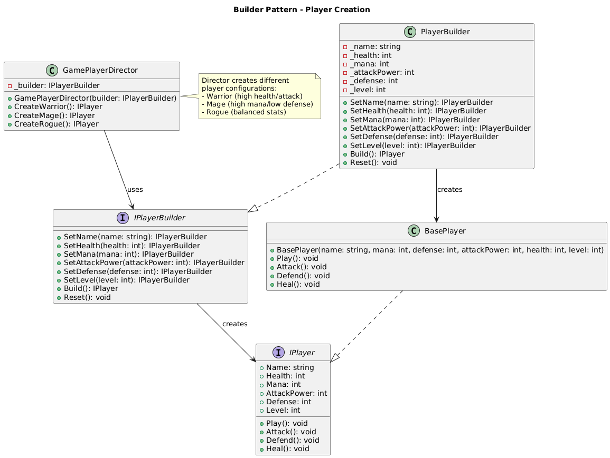

# Builder Pattern Summary

## 📖 Overview
The Builder pattern separates the construction of complex objects from their representation, allowing the same construction process to create different representations through a fluent interface.

## 🎯 Purpose
- Construct complex objects step by step
- Create different representations of the same object
- Provide a fluent interface for object creation
- Hide complex construction logic

## 📋 Generic Implementation Guidelines

### Standard Structure
1. **Builder Interface**
   ```csharp
   interface IBuilder {
       IBuilder SetPropertyA(string value);
       IBuilder SetPropertyB(int value);
       IProduct Build();
       void Reset();
   }
   ```

2. **Concrete Builder**
   ```csharp
   class ConcreteBuilder : IBuilder {
       private Product product = new Product();
       
       public IBuilder SetPropertyA(string value) {
           product.PropertyA = value;
           return this;
       }
       
       public IProduct Build() {
           var result = product;
           Reset();
           return result;
       }
   }
   ```

3. **Director (Optional)**
   ```csharp
   class Director {
       private IBuilder builder;
       
       public IProduct CreateStandardProduct() {
           return builder.SetPropertyA("default")
                         .SetPropertyB(100)
                         .Build();
       }
   }
   ```

4. **Client Usage**
   ```csharp
   var builder = new ConcreteBuilder();
   var product = builder.SetPropertyA("custom")
                        .SetPropertyB(200)
                        .Build();
   ```

### When to Use
- Object construction is complex with many parameters
- Need different representations of the same object
- Want to isolate construction code from representation
- Construction process must allow different representations

## 🏗️ Implementation in PlayerMMO

### Key Components
- **IPlayerBuilder**: Builder interface with fluent methods
- **PlayerBuilder**: Concrete builder implementation
- **GamePlayerDirector**: Director with preset configurations
- **BasePlayer**: Product being built

### Code Structure
```
PlayerMMO/Builder/
├── Pattern/
│   ├── IPlayerBuilder.cs
│   ├── PlayerBuilder.cs
│   └── GamePlayerDirector.cs
├── Program.cs
└── builder.puml
```

## 🎮 Game Integration
- **BaseGame Classes Used**: IPlayer, BasePlayer
- **Game Context**: Creating players with different stat configurations
- **Demo Features**: Director presets (Warrior, Mage, Rogue), custom builder usage

### Actual Implementation Mapping
| Generic Component | PlayerMMO Implementation | Purpose |
|------------------|-------------------------|---------|
| IBuilder | IPlayerBuilder | Player building interface |
| ConcreteBuilder | PlayerBuilder | Concrete player builder |
| Director | GamePlayerDirector | Provides preset configurations |
| Product | BasePlayer (IPlayer) | The player being built |
| SetPropertyA() | SetName(), SetHealth(), etc. | Fluent configuration methods |
| Build() | Build() | Creates final player object |

### Real Usage Example
```csharp
// Using Director for presets
var director = new GamePlayerDirector(new PlayerBuilder());
var warrior = director.CreateWarrior();  // Preset: High health/attack, low mana
var mage = director.CreateMage();        // Preset: High mana/attack, low health
var rogue = director.CreateRogue();      // Preset: Balanced stats

// Using Builder directly for custom builds
var customPlayer = new PlayerBuilder()
    .SetName("Custom Hero")
    .SetHealth(200)        // High survivability
    .SetMana(100)          // Moderate magical ability
    .SetAttackPower(25)    // High damage
    .SetDefense(20)        // Good protection
    .SetLevel(10)          // Experienced
    .Build();

// Builder automatically validates and creates BasePlayer instance
```

## ✨ Key Benefits
- **Fluent Interface**: Chainable method calls for readability
- **Flexibility**: Easy to add new player configurations
- **Reusability**: Same builder can create different player types
- **Validation**: Centralized validation in the Build() method

## 🔧 Fluent API Example
```csharp
var player = builder
    .SetName("Custom Hero")
    .SetHealth(200)
    .SetMana(100)
    .SetAttackPower(25)
    .SetDefense(20)
    .SetLevel(10)
    .Build();
```

## 🔗 Related Patterns
- **Factory Method**: Builder can use factories for component creation
- **Composite**: Often used to build composite structures
- **Abstract Factory**: Both deal with object creation but different approaches

## 📊 UML Diagrams

### Generic Pattern Structure


### PlayerMMO Implementation


---
[← Back to Main Pattern Summary](../Summaries/README.md)
