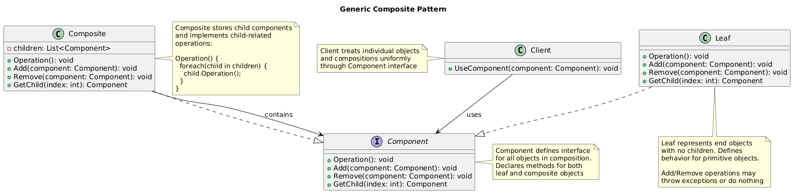
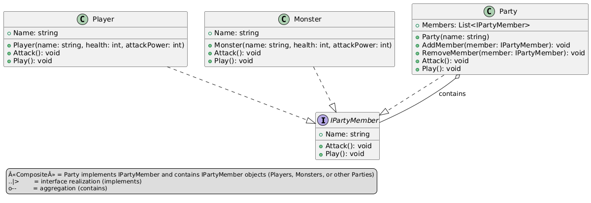

# Composite Pattern Summary

## 📖 Overview
The Composite pattern composes objects into tree structures to represent part-whole hierarchies, allowing clients to treat individual objects and compositions uniformly.

## 🎯 Purpose
- Represent part-whole hierarchies of objects
- Treat individual objects and compositions uniformly
- Build complex structures from simple components
- Simplify client code by using uniform interface

## 📋 Generic Implementation Guidelines

### Standard Structure
1. **Component Interface**
   ```csharp
   abstract class Component {
       protected string name;
       
       public Component(string name) {
           this.name = name;
       }
       
       public abstract void Operation();
       
       // Optional: methods for managing children
       public virtual void Add(Component component) {
           throw new NotSupportedException();
       }
       
       public virtual void Remove(Component component) {
           throw new NotSupportedException();
       }
       
       public virtual Component GetChild(int index) {
           throw new NotSupportedException();
       }
   }
   ```

2. **Leaf (Simple Component)**
   ```csharp
   class Leaf : Component {
       public Leaf(string name) : base(name) { }
       
       public override void Operation() {
           Console.WriteLine($"Leaf {name} operation");
       }
   }
   ```

3. **Composite (Container Component)**
   ```csharp
   class Composite : Component {
       private List<Component> children = new List<Component>();
       
       public Composite(string name) : base(name) { }
       
       public override void Operation() {
           Console.WriteLine($"Composite {name} operation");
           
           // Delegate to all children
           foreach (var child in children) {
               child.Operation();
           }
       }
       
       public override void Add(Component component) {
           children.Add(component);
       }
       
       public override void Remove(Component component) {
           children.Remove(component);
       }
       
       public override Component GetChild(int index) {
           return children[index];
       }
   }
   ```

4. **Client Usage**
   ```csharp
   // Create leaf components
   var leaf1 = new Leaf("Leaf 1");
   var leaf2 = new Leaf("Leaf 2");
   var leaf3 = new Leaf("Leaf 3");
   
   // Create composite components
   var composite1 = new Composite("Composite 1");
   var composite2 = new Composite("Composite 2");
   
   // Build hierarchy
   composite1.Add(leaf1);
   composite1.Add(leaf2);
   composite2.Add(leaf3);
   composite2.Add(composite1); // Nested composite
   
   // Treat uniformly
   composite2.Operation(); // Operates on entire tree
   ```

### When to Use
- Want to represent part-whole hierarchies
- Want clients to ignore differences between compositions and individual objects
- Want to build complex structures from simpler ones
- Need recursive composition with arbitrary depth

## 🏗️ Implementation in PlayerMMO

### Key Components
- **GameComponent**: Abstract base for all game elements
- **SimpleGameItem**: Leaf components (individual items, units)
- **GameContainer**: Composite components (groups, inventories, armies)
- **Hierarchical structure**: Items in containers, units in squads, squads in armies

### Code Structure
```
PlayerMMO/Composite/
├── CompositePattern/
│   ├── GameComponent.cs
│   ├── SimpleGameItem.cs
│   ├── GameContainer.cs
│   └── CompositeOperations.cs
├── Program.cs
└── composite.puml
```

## 🎮 Game Integration
- **BaseGame Classes Used**: IPlayer, IMonster
- **Game Context**: Hierarchical game structures like inventories, party systems, world maps
- **Demo Features**: Nested containers, inventory management, group operations

### Actual Implementation Mapping
| Generic Component | PlayerMMO Implementation | Purpose |
|------------------|-------------------------|---------|
| Component | GameComponent | Base for all game elements |
| Leaf | SimpleGameItem | Individual items/units |
| Composite | GameContainer | Groups and collections |
| Operation() | Display(), CalculateValue() | Game element operations |
| Add/Remove | AddItem(), RemoveItem() | Container management |
| Client | Program.cs demo | Game using composite structures |

### Real Usage Example
```csharp
// Create individual game items (leaves)
var sword = new SimpleGameItem("Magic Sword", 100);
var shield = new SimpleGameItem("Dragon Shield", 75);
var potion = new SimpleGameItem("Health Potion", 25);
var gem = new SimpleGameItem("Ruby Gem", 200);

// Create containers (composites)
var weapons = new GameContainer("Weapons");
var armor = new GameContainer("Armor");
var consumables = new GameContainer("Consumables");
var inventory = new GameContainer("Player Inventory");

// Build hierarchical structure
weapons.AddItem(sword);
armor.AddItem(shield);
consumables.AddItem(potion);

// Create nested structure
inventory.AddItem(weapons);    // Container in container
inventory.AddItem(armor);      // Container in container
inventory.AddItem(consumables); // Container in container
inventory.AddItem(gem);        // Direct item in main inventory

// Uniform operations on entire hierarchy
Console.WriteLine("=== Inventory Display ===");
inventory.Display(); // Shows entire tree structure recursively

Console.WriteLine($"\nTotal Inventory Value: {inventory.CalculateValue()} gold");

// Individual operations work the same way
Console.WriteLine("\n=== Weapons Only ===");
weapons.Display();
Console.WriteLine($"Weapons Value: {weapons.CalculateValue()} gold");

// Easy manipulation of complex structures
var treasureChest = new GameContainer("Treasure Chest");
treasureChest.AddItem(new SimpleGameItem("Gold Coins", 50));
treasureChest.AddItem(new SimpleGameItem("Diamond Ring", 300));

// Add entire chest to inventory
inventory.AddItem(treasureChest);

// Party system example
var playerParty = new GameContainer("Adventure Party");
var frontLine = new GameContainer("Front Line");
var backLine = new GameContainer("Back Line");

// Add individual party members
frontLine.AddItem(new SimpleGameItem("Warrior (Tank)", 150));
frontLine.AddItem(new SimpleGameItem("Paladin (Tank)", 160));
backLine.AddItem(new SimpleGameItem("Mage (DPS)", 120));
backLine.AddItem(new SimpleGameItem("Healer (Support)", 110));

playerParty.AddItem(frontLine);
playerParty.AddItem(backLine);

// Operations on entire party
Console.WriteLine("\n=== Party Operations ===");
playerParty.Display();
Console.WriteLine($"Total Party Strength: {playerParty.CalculateValue()}");

// Benefits demonstrated:
// - Uniform interface for items and containers
// - Recursive operations on complex structures
// - Easy to add/remove items at any level
// - Flexible hierarchy that can be restructured
// - Same code works for simple items and complex nested structures
```

## ✨ Key Benefits
- **Uniform Interface**: Same operations for individual objects and compositions
- **Recursive Structure**: Natural tree-like hierarchies
- **Flexibility**: Easy to add new component types
- **Simplified Client Code**: No need to distinguish between leaves and composites

## 🔧 Advanced Composite Features
```csharp
// Safe composite with type checking
public class SafeGameContainer : GameComponent {
    private List<GameComponent> children = new List<GameComponent>();
    private readonly Type allowedType;
    
    public SafeGameContainer(string name, Type allowedType = null) : base(name) {
        this.allowedType = allowedType;
    }
    
    public override void AddItem(GameComponent component) {
        if (allowedType != null && !allowedType.IsAssignableFrom(component.GetType())) {
            throw new InvalidOperationException($"Only {allowedType.Name} allowed in this container");
        }
        children.Add(component);
    }
}

// Composite with visitor pattern support
public abstract class GameComponent {
    public abstract void Accept(IGameVisitor visitor);
}

public interface IGameVisitor {
    void Visit(SimpleGameItem item);
    void Visit(GameContainer container);
}

// Iterator support for composite
public class GameContainer : GameComponent, IEnumerable<GameComponent> {
    public IEnumerator<GameComponent> GetEnumerator() {
        return children.GetEnumerator();
    }
    
    // Deep iteration through entire tree
    public IEnumerable<GameComponent> GetAllItems() {
        foreach (var child in children) {
            yield return child;
            
            if (child is GameContainer container) {
                foreach (var subItem in container.GetAllItems()) {
                    yield return subItem;
                }
            }
        }
    }
}

// Usage with LINQ
var allWeapons = inventory.GetAllItems()
    .OfType<SimpleGameItem>()
    .Where(item => item.Name.Contains("Sword"))
    .ToList();

// Composite with search capabilities
public class SearchableContainer : GameContainer {
    public GameComponent FindByName(string name) {
        if (this.Name == name) return this;
        
        foreach (var child in children) {
            if (child.Name == name) return child;
            
            if (child is SearchableContainer container) {
                var found = container.FindByName(name);
                if (found != null) return found;
            }
        }
        return null;
    }
    
    public List<GameComponent> FindAll(Predicate<GameComponent> criteria) {
        var results = new List<GameComponent>();
        
        if (criteria(this)) results.Add(this);
        
        foreach (var child in children) {
            if (criteria(child)) results.Add(child);
            
            if (child is SearchableContainer container) {
                results.AddRange(container.FindAll(criteria));
            }
        }
        return results;
    }
}
```

## 🔗 Related Patterns
- **Decorator**: Both use recursive composition but for different purposes
- **Visitor**: Often used together for operations on composite structures
- **Iterator**: Used to traverse composite structures
- **Chain of Responsibility**: Can be implemented using composite structure

## 📊 UML Diagrams

### Generic Pattern Structure


### PlayerMMO Implementation


---
[← Back to Main Pattern Summary](../Summaries/README.md)
