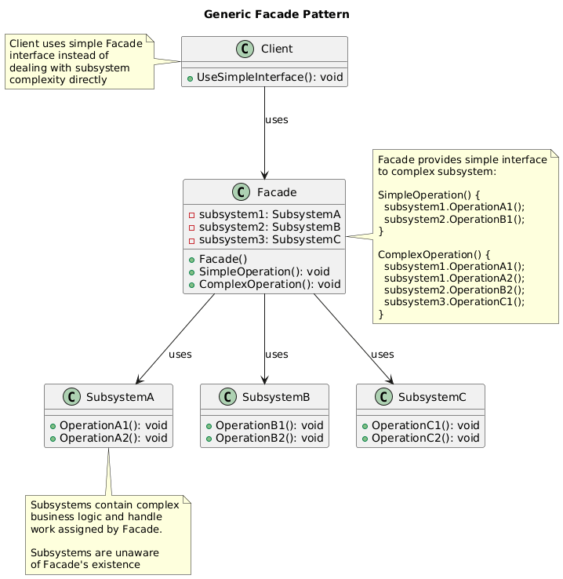

# Facade Pattern Summary

## 📖 Overview
The Facade pattern provides a simplified interface to a complex subsystem, making it easier to use and reducing dependencies on the subsystem's internal structure.

## 🎯 Purpose
- Provide simple interface to complex subsystem
- Reduce coupling between clients and subsystem
- Hide complexity of subsystem from clients
- Define entry point to each subsystem level

## 📋 Generic Implementation Guidelines

### Standard Structure
1. **Complex Subsystem Classes**
   ```csharp
   class SubsystemA {
       public string OperationA1() {
           return "SubsystemA: OperationA1";
       }
       
       public string OperationA2() {
           return "SubsystemA: OperationA2";
       }
   }
   
   class SubsystemB {
       public string OperationB1() {
           return "SubsystemB: OperationB1";
       }
       
       public string OperationB2() {
           return "SubsystemB: OperationB2";
       }
   }
   
   class SubsystemC {
       public string OperationC1() {
           return "SubsystemC: OperationC1";
       }
   }
   ```

2. **Facade Class**
   ```csharp
   class Facade {
       private readonly SubsystemA subsystemA;
       private readonly SubsystemB subsystemB;
       private readonly SubsystemC subsystemC;
       
       public Facade(SubsystemA subsystemA, SubsystemB subsystemB, SubsystemC subsystemC) {
           this.subsystemA = subsystemA;
           this.subsystemB = subsystemB;
           this.subsystemC = subsystemC;
       }
       
       // Simplified operation that coordinates multiple subsystems
       public string Operation() {
           var results = new List<string>();
           
           results.Add("Facade initializes subsystems:");
           results.Add(subsystemA.OperationA1());
           results.Add(subsystemB.OperationB1());
           results.Add(subsystemC.OperationC1());
           results.Add("Facade orders subsystems to perform the action:");
           results.Add(subsystemA.OperationA2());
           results.Add(subsystemB.OperationB2());
           
           return string.Join("\n", results);
       }
   }
   ```

3. **Client Usage**
   ```csharp
   // Without facade - complex client code
   var subsystemA = new SubsystemA();
   var subsystemB = new SubsystemB();
   var subsystemC = new SubsystemC();
   
   // Client must know about all subsystems and their coordination
   subsystemA.OperationA1();
   subsystemB.OperationB1();
   subsystemC.OperationC1();
   subsystemA.OperationA2();
   subsystemB.OperationB2();
   
   // With facade - simplified client code
   var facade = new Facade(subsystemA, subsystemB, subsystemC);
   string result = facade.Operation(); // One simple call
   ```

### When to Use
- Complex subsystem with many interdependent classes
- Want to provide simple interface to complex functionality
- Need to decouple clients from subsystem implementation
- Want to layer your subsystems with entry points

## 🏗️ Implementation in PlayerMMO

### Key Components
- **GameEngine**: Complex game subsystem with multiple components
- **AudioSystem**: Sound and music management
- **GraphicsRenderer**: Visual rendering system
- **InputHandler**: User input processing
- **GameFacade**: Simple interface coordinating all subsystems
- **Simplified API**: Easy-to-use methods for common game operations

### Code Structure
```
PlayerMMO/Facade/
├── FacadePattern/
│   ├── GameEngine.cs
│   ├── AudioSystem.cs
│   ├── GraphicsRenderer.cs
│   ├── InputHandler.cs
│   └── GameFacade.cs
├── Program.cs
└── facade.puml
```

## 🎮 Game Integration
- **BaseGame Classes Used**: IPlayer, IMonster
- **Game Context**: Game engine coordination and simplified game management
- **Demo Features**: Start game, combat system, save/load operations

### Actual Implementation Mapping
| Generic Component | PlayerMMO Implementation | Purpose |
|------------------|-------------------------|---------|
| SubsystemA | GameEngine | Core game logic and state |
| SubsystemB | AudioSystem | Sound effects and music |
| SubsystemC | GraphicsRenderer | Visual rendering |
| Additional | InputHandler | User input processing |
| Facade | GameFacade | Simplified game interface |
| Operation() | StartGame(), ProcessCombat() | High-level game operations |
| Client | Program.cs demo | Game client using facade |

### Real Usage Example
```csharp
// Complex subsystems working together
var gameEngine = new GameEngine();
var audioSystem = new AudioSystem();
var graphicsRenderer = new GraphicsRenderer();
var inputHandler = new InputHandler();

// Create facade to coordinate everything
var gameFacade = new GameFacade(gameEngine, audioSystem, graphicsRenderer, inputHandler);

// Simple game operations through facade
Console.WriteLine("=== Starting New Game ===");
gameFacade.StartNewGame("Hero"); // Coordinates all subsystems

// Behind the scenes, this coordinates:
// - GameEngine: Initialize game state, create player
// - AudioSystem: Load background music, enable sound effects
// - GraphicsRenderer: Set up display, load textures
// - InputHandler: Configure controls, enable input

Console.WriteLine("\n=== Combat System ===");
var player = gameEngine.GetPlayer();
var monster = new BaseMonster("Goblin", 2);

// Simple combat through facade
gameFacade.ProcessCombat(player, monster);

// Behind the scenes coordinates:
// - GameEngine: Calculate damage, update health, check game rules
// - AudioSystem: Play attack sounds, death sounds, victory music
// - GraphicsRenderer: Show damage numbers, health bars, animations
// - InputHandler: Process attack commands, special abilities

Console.WriteLine("\n=== Save Game ===");
gameFacade.SaveGame("savefile1.dat");

// Coordinates:
// - GameEngine: Serialize game state
// - AudioSystem: Save audio settings
// - GraphicsRenderer: Save graphics preferences
// - InputHandler: Save control bindings

Console.WriteLine("\n=== Load Game ===");
gameFacade.LoadGame("savefile1.dat");

// Benefits demonstrated:
// - Client doesn't need to know about subsystem complexity
// - One method call coordinates multiple systems
// - Error handling centralized in facade
// - Easy to use API for complex operations
// - Subsystems can change without affecting client

// Advanced game operations
Console.WriteLine("\n=== Advanced Operations ===");

// Configure game settings (coordinates all subsystems)
gameFacade.ConfigureSettings(
    soundVolume: 0.8f,
    graphicsQuality: "High",
    difficultyLevel: "Normal"
);

// Process game loop frame (coordinates everything)
gameFacade.ProcessGameFrame(); // One call handles:
// - Input processing
// - Game logic update
// - Audio updates
// - Rendering frame

// Shutdown game cleanly
gameFacade.ShutdownGame(); // Properly shuts down all subsystems

// Without facade, client would need:
// inputHandler.ProcessInput();
// gameEngine.UpdateGameLogic();
// audioSystem.UpdateAudio();
// graphicsRenderer.RenderFrame();
// audioSystem.CleanupResources();
// graphicsRenderer.CleanupResources();
// gameEngine.SaveState();
// inputHandler.Cleanup();
```

## ✨ Key Benefits
- **Simplified Interface**: Hide complex subsystem interactions
- **Reduced Coupling**: Clients depend only on facade, not subsystems
- **Easier Testing**: Mock facade instead of multiple subsystems
- **Centralized Control**: Single point for coordinating subsystems

## 🔧 Advanced Facade Features
```csharp
// Facade with configuration and error handling
public class AdvancedGameFacade {
    private readonly GameEngine gameEngine;
    private readonly AudioSystem audioSystem;
    private readonly GraphicsRenderer graphicsRenderer;
    private readonly InputHandler inputHandler;
    private readonly ILogger logger;
    
    public AdvancedGameFacade(ILogger logger) {
        this.logger = logger;
        
        // Initialize subsystems with error handling
        try {
            gameEngine = new GameEngine();
            audioSystem = new AudioSystem();
            graphicsRenderer = new GraphicsRenderer();
            inputHandler = new InputHandler();
        } catch (Exception ex) {
            logger.LogError($"Failed to initialize game subsystems: {ex.Message}");
            throw;
        }
    }
    
    public async Task<bool> StartNewGameAsync(string playerName) {
        try {
            logger.LogInfo("Starting new game...");
            
            // Coordinate subsystems with error handling
            await gameEngine.InitializeAsync(playerName);
            await audioSystem.LoadBackgroundMusicAsync();
            await graphicsRenderer.InitializeRenderingAsync();
            inputHandler.EnableControls();
            
            logger.LogInfo("Game started successfully");
            return true;
        } catch (Exception ex) {
            logger.LogError($"Failed to start game: {ex.Message}");
            return false;
        }
    }
    
    // Facade with fluent interface
    public GameFacadeBuilder CreateGame() {
        return new GameFacadeBuilder(this);
    }
}

// Builder pattern integrated with facade
public class GameFacadeBuilder {
    private readonly AdvancedGameFacade facade;
    private string playerName;
    private string difficulty;
    private bool soundEnabled = true;
    
    public GameFacadeBuilder(AdvancedGameFacade facade) {
        this.facade = facade;
    }
    
    public GameFacadeBuilder WithPlayer(string name) {
        playerName = name;
        return this;
    }
    
    public GameFacadeBuilder WithDifficulty(string level) {
        difficulty = level;
        return this;
    }
    
    public GameFacadeBuilder WithSound(bool enabled) {
        soundEnabled = enabled;
        return this;
    }
    
    public async Task<bool> Start() {
        // Configure and start game through facade
        return await facade.StartConfiguredGameAsync(playerName, difficulty, soundEnabled);
    }
}

// Usage with fluent interface
var success = await gameFacade.CreateGame()
    .WithPlayer("Hero")
    .WithDifficulty("Hard")
    .WithSound(true)
    .Start();

// Facade with event notifications
public class EventDrivenGameFacade {
    public event EventHandler<GameEventArgs> GameEvent;
    
    public void ProcessCombat(IPlayer player, IMonster monster) {
        // Process combat and notify subscribers
        var result = gameEngine.ProcessCombat(player, monster);
        
        GameEvent?.Invoke(this, new GameEventArgs {
            EventType = "Combat",
            Player = player,
            Monster = monster,
            Result = result
        });
        
        // Update other systems based on result
        if (result.PlayerWon) {
            audioSystem.PlayVictorySound();
            graphicsRenderer.ShowVictoryEffect();
        } else {
            audioSystem.PlayDefeatSound();
            graphicsRenderer.ShowDefeatEffect();
        }
    }
}

// Subsystem-specific facades for complex domains
public class CombatFacade {
    // Specialized facade for combat operations
    public CombatResult ProcessTurn(IPlayer player, IMonster monster, string action) {
        // Coordinate combat-specific subsystems
    }
}

public class InventoryFacade {
    // Specialized facade for inventory operations
    public bool TransferItem(IPlayer from, IPlayer to, string item) {
        // Coordinate inventory-specific subsystems
    }
}
```

## 🔗 Related Patterns
- **Adapter**: Both provide interface, but Facade simplifies while Adapter converts
- **Mediator**: Both encapsulate communication but Mediator is bidirectional
- **Abstract Factory**: Facade often uses factories to create subsystem objects
- **Singleton**: Facade often implemented as singleton

## 📊 UML Diagrams

### Generic Pattern Structure


### PlayerMMO Implementation


---
[← Back to Main Pattern Summary](../Summaries/README.md)
