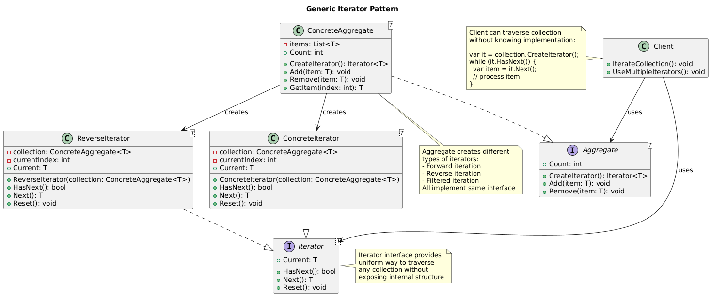
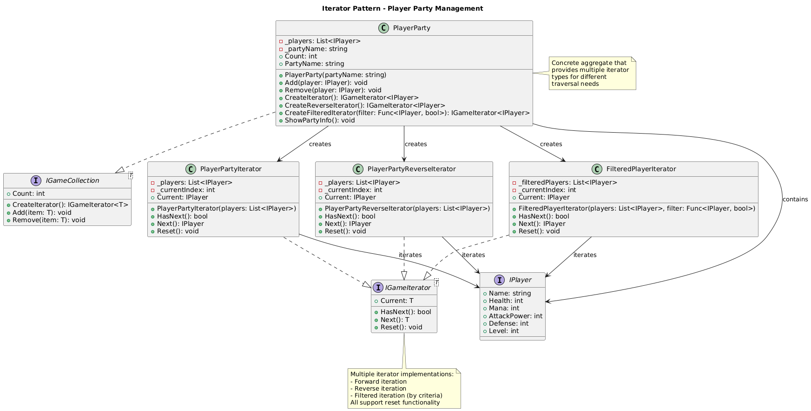

# Iterator Pattern Summary

## 📖 Overview
The Iterator pattern provides a way to access elements of an aggregate object sequentially without exposing its underlying representation. It separates traversal logic from the collection structure.

## 🎯 Purpose
- Access collection elements without exposing internal structure
- Support multiple traversal methods for same collection
- Provide uniform interface for different collection types
- Enable collection traversal without knowing implementation details

## 📋 Generic Implementation Guidelines

### Standard Structure
1. **Iterator Interface**
   ```csharp
   interface IIterator<T> {
       bool HasNext();
       T Next();
       void Reset();
       T Current { get; }
   }
   ```

2. **Aggregate Interface**
   ```csharp
   interface IAggregate<T> {
       IIterator<T> CreateIterator();
       void Add(T item);
       void Remove(T item);
       int Count { get; }
   }
   ```

3. **Concrete Iterator**
   ```csharp
   class ConcreteIterator<T> : IIterator<T> {
       private ConcreteAggregate<T> aggregate;
       private int currentIndex = 0;
       
       public ConcreteIterator(ConcreteAggregate<T> aggregate) {
           this.aggregate = aggregate;
       }
       
       public bool HasNext() {
           return currentIndex < aggregate.Count;
       }
       
       public T Next() {
           return aggregate.GetItem(currentIndex++);
       }
       
       public void Reset() {
           currentIndex = 0;
       }
       
       public T Current => aggregate.GetItem(currentIndex);
   }
   ```

4. **Concrete Aggregate**
   ```csharp
   class ConcreteAggregate<T> : IAggregate<T> {
       private List<T> items = new List<T>();
       
       public IIterator<T> CreateIterator() {
           return new ConcreteIterator<T>(this);
       }
       
       public void Add(T item) => items.Add(item);
       public void Remove(T item) => items.Remove(item);
       public int Count => items.Count;
       public T GetItem(int index) => items[index];
   }
   ```

5. **Client Usage**
   ```csharp
   var collection = new ConcreteAggregate<string>();
   collection.Add("Item1");
   collection.Add("Item2");
   
   var iterator = collection.CreateIterator();
   while (iterator.HasNext()) {
       var item = iterator.Next();
       // Process item
   }
   ```

### When to Use
- Need to traverse collection without exposing internal structure
- Want multiple traversal algorithms for same collection
- Want uniform traversal interface for different collection types
- Need to support concurrent traversals of same collection

## 🏗️ Implementation in PlayerMMO

### Key Components
- **IGameIterator<T>**: Generic iterator interface
- **IGameCollection<T>**: Collection interface for iterables
- **PlayerParty**: Concrete collection of players
- **PlayerPartyIterator, PlayerPartyReverseIterator, FilteredPlayerIterator**: Different traversal strategies

### Code Structure
```
PlayerMMO/Iterator/
├── Pattern/
│   ├── IGameIterator.cs
│   ├── IGameCollection.cs
│   ├── PlayerParty.cs
│   ├── PlayerPartyIterator.cs
│   ├── PlayerPartyReverseIterator.cs
│   └── FilteredPlayerIterator.cs
├── Program.cs
└── iterator.puml
```

## 🎮 Game Integration
- **BaseGame Classes Used**: IPlayer
- **Game Context**: Player party management with different traversal needs
- **Demo Features**: Forward/reverse iteration, filtered traversal, party management

### Actual Implementation Mapping
| Generic Component | PlayerMMO Implementation | Purpose |
|------------------|-------------------------|---------|
| IIterator<T> | IGameIterator<IPlayer> | Player iterator interface |
| IAggregate<T> | IGameCollection<IPlayer> | Player collection interface |
| ConcreteIterator | PlayerPartyIterator | Forward player traversal |
| ConcreteAggregate | PlayerParty | Player party collection |
| Additional Iterators | PlayerPartyReverseIterator | Reverse traversal |
| | FilteredPlayerIterator | Conditional traversal |
| Client | Program.cs demo | Uses different iteration strategies |

### Real Usage Example
```csharp
// Create party with multiple players
var party = new PlayerParty("Adventure Party");
party.Add(new BasePlayer("Warrior", 50, 10, 25, 200, 5));
party.Add(new BasePlayer("Mage", 100, 5, 30, 100, 4));
party.Add(new BasePlayer("Rogue", 75, 8, 20, 150, 6));
party.Add(new BasePlayer("Healer", 80, 15, 15, 120, 3));

// Forward iteration - attack order
var forwardIterator = party.CreateIterator();
Console.WriteLine("Attack Order:");
while (forwardIterator.HasNext()) {
    var player = forwardIterator.Next();
    player.Attack();
}

// Reverse iteration - retreat order
var reverseIterator = party.CreateReverseIterator();
Console.WriteLine("Retreat Order:");
while (reverseIterator.HasNext()) {
    var player = reverseIterator.Next();
    Console.WriteLine($"{player.Name} retreats");
}

// Filtered iteration - only injured players
var injuredFilter = party.CreateFilteredIterator(p => p.Health < 150);
Console.WriteLine("Injured Players:");
while (injuredFilter.HasNext()) {
    var player = injuredFilter.Next();
    player.Heal();
}

// Filtered iteration - high-level players
var highLevelFilter = party.CreateFilteredIterator(p => p.Level >= 5);
Console.WriteLine("Experienced Players:");
while (highLevelFilter.HasNext()) {
    var player = highLevelFilter.Next();
    Console.WriteLine($"{player.Name} (Level {player.Level}) leads the charge");
}

// Multiple concurrent iterations
var iter1 = party.CreateIterator();
var iter2 = party.CreateReverseIterator();
// Both can traverse independently without interference
```

## ✨ Key Benefits
- **Encapsulation**: Internal party structure hidden from client
- **Multiple Traversals**: Forward, reverse, and filtered iteration
- **Concurrent Access**: Multiple iterators can work simultaneously
- **Extensibility**: Easy to add new iteration strategies
- **Uniform Interface**: Same interface for all iterator types

## 🔧 Advanced Features
```csharp
// Custom filter examples
var mageFilter = party.CreateFilteredIterator(p => p.Mana > 80);
var tankFilter = party.CreateFilteredIterator(p => p.Health > 180);
var dpsFilter = party.CreateFilteredIterator(p => p.AttackPower > 20);

// Chaining operations with iterators
public void HealAllInjured(PlayerParty party) {
    var injuredIterator = party.CreateFilteredIterator(p => p.Health < 100);
    while (injuredIterator.HasNext()) {
        injuredIterator.Next().Heal();
    }
}

// Party formation strategies using different iterators
public void FormBattleLine(PlayerParty party) {
    var tankIterator = party.CreateFilteredIterator(p => p.Defense > 15);
    var dpsIterator = party.CreateFilteredIterator(p => p.AttackPower > 20);
    
    // Position tanks in front, DPS in back
}
```

## 🔗 Related Patterns
- **Composite**: Often used together for tree traversal
- **Factory Method**: Iterators often created using factory methods
- **Visitor**: Can be combined for operations during traversal

## 📊 UML Diagrams

### Generic Pattern Structure


### PlayerMMO Implementation


---
[← Back to Main Pattern Summary](../Summaries/README.md)
