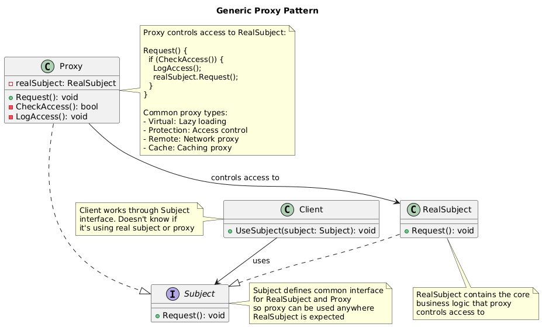
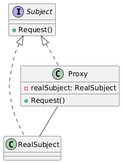

# Proxy Pattern Summary

## 📖 Overview
The Proxy pattern provides a placeholder or surrogate for another object to control access to it, allowing you to perform additional actions before or after forwarding the request.

## 🎯 Purpose
- Control access to another object
- Add additional behavior when accessing an object
- Provide placeholder for expensive-to-create objects
- Implement lazy initialization, access control, caching, or logging

## 📋 Generic Implementation Guidelines

### Standard Structure
1. **Subject Interface**
   ```csharp
   interface ISubject {
       void Request();
   }
   ```

2. **Real Subject**
   ```csharp
   class RealSubject : ISubject {
       public void Request() {
           Console.WriteLine("RealSubject: Handling request.");
       }
   }
   ```

3. **Proxy**
   ```csharp
   class Proxy : ISubject {
       private RealSubject realSubject;
       
       public void Request() {
           // Control access and add behavior
           if (CheckAccess()) {
               CreateRealSubject(); // Lazy initialization
               LogAccess();
               realSubject.Request();
               LogCompletion();
           }
       }
       
       private bool CheckAccess() {
           Console.WriteLine("Proxy: Checking access prior to firing a real request.");
           return true; // Access control logic
       }
       
       private void CreateRealSubject() {
           if (realSubject == null) {
               realSubject = new RealSubject();
           }
       }
       
       private void LogAccess() {
           Console.WriteLine("Proxy: Logging the time of request.");
       }
       
       private void LogCompletion() {
           Console.WriteLine("Proxy: Logging completion of request.");
       }
   }
   ```

4. **Client Usage**
   ```csharp
   // Client works with proxy as if it were the real subject
   ISubject proxy = new Proxy();
   proxy.Request(); // Proxy controls access to real subject
   ```

### Proxy Types
- **Virtual Proxy**: Lazy initialization of expensive objects
- **Protection Proxy**: Access control and permissions
- **Remote Proxy**: Access to remote objects
- **Caching Proxy**: Cache results for expensive operations

### When to Use
- Need to control access to an object
- Want to add behavior without changing the original object
- Need lazy initialization for expensive objects
- Want to implement caching, logging, or access control

## 🏗️ Implementation in PlayerMMO

### Key Components
- **IGameResource**: Interface for game resources
- **GameResource**: Expensive-to-load game resource (textures, sounds, levels)
- **GameResourceProxy**: Controls access and provides lazy loading
- **Access control**: Permission checking and resource management
- **Caching system**: Avoids reloading expensive resources

### Code Structure
```
PlayerMMO/Proxy/
├── ProxyPattern/
│   ├── IGameResource.cs
│   ├── GameResource.cs
│   ├── GameResourceProxy.cs
│   └── ResourceManager.cs
├── Program.cs
└── proxy.puml
```

## 🎮 Game Integration
- **BaseGame Classes Used**: IPlayer, IMonster
- **Game Context**: Resource loading and access control system
- **Demo Features**: Lazy loading, permission checking, caching, logging

### Actual Implementation Mapping
| Generic Component | PlayerMMO Implementation | Purpose |
|------------------|-------------------------|---------|
| ISubject | IGameResource | Game resource interface |
| RealSubject | GameResource | Actual game resource |
| Proxy | GameResourceProxy | Resource access controller |
| Request() | Load(), GetData() | Resource operations |
| CheckAccess() | ValidatePermissions() | Access control |
| LogAccess() | LogResourceAccess() | Usage tracking |
| Client | Program.cs demo | Game using resources through proxy |

### Real Usage Example
```csharp
// Game resources are expensive to load
Console.WriteLine("=== Game Resource Loading with Proxy ===");

// Create proxies for different resource types
var textureProxy = new GameResourceProxy("boss_texture.png", "Texture", 100);
var audioProxy = new GameResourceProxy("epic_music.wav", "Audio", 50);
var levelProxy = new GameResourceProxy("level5_data.json", "Level", 200);

// Resources not loaded yet - proxies created instantly
Console.WriteLine("Proxies created - no actual loading yet");

var player = new BasePlayer("Hero");
var monster = new BaseMonster("Boss", 5);

// First access triggers loading with permission check
Console.WriteLine("\n=== First Resource Access ===");
var textureData = textureProxy.GetData(player); // Loads and caches
Console.WriteLine($"Texture data: {textureData}");

// Second access uses cached data
Console.WriteLine("\n=== Cached Access ===");
textureData = textureProxy.GetData(player); // From cache
Console.WriteLine($"Cached texture data: {textureData}");

// Access control demonstration
Console.WriteLine("\n=== Access Control ===");
var lowLevelPlayer = new BasePlayer("Newbie");
try {
    var levelData = levelProxy.GetData(lowLevelPlayer); // Should be denied
} catch (UnauthorizedAccessException ex) {
    Console.WriteLine($"Access denied: {ex.Message}");
}

// High-level player can access
var highLevelPlayer = new BasePlayer("Hero");
highLevelPlayer.Level = 5;
var levelData = levelProxy.GetData(highLevelPlayer); // Allowed
Console.WriteLine($"Level data: {levelData}");

// Benefits demonstrated:
// - Resources only loaded when needed (lazy loading)
// - Automatic caching prevents reloading
// - Permission system controls access
// - Logging tracks resource usage
// - Client code doesn't change whether using proxy or real resource

// Resource management through proxy
Console.WriteLine("\n=== Resource Management ===");
var resourceManager = new ResourceManager();

// Load resources through manager (uses proxies internally)
resourceManager.LoadResource("player_sprites.png", player);
resourceManager.LoadResource("sound_effects.wav", player);

// Batch operations
var resources = new[] {
    "texture1.png", "texture2.png", "sound1.wav", "level1.json"
};

foreach (var resource in resources) {
    try {
        resourceManager.LoadResource(resource, player);
        Console.WriteLine($"✓ Loaded: {resource}");
    } catch (Exception ex) {
        Console.WriteLine($"✗ Failed: {resource} - {ex.Message}");
    }
}

// Resource usage statistics
Console.WriteLine("\n=== Usage Statistics ===");
resourceManager.PrintUsageStatistics();

// Memory management
resourceManager.ClearCache(); // Proxy can manage memory
Console.WriteLine("Cache cleared - resources will reload on next access");
```

## ✨ Key Benefits
- **Controlled Access**: Manage how and when objects are accessed
- **Lazy Loading**: Create expensive objects only when needed
- **Caching**: Store results to improve performance
- **Transparent Usage**: Client uses proxy same as real object

## 🔧 Advanced Proxy Features
```csharp
// Smart proxy with multiple capabilities
public class SmartGameResourceProxy : IGameResource {
    private GameResource realResource;
    private readonly string resourcePath;
    private readonly string resourceType;
    private readonly int requiredLevel;
    private DateTime lastAccessed;
    private int accessCount;
    private readonly Dictionary<IPlayer, byte[]> playerCache;
    
    public SmartGameResourceProxy(string path, string type, int level) {
        resourcePath = path;
        resourceType = type;
        requiredLevel = level;
        playerCache = new Dictionary<IPlayer, byte[]>();
    }
    
    public byte[] GetData(IPlayer player) {
        // Access control
        if (!ValidateAccess(player)) {
            throw new UnauthorizedAccessException($"Player level {player.Level} insufficient for {resourceType}");
        }
        
        // Player-specific caching
        if (playerCache.ContainsKey(player)) {
            Console.WriteLine($"📋 Returning cached data for {player.Name}");
            UpdateStats();
            return playerCache[player];
        }
        
        // Lazy loading
        if (realResource == null) {
            Console.WriteLine($"⏳ Loading {resourceType} resource: {resourcePath}");
            realResource = new GameResource(resourcePath, resourceType, requiredLevel);
        }
        
        // Get data and cache per player
        var data = realResource.GetData(player);
        playerCache[player] = data;
        
        UpdateStats();
        return data;
    }
    
    private void UpdateStats() {
        lastAccessed = DateTime.Now;
        accessCount++;
    }
    
    // Resource monitoring
    public ResourceStats GetStats() {
        return new ResourceStats {
            Path = resourcePath,
            Type = resourceType,
            AccessCount = accessCount,
            LastAccessed = lastAccessed,
            IsLoaded = realResource != null,
            CachedPlayers = playerCache.Count
        };
    }
    
    // Memory management
    public void ClearPlayerCache(IPlayer player) {
        playerCache.Remove(player);
    }
    
    public void ClearAllCache() {
        playerCache.Clear();
    }
    
    // Resource lifecycle
    public void Unload() {
        realResource = null;
        playerCache.Clear();
        Console.WriteLine($"🗑️ Unloaded {resourceType}: {resourcePath}");
    }
}

// Proxy with async loading
public class AsyncGameResourceProxy : IGameResource {
    private Task<GameResource> loadingTask;
    private readonly object lockObject = new object();
    
    public async Task<byte[]> GetDataAsync(IPlayer player) {
        lock (lockObject) {
            if (loadingTask == null) {
                loadingTask = LoadResourceAsync();
            }
        }
        
        var resource = await loadingTask;
        return resource.GetData(player);
    }
    
    private async Task<GameResource> LoadResourceAsync() {
        Console.WriteLine("🔄 Starting async resource load...");
        await Task.Delay(1000); // Simulate loading time
        Console.WriteLine("✅ Async resource load complete");
        return new GameResource(resourcePath, resourceType, requiredLevel);
    }
}

// Chain of responsibility proxy
public class SecurityGameResourceProxy : IGameResource {
    private readonly IGameResource target;
    private readonly List<ISecurityCheck> securityChecks;
    
    public SecurityGameResourceProxy(IGameResource target) {
        this.target = target;
        securityChecks = new List<ISecurityCheck> {
            new LevelSecurityCheck(),
            new TimeBasedSecurityCheck(),
            new LocationSecurityCheck()
        };
    }
    
    public byte[] GetData(IPlayer player) {
        // Run through security chain
        foreach (var check in securityChecks) {
            if (!check.Validate(player, resourcePath)) {
                throw new SecurityException($"Security check failed: {check.GetType().Name}");
            }
        }
        
        return target.GetData(player);
    }
}

// Factory for different proxy types
public static class ProxyFactory {
    public static IGameResource CreateProxy(string path, string type, ProxyType proxyType) {
        var baseResource = new GameResource(path, type, 1);
        
        return proxyType switch {
            ProxyType.Simple => new GameResourceProxy(path, type, 1),
            ProxyType.Smart => new SmartGameResourceProxy(path, type, 1),
            ProxyType.Async => new AsyncGameResourceProxy(path, type, 1),
            ProxyType.Security => new SecurityGameResourceProxy(baseResource),
            _ => throw new ArgumentException("Unknown proxy type")
        };
    }
}

public enum ProxyType {
    Simple,
    Smart,
    Async,
    Security
}
```

## 🔗 Related Patterns
- **Adapter**: Both act as intermediaries but for different purposes
- **Decorator**: Both wrap objects but Proxy controls access while Decorator adds behavior
- **Facade**: Both provide interface but Facade simplifies while Proxy controls
- **Strategy**: Proxy can use different strategies for access control

## 📊 UML Diagrams

### Generic Pattern Structure


### PlayerMMO Implementation


---
[← Back to Main Pattern Summary](../Summaries/README.md)
