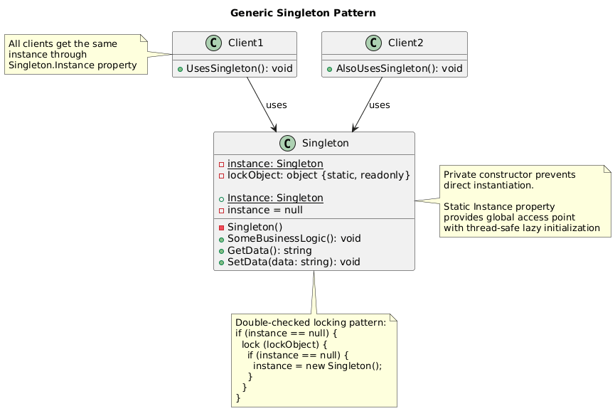

# Singleton Pattern Summary

## 📖 Overview
The Singleton pattern ensures that a class has only one instance and provides a global point of access to that instance. It's useful for coordinating actions across the system.

## 🎯 Purpose
- Ensure only one instance of a class exists
- Provide global access to that instance
- Control object creation and access
- Manage shared resources or state

## 📋 Generic Implementation Guidelines

### Standard Structure (Thread-Safe)
1. **Basic Singleton**
   ```csharp
   class Singleton {
       private static Singleton instance = null;
       private static readonly object lockObject = new object();
       
       private Singleton() { }
       
       public static Singleton Instance {
           get {
               if (instance == null) {
                   lock (lockObject) {
                       if (instance == null) {
                           instance = new Singleton();
                       }
                   }
               }
               return instance;
           }
       }
       
       public void SomeBusinessLogic() {
           // Implementation
       }
   }
   ```

2. **Lazy Initialization (C# Specific)**
   ```csharp
   class Singleton {
       private static readonly Lazy<Singleton> lazy = 
           new Lazy<Singleton>(() => new Singleton());
       
       private Singleton() { }
       
       public static Singleton Instance => lazy.Value;
   }
   ```

3. **Client Usage**
   ```csharp
   // Always gets the same instance
   var instance1 = Singleton.Instance;
   var instance2 = Singleton.Instance;
   // instance1 == instance2 (true)
   ```

### When to Use
- Need exactly one instance of a class
- Instance must be accessible from multiple points
- Instance should be created only when first needed
- Need to control access to shared resources

### ⚠️ Considerations
- Can make unit testing difficult
- May violate Single Responsibility Principle
- Can become a global state (anti-pattern if overused)
- Consider dependency injection as alternative

## 🏗️ Implementation in PlayerMMO

### Key Components
- **GameManager**: Thread-safe singleton managing game state
- **Double-checked locking**: Ensures thread safety
- **Global game state**: Players, monsters, level, score management

### Code Structure
```
PlayerMMO/Singleton/
├── Pattern/
│   └── GameManager.cs
├── Program.cs
└── singleton.puml
```

## 🎮 Game Integration
- **BaseGame Classes Used**: IPlayer, IMonster
- **Game Context**: Global game state management across all game systems
- **Demo Features**: Player/monster registration, combat processing, score tracking

### Actual Implementation Mapping
| Generic Component | PlayerMMO Implementation | Purpose |
|------------------|-------------------------|---------|
| Singleton | GameManager | Global game state manager |
| Instance | Instance property | Access point to game manager |
| SomeBusinessLogic() | RegisterPlayer(), ProcessCombat(), etc. | Game management operations |
| Private Constructor | Private GameManager() | Prevents external instantiation |
| Thread Safety | Double-checked locking | Ensures safe multi-threaded access |

### Real Usage Example
```csharp
// Get the singleton instance (same instance always returned)
var gameManager = GameManager.Instance;

// Register players and monsters
gameManager.RegisterPlayer(warrior);
gameManager.RegisterPlayer(mage);
gameManager.RegisterMonster(goblin);
gameManager.RegisterMonster(dragon);

// Start game and process combat
gameManager.StartGame();
gameManager.ProcessCombat(warrior, goblin);  // Handles battle logic
gameManager.AddScore(100);                   // Update global score
gameManager.NextLevel();                     // Progress to next level

// From anywhere in the application
var sameManager = GameManager.Instance;       // Same instance
Console.WriteLine($"Current Level: {sameManager.GetCurrentLevel()}");
Console.WriteLine($"Total Score: {sameManager.GetTotalScore()}");

// Game state is shared across all access points
```

## ✨ Key Benefits
- **Global Access**: Available from anywhere in the application
- **Resource Control**: Manages shared game resources efficiently
- **State Consistency**: Single source of truth for game state
- **Thread Safety**: Safe for multi-threaded game environments

## 🔧 Thread Safety Implementation
```csharp
// Double-checked locking pattern
if (_instance == null) {           // First check (performance)
    lock (_lock) {                 // Synchronization
        if (_instance == null) {   // Second check (safety)
            _instance = new GameManager();
        }
    }
}
```

## 🔗 Related Patterns
- **Factory Method**: Factories are often implemented as Singletons
- **Facade**: Facades frequently use Singleton for global access
- **Observer**: Singleton can serve as the subject in Observer pattern

## 📊 UML Diagrams

### Generic Pattern Structure


### PlayerMMO Implementation


---
[← Back to Main Pattern Summary](../Summaries/README.md)
