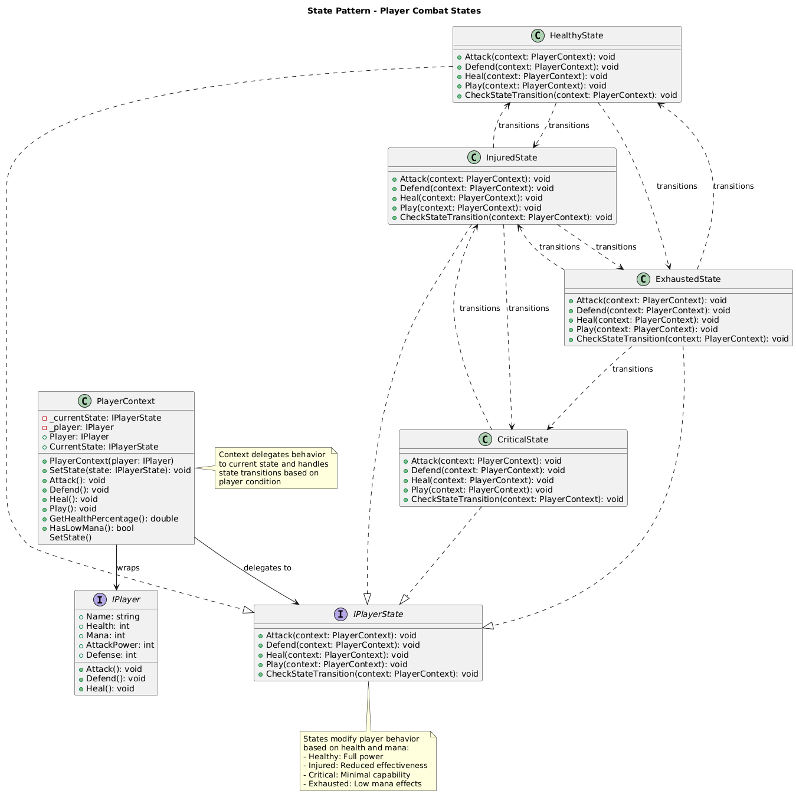

# State Pattern Summary

## 📖 Overview
The State pattern allows an object to alter its behavior when its internal state changes. The object will appear to change its class by delegating behavior to state objects.

## 🎯 Purpose
- Allow object behavior to change based on internal state
- Eliminate complex conditional statements
- Make state transitions explicit
- Support the Open/Closed Principle for new states

## 📋 Generic Implementation Guidelines

### Standard Structure
1. **State Interface**
   ```csharp
   interface IState {
       void Handle(Context context);
       void DoAction();
   }
   ```

2. **Concrete States**
   ```csharp
   class ConcreteStateA : IState {
       public void Handle(Context context) {
           // State-specific behavior
           if (condition) {
               context.SetState(new ConcreteStateB());
           }
       }
   }
   ```

3. **Context**
   ```csharp
   class Context {
       private IState currentState;
       
       public void SetState(IState state) {
           currentState = state;
       }
       
       public void Request() {
           currentState.Handle(this);
       }
   }
   ```

4. **Client Usage**
   ```csharp
   var context = new Context(new ConcreteStateA());
   context.Request(); // Behavior depends on current state
   ```

### When to Use
- Object behavior depends on its state
- Operations have large conditional statements on object state
- State transitions are explicit and well-defined
- Want to avoid duplicate code across similar states

## 🏗️ Implementation in PlayerMMO

### Key Components
- **IPlayerState**: State interface defining player behavior
- **HealthyState, InjuredState, CriticalState, ExhaustedState**: Concrete states
- **PlayerContext**: Context managing state transitions
- **IPlayer**: Wrapped player object

### Code Structure
```
PlayerMMO/State/
├── Pattern/
│   ├── IPlayerState.cs
│   ├── HealthyState.cs
│   ├── InjuredState.cs
│   ├── CriticalState.cs
│   ├── ExhaustedState.cs
│   └── PlayerContext.cs
├── Program.cs
└── state.puml
```

## 🎮 Game Integration
- **BaseGame Classes Used**: IPlayer
- **Game Context**: Player behavior changes based on health and mana conditions
- **Demo Features**: State transitions, behavior modification, automatic state management

### Actual Implementation Mapping
| Generic Component | PlayerMMO Implementation | Purpose |
|------------------|-------------------------|---------|
| IState | IPlayerState | Player state interface |
| ConcreteStateA | HealthyState | Full power state (>70% health, sufficient mana) |
| ConcreteStateB | InjuredState | Reduced effectiveness (30-70% health) |
| ConcreteStateC | CriticalState | Minimal capability (<30% health) |
| ConcreteStateD | ExhaustedState | Low mana effects (<20 mana) |
| Context | PlayerContext | Manages player state transitions |
| Client | Program.cs demo | Uses context to perform actions |

### Real Usage Example
```csharp
// Wrap player in context
var player = new BasePlayer("Hero", 50, 10, 20, 100, 1);
var context = new PlayerContext(player);

// Actions change behavior based on state
context.Attack();  // Full damage in HealthyState
context.Heal();    // Normal healing

// Damage player to trigger state transition
player.Health = 50; // Triggers transition to InjuredState
context.Attack();   // Reduced damage due to injury

player.Health = 20; // Triggers transition to CriticalState  
context.Attack();   // Minimal damage, high chance to fail

player.Mana = 10;   // Triggers transition to ExhaustedState
context.Attack();   // Can't use mana-based abilities

// States automatically transition based on conditions:
// HealthyState → InjuredState (health drops)
// InjuredState → CriticalState (health drops further)
// Any state → ExhaustedState (mana too low)
// ExhaustedState → previous state (mana restored)
```

## ✨ Key Benefits
- **Automatic Transitions**: States change based on player condition
- **Behavior Modification**: Each state alters attack/defend/heal effectiveness
- **Clean Code**: No complex if-else chains for state checking
- **Extensible**: Easy to add new states (e.g., PoisonedState, BerserkState)

## 🔧 State Transition Logic
```csharp
// Example from HealthyState
public void CheckStateTransition(PlayerContext context) {
    if (context.HasLowMana()) {
        context.SetState(new ExhaustedState());
    } else if (context.GetHealthPercentage() < 0.3) {
        context.SetState(new CriticalState());
    } else if (context.GetHealthPercentage() < 0.7) {
        context.SetState(new InjuredState());
    }
}
```

## 🔗 Related Patterns
- **Strategy**: State can be seen as extension of Strategy
- **Singleton**: States are often implemented as Singletons
- **Flyweight**: State objects can be shared if they're stateless

## 📊 UML Diagrams

### Generic Pattern Structure


### PlayerMMO Implementation


---
[← Back to Main Pattern Summary](../Summaries/README.md)
