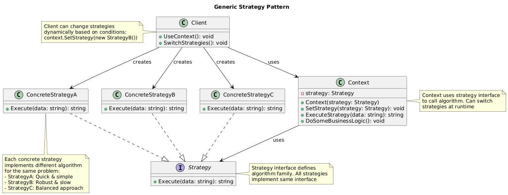
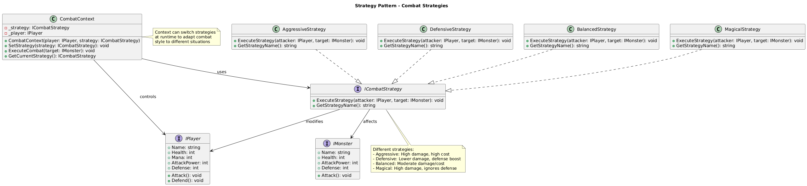

# Strategy Pattern Summary

## 📖 Overview
The Strategy pattern defines a family of algorithms, encapsulates each one, and makes them interchangeable. It lets the algorithm vary independently from clients that use it.

## 🎯 Purpose
- Define family of algorithms and make them interchangeable
- Eliminate conditional statements for algorithm selection
- Support runtime algorithm switching
- Isolate algorithm implementation from clients

## 📋 Generic Implementation Guidelines

### Standard Structure
1. **Strategy Interface**
   ```csharp
   interface IStrategy {
       string Execute(string data);
   }
   ```

2. **Concrete Strategies**
   ```csharp
   class ConcreteStrategyA : IStrategy {
       public string Execute(string data) {
           // Algorithm A implementation
           return "Result A: " + data;
       }
   }
   
   class ConcreteStrategyB : IStrategy {
       public string Execute(string data) {
           // Algorithm B implementation
           return "Result B: " + data.ToUpper();
       }
   }
   ```

3. **Context**
   ```csharp
   class Context {
       private IStrategy strategy;
       
       public void SetStrategy(IStrategy strategy) {
           this.strategy = strategy;
       }
       
       public string ExecuteStrategy(string data) {
           return strategy.Execute(data);
       }
   }
   ```

4. **Client Usage**
   ```csharp
   var context = new Context();
   context.SetStrategy(new ConcreteStrategyA());
   var result = context.ExecuteStrategy("data");
   
   // Switch strategy at runtime
   context.SetStrategy(new ConcreteStrategyB());
   var newResult = context.ExecuteStrategy("data");
   ```

### When to Use
- Multiple ways to perform a task
- Want to switch algorithms at runtime
- Avoid exposing complex algorithm-specific data structures
- Many classes differ only in their behavior

## 🏗️ Implementation in PlayerMMO

### Key Components
- **ICombatStrategy**: Strategy interface for combat algorithms
- **AggressiveStrategy, DefensiveStrategy, BalancedStrategy, MagicalStrategy**: Concrete strategies
- **CombatContext**: Context managing strategy execution
- **IPlayer, IMonster**: Objects affected by strategies

### Code Structure
```
PlayerMMO/Strategy/
├── Pattern/
│   ├── ICombatStrategy.cs
│   ├── AggressiveStrategy.cs
│   ├── DefensiveStrategy.cs
│   ├── BalancedStrategy.cs
│   ├── MagicalStrategy.cs
│   └── CombatContext.cs
├── Program.cs
└── strategy.puml
```

## 🎮 Game Integration
- **BaseGame Classes Used**: IPlayer, IMonster
- **Game Context**: Dynamic combat strategy selection during battles
- **Demo Features**: Strategy switching, different combat outcomes, mana management

### Actual Implementation Mapping
| Generic Component | PlayerMMO Implementation | Purpose |
|------------------|-------------------------|---------|
| IStrategy | ICombatStrategy | Combat algorithm interface |
| ConcreteStrategyA | AggressiveStrategy | High damage, high cost combat |
| ConcreteStrategyB | DefensiveStrategy | Defensive combat with protection |
| ConcreteStrategyC | BalancedStrategy | Moderate damage and cost |
| ConcreteStrategyD | MagicalStrategy | High damage, ignores defense |
| Context | CombatContext | Manages combat strategy execution |
| Client | Program.cs demo | Switches strategies during combat |

### Real Usage Example
```csharp
// Create combat context with player
var player = new BasePlayer("Warrior", 100, 15, 20, 150, 5);
var context = new CombatContext(player, new BalancedStrategy());

// Fight different monsters with different strategies
var goblin = new Monster("Goblin", 5, 15, 80, 1);
var dragon = new Monster("Dragon", 10, 25, 200, 5);

// Balanced approach for weaker enemies
context.ExecuteCombat(goblin);  // Moderate damage, reasonable cost

// Switch to aggressive for tough enemies
context.SetStrategy(new AggressiveStrategy());
context.ExecuteCombat(dragon);  // High damage but high mana cost

// Switch to defensive when low on health
if (player.Health < 50) {
    context.SetStrategy(new DefensiveStrategy());
    context.ExecuteCombat(goblin);  // Lower damage but gain defense
}

// Use magical strategy to bypass armor
context.SetStrategy(new MagicalStrategy());
context.ExecuteCombat(dragon);  // Ignores dragon's high defense

// Strategy effects:
// - Aggressive: +50% damage, +200% mana cost, -2 defense
// - Defensive: -20% damage, normal mana, +5 defense  
// - Balanced: Normal damage, normal mana, +1 defense
// - Magical: +30% damage, ignores defense, +300% mana cost
```

## ✨ Key Benefits
- **Runtime Flexibility**: Change combat style based on situation
- **Clean Algorithm Isolation**: Each strategy encapsulates its logic
- **Easy Extension**: Add new strategies without changing existing code
- **Testability**: Each strategy can be tested independently

## 🔧 Strategy Selection Logic
```csharp
// Smart strategy selection based on conditions
public ICombatStrategy SelectBestStrategy(IPlayer player, IMonster target) {
    if (player.Mana < 20) {
        return new DefensiveStrategy();  // Conserve mana
    } else if (target.Defense > 15) {
        return new MagicalStrategy();    // Bypass high defense
    } else if (player.Health < 50) {
        return new DefensiveStrategy();  // Play it safe
    } else {
        return new AggressiveStrategy(); // Go for maximum damage
    }
}
```

## 🔗 Related Patterns
- **State**: Strategy can be used to implement state behavior
- **Template Method**: Strategies can use template methods
- **Command**: Commands can encapsulate strategies

## 📊 UML Diagrams

### Generic Pattern Structure


### PlayerMMO Implementation


---
[← Back to Main Pattern Summary](../Summaries/README.md)
