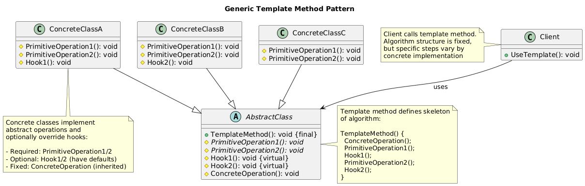

# Template Method Pattern Summary

## 📖 Overview
The Template Method pattern defines the skeleton of an algorithm in an operation, deferring some steps to subclasses. It lets subclasses redefine certain steps without changing the algorithm's structure.

## 🎯 Purpose
- Define algorithm skeleton with customizable steps
- Avoid code duplication in similar algorithms
- Control which parts of algorithm can be overridden
- Implement the "Hollywood Principle" (Don't call us, we'll call you)

## 📋 Generic Implementation Guidelines

### Standard Structure
1. **Abstract Class**
   ```csharp
   abstract class AbstractClass {
       // Template method - defines algorithm skeleton
       public void TemplateMethod() {
           PrimitiveOperation1();
           PrimitiveOperation2();
           ConcreteOperation();
           Hook1();
           PrimitiveOperation3();
           Hook2();
       }
       
       // Abstract operations - must be implemented
       protected abstract void PrimitiveOperation1();
       protected abstract void PrimitiveOperation2();
       protected abstract void PrimitiveOperation3();
       
       // Concrete operation - shared implementation
       protected void ConcreteOperation() {
           // Common behavior
       }
       
       // Hooks - optional override points
       protected virtual void Hook1() { }
       protected virtual void Hook2() { }
   }
   ```

2. **Concrete Classes**
   ```csharp
   class ConcreteClassA : AbstractClass {
       protected override void PrimitiveOperation1() {
           // Implementation A for step 1
       }
       
       protected override void PrimitiveOperation2() {
           // Implementation A for step 2
       }
       
       protected override void PrimitiveOperation3() {
           // Implementation A for step 3
       }
       
       protected override void Hook1() {
           // Optional: Override hook for additional behavior
       }
   }
   ```

3. **Client Usage**
   ```csharp
   AbstractClass algorithm = new ConcreteClassA();
   algorithm.TemplateMethod(); // Executes algorithm with A's implementations
   ```

### When to Use
- Multiple classes have similar algorithms with minor differences
- Want to control algorithm structure while allowing customization
- Need to avoid code duplication in related classes
- Want to define extension points in algorithms

## 🏗️ Implementation in PlayerMMO

### Key Components
- **GameLevelTemplate**: Abstract template defining level progression
- **DungeonLevel, ForestLevel, CaveLevel**: Concrete level implementations
- **IPlayer, IMonster**: Objects used in level progression
- **Template Method**: PlayLevel() defines the game flow

### Code Structure
```
PlayerMMO/Template/
├── Pattern/
│   ├── GameLevelTemplate.cs
│   ├── DungeonLevel.cs
│   ├── ForestLevel.cs
│   └── CaveLevel.cs
├── Program.cs
└── template_method.puml
```

## 🎮 Game Integration
- **BaseGame Classes Used**: IPlayer, IMonster, Monster
- **Game Context**: Level progression system with different level types
- **Demo Features**: Sequential level play, different level mechanics, shared progression logic

### Actual Implementation Mapping
| Generic Component | PlayerMMO Implementation | Purpose |
|------------------|-------------------------|---------|
| AbstractClass | GameLevelTemplate | Level progression template |
| TemplateMethod() | PlayLevel() | Defines level flow algorithm |
| PrimitiveOperation1() | InitializeLevel() | Level-specific setup |
| PrimitiveOperation2() | SpawnEnemies() | Enemy creation logic |
| PrimitiveOperation3() | ExecuteLevelLoop() | Main level gameplay |
| ConcreteOperation() | Battle() | Shared combat logic |
| Hook1() | FinishLevel() | Optional level completion |
| Hook2() | GiveReward() | Optional reward system |
| ConcreteClassA | DungeonLevel | Sequential combat level |
| ConcreteClassB | ForestLevel | Multiple enemy encounters |
| ConcreteClassC | CaveLevel | Exploration-based level |

### Real Usage Example
```csharp
// Create player for level progression
var player = new BasePlayer("Hero", 100, 15, 20, 150, 1);

// Play different level types using same template
GameLevelTemplate[] levels = {
    new DungeonLevel(player),   // Sequential enemy battles
    new ForestLevel(player),    // Multiple simultaneous enemies
    new CaveLevel(player)       // Exploration with treasure hunting
};

foreach (var level in levels) {
    level.PlayLevel();  // Same algorithm, different implementations
}

// Template Method Algorithm (PlayLevel):
// 1. GetLevelName()        - Abstract: Each level has unique name
// 2. InitializeLevel()     - Abstract: Level-specific setup
// 3. SpawnEnemies()        - Abstract: Different enemy patterns
// 4. ShowLevelIntro()      - Abstract: Custom introduction
// 5. ExecuteLevelLoop()    - Abstract: Level-specific gameplay
// 6. IsLevelComplete()     - Abstract: Different completion criteria
// 7. FinishLevel()         - Hook: Optional override
// 8. GiveReward()          - Hook: Optional reward logic
// 9. Battle()              - Concrete: Shared combat implementation

// DungeonLevel: Fight enemies one by one until all defeated
// ForestLevel: Fight multiple enemies, restore mana between battles
// CaveLevel: Explore for limited turns, find treasure, optional combat
```

## ✨ Key Benefits
- **Consistent Structure**: All levels follow same progression flow
- **Code Reuse**: Shared Battle() method used by all levels
- **Customization**: Each level type implements unique mechanics
- **Extension Points**: Hooks allow optional behavior without breaking structure

## 🔧 Template Method Implementation
```csharp
// Template method defines invariant algorithm structure
public void PlayLevel() {
    Console.WriteLine($"=== {GetLevelName()} ===");
    InitializeLevel();
    SpawnEnemies();
    ShowLevelIntro();
    
    while (!IsLevelComplete()) {
        ExecuteLevelLoop();
        // Battle() method is shared concrete implementation
    }
    
    FinishLevel();    // Hook - can be overridden
    GiveReward();     // Hook - can be overridden
    Console.WriteLine("Level completed!\n");
}
```

## 🔗 Related Patterns
- **Factory Method**: Template methods often use factory methods
- **Strategy**: Template method uses inheritance, Strategy uses composition
- **Command**: Steps in template method can be implemented as commands

## 📊 UML Diagrams

### Generic Pattern Structure


### PlayerMMO Implementation


---
[← Back to Main Pattern Summary](../Summaries/README.md)
