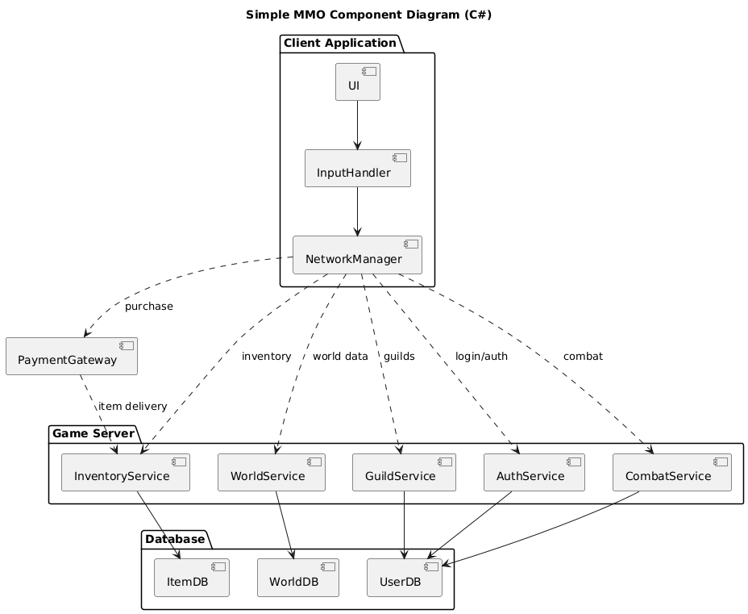
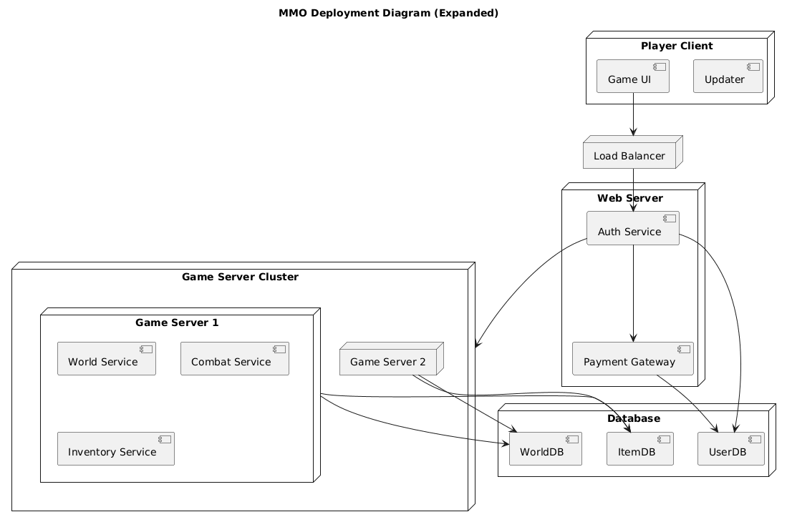
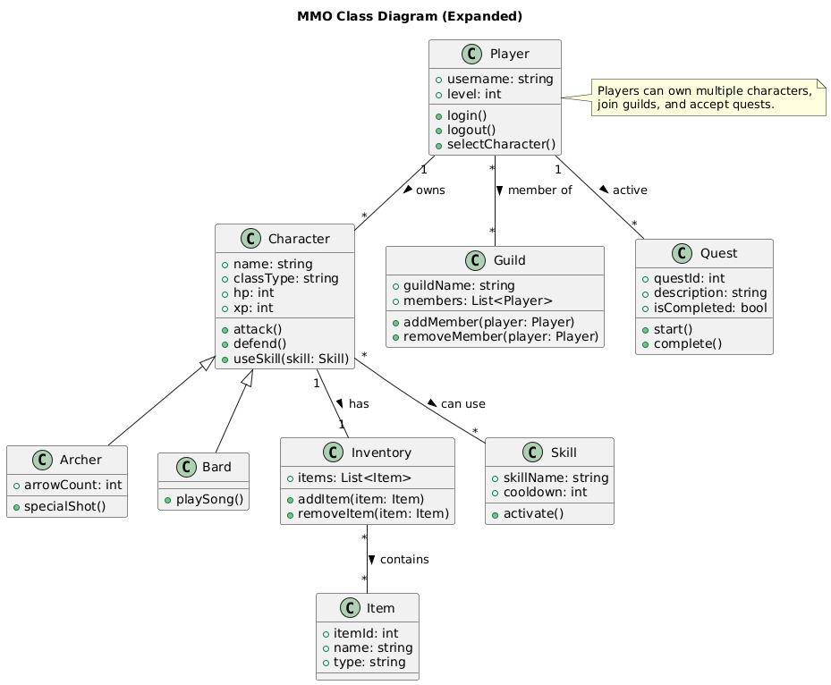
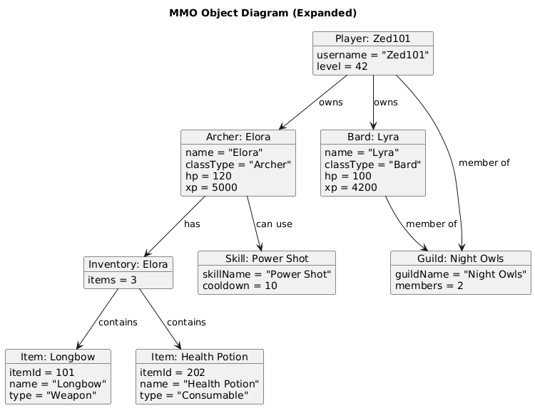
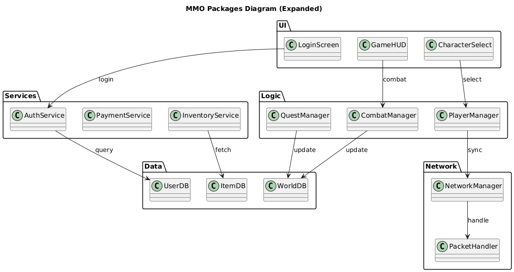
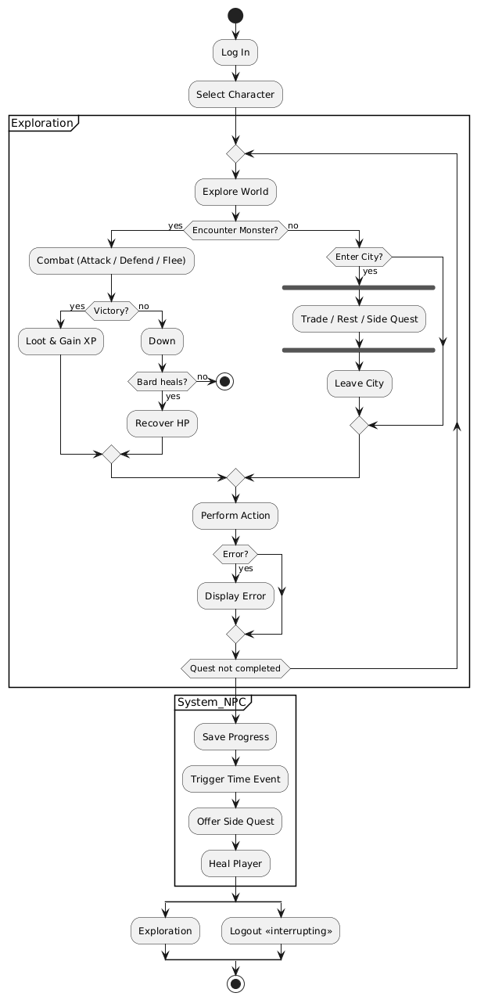
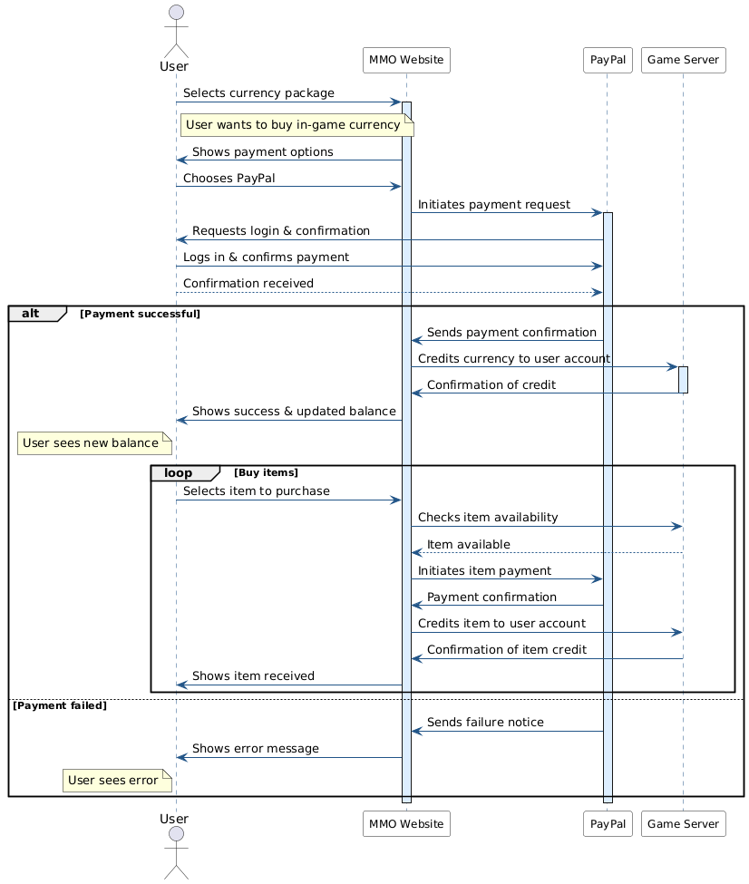
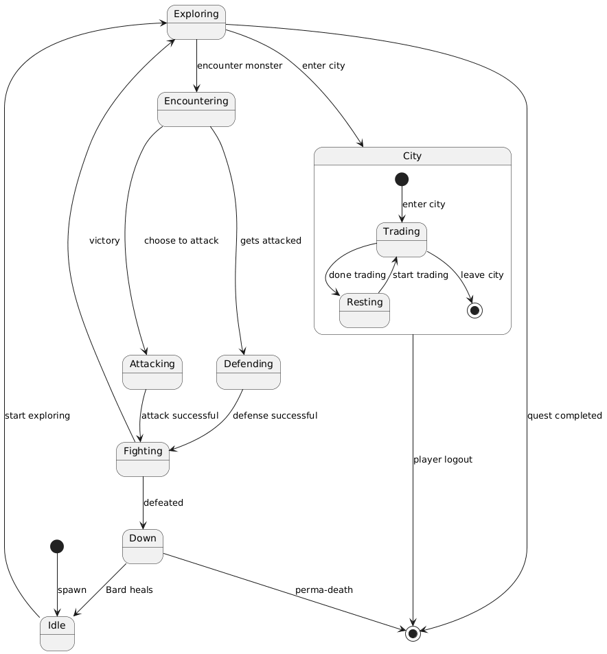
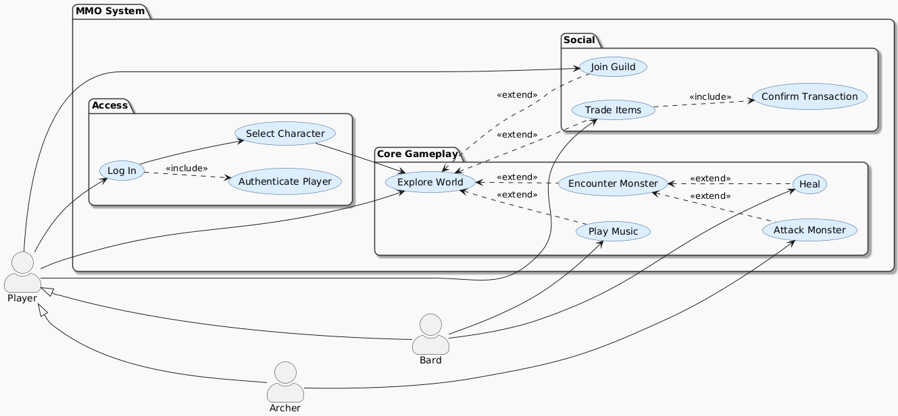
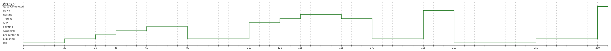

# 📊 Modelling Diagrams Summary

This document provides an overview of all static and dynamic modelling diagrams used in this course. Each section includes a brief explanation of the diagram's purpose, its typical use cases, and a reference to the corresponding PlantUML code.

---
## 📐 Static Diagrams

### 1. Component Diagram
**Purpose:** Illustrates the organization and dependencies among software components.  
**Use Cases:** High-level system design, microservices architecture.



<details>
<summary>PlantUML Code</summary>

```
@startuml Simple_MMO_Component_Diagram
title Simple MMO Component Diagram (C#)

package "Client Application" {
	[UI]
	[InputHandler]
	[NetworkManager]
}

package "Game Server" {
	[AuthService]
	[WorldService]
	[InventoryService]
	[CombatService]
	[GuildService]
}

package "Database" {
	[UserDB]
}
@enduml
```

</details>

### 2. Deployment Diagram
**Purpose:** Shows the physical deployment of artifacts on nodes.  
**Use Cases:** Cloud architecture, hardware-software mapping.



<details>
<summary>PlantUML Code</summary>

```
@startuml MMO_DeploymentDiagram
title MMO Deployment Diagram (Expanded)

node "Player Client" {
	[Game UI]
	[Updater]
}

node "Load Balancer" {
}

node "Web Server" {
	[Auth Service]
	[Payment Gateway]
}

node "Game Server Cluster" {
	node "Game Server 1" {
		[World Service]
	}
}
@enduml
```

</details>

### 3. Class Diagram
**Purpose:** Describes the structure of a system by showing its classes, attributes, and relationships.  
**Use Cases:** Object-oriented design, database schema design.



<details>
<summary>PlantUML Code</summary>

```
@startuml MMO_ClassDiagram
title MMO Class Diagram (Expanded)

class Player {
  +username: string
  +level: int
  +login()
  +logout()
  +selectCharacter()
}

class Character {
  +name: string
  +classType: string
  +hp: int
  +xp: int
  +attack()
  +defend()
  +useSkill(skill: Skill)
}
@enduml
```

</details>

### 4. Object Diagram
**Purpose:** Represents instances of classes and their relationships at a specific point in time.  
**Use Cases:** Debugging, example scenarios.



<details>
<summary>PlantUML Code</summary>

```
@startuml MMO_ObjectDiagram
title MMO Object Diagram (Expanded)

object player1 as "Player: Zed101" {
  username = "Zed101"
  level = 42
}
object archer1 as "Archer: Elora" {
  name = "Elora"
  classType = "Archer"
  hp = 120
  xp = 5000
}
object bard1 as "Bard: Lyra" {
  name = "Lyra"
  classType = "Bard"
  hp = 100
  xp = 4200
}
@enduml
```

</details>

### 5. Packages Diagram
**Purpose:** Shows how classes and interfaces are grouped into packages.  
**Use Cases:** Modular design, dependency management.



<details>
<summary>PlantUML Code</summary>

```
@startuml MMO_PackagesDiagram
title MMO Packages Diagram (Expanded)

package "UI" {
  class LoginScreen
  class CharacterSelect
  class GameHUD
}

package "Logic" {
  class PlayerManager
  class CombatManager
  class QuestManager
}

package "Network" {
  class NetworkManager
  class PacketHandler
}
@enduml
```

</details>
---
## 🔄 Dynamic Diagrams

### 1. Activity Diagram
**Purpose:** Models the workflow of a system or process.  
**Use Cases:** Business process modeling, algorithm design.



<details>
<summary>PlantUML Code</summary>

```
@startuml Refined_Archer_Activity_Diagram

|Player|
start
:Log In;
:Select Character;

partition Exploration {
    repeat
        :Explore World;

        if (Encounter Monster?) then (yes)
            :Combat (Attack / Defend / Flee);
            if (Victory?) then (yes)
                :Loot & Gain XP;
                :Check Level Up;
                if (Level Up?) then (yes)
@enduml
```

</details>

### 2. Sequence Diagram
**Purpose:** Shows how objects interact in a particular sequence.  
**Use Cases:** API design, interaction modeling.



<details>
<summary>PlantUML Code</summary>

```
@startuml mmo_purchase
skinparam participant {
  BackgroundColor #f9f9f9
  BorderColor #333
  FontSize 12
}
skinparam sequence {
  ArrowColor #225588
  LifeLineBorderColor #225588
  LifeLineBackgroundColor #ddeeff
}

actor User
participant "MMO Website" as MMO
participant "PayPal" as PayPal
participant "Game Server" as Server
@enduml
```

</details>

### 3. State Diagram
**Purpose:** Describes the states and transitions of an object.  
**Use Cases:** Finite state machines, lifecycle modeling.



<details>
<summary>PlantUML Code</summary>

```
@startuml Archer_State_Diagram
[*] --> Idle : spawn

Idle --> Exploring : start exploring
Exploring --> Encountering : encounter monster
Encountering --> Attacking : choose to attack
Encountering --> Defending : gets attacked

Attacking --> Fighting : attack successful
Defending --> Fighting : defense successful
Fighting --> Exploring : victory
Fighting --> Down : defeated

Down --> Idle : Bard heals
Down --> [*] : perma-death
@enduml
```

</details>

### 4. Use Case Diagram
**Purpose:** Represents the functional requirements of a system.  
**Use Cases:** Requirement analysis, stakeholder communication.



<details>
<summary>PlantUML Code</summary>

```
@startuml MMO_UC_Diagram
left to right direction

actor Player
actor Archer
actor Bard
@enduml
```

</details>

### 5. Time Diagram
**Purpose:** Visualizes the behavior of objects over time.  
**Use Cases:** Real-time systems, performance analysis.



<details>
<summary>PlantUML Code</summary>

```
@startuml
robust "Archer" as A

@0
A is Idle

@20
A is Exploring

@35
A is Encountering

@45
A is Attacking

@60
A is Fighting

@80
A is Exploring
@enduml
```

</details>
---

> All diagrams are generated from their corresponding PlantUML files for consistency and easy updates.
