# Software Design Patterns Course Overview

This course provides an in-depth overview of the main categories of design patterns in software engineering. Each module is designed to provide a concise yet comprehensive understanding of the patterns, their purpose, and their applications, supported by UML diagrams.

---
## Module 0: How to Read UML

Understanding UML (Unified Modeling Language) is essential for visualizing and designing software systems. The diagrams in this course use UML to represent the structure and behavior of design patterns.

---
## Module 1: Creational Patterns
**Goal:** Simplify and structure object creation.

### 1. Singleton
**Purpose:** Ensure only one instance of a class exists and provide a global point of access to it.
**Applications:**
- Configuration management
- Logging
- Database connections

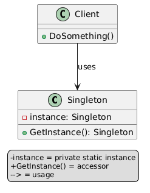

### 2. Factory Method
**Purpose:** Define an interface for creating an object, but let subclasses decide which class to instantiate.
**Applications:**
- UI components
- File format parsers

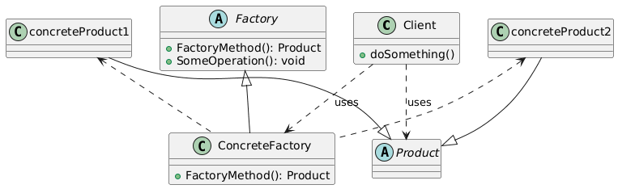

### 3. Abstract Factory
**Purpose:** Provide an interface for creating families of related or dependent objects without specifying their concrete classes.
**Applications:**
- GUI toolkits
- Cross-platform applications

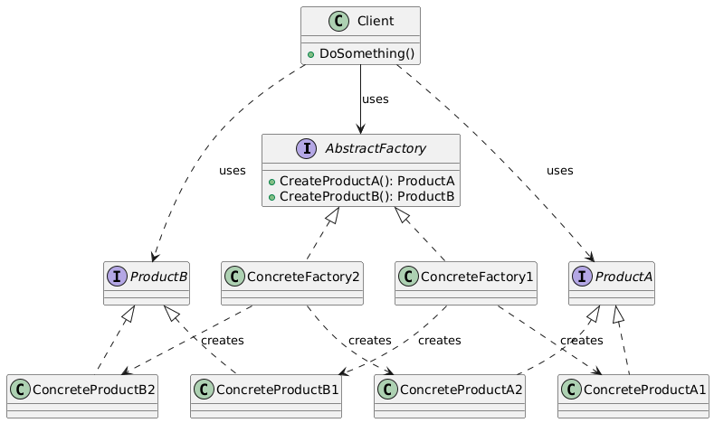

### 4. Builder
**Purpose:** Separate the construction of a complex object from its representation, allowing the same construction process to create different representations.
**Applications:**
- Document generation
- HTML/XML builders

---
## Module 2: Behavioral Patterns
**Goal:** Manage object behavior and communication.

### 1. Observer
**Purpose:** Define a one-to-many dependency between objects so that when one object changes state, all its dependents are notified and updated automatically.
**Applications:**
- Event systems
- GUI buttons
- Notifications

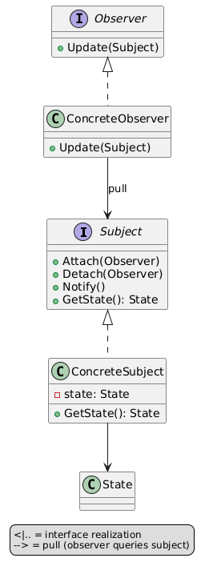

### 2. Strategy
**Purpose:** Define a family of algorithms, encapsulate each one, and make them interchangeable. This pattern lets the algorithm vary independently from clients that use it.
**Applications:**
- Sorting algorithms
- Payment methods

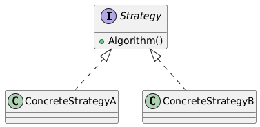

### 3. Command
**Purpose:** Encapsulate a request as an object, thereby allowing parameterization of clients with different requests, queuing of requests, and logging of the requests.
**Applications:**
- Undo/redo functionality
- Macro recording

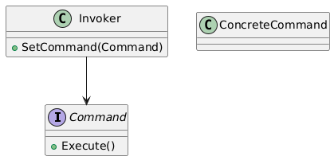

### 4. State
**Purpose:** Allow an object to alter its behavior when its internal state changes. The object will appear to change its class.
**Applications:**
- Game player states
- Workflow systems

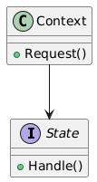

### 5. Template Method
**Purpose:** Define the skeleton of an algorithm in an operation, deferring some steps to subclasses. This lets subclasses redefine certain steps of an algorithm without changing its structure.
**Applications:**
- Document processing
- Report generation

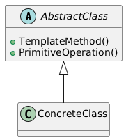

### 6. Iterator
**Purpose:** Provide a way to access the elements of an aggregate object sequentially without exposing its underlying representation.
**Applications:**
- Collections
- Data structures

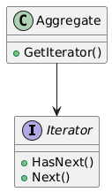

---
## Module 3: Structural Patterns
**Goal:** Flexibly combine objects and classes.

### 1. Adapter
**Purpose:** Convert the interface of a class into another interface clients expect. Adapter lets classes work together that couldn’t otherwise because of incompatible interfaces.
**Applications:**
- Legacy code integration
- API conversion

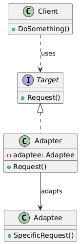

### 2. Decorator
**Purpose:** Attach additional responsibilities to an object dynamically. Decorators provide a flexible alternative to subclassing for extending functionality.
**Applications:**
- UI components (scrollbars, borders)
- Logging

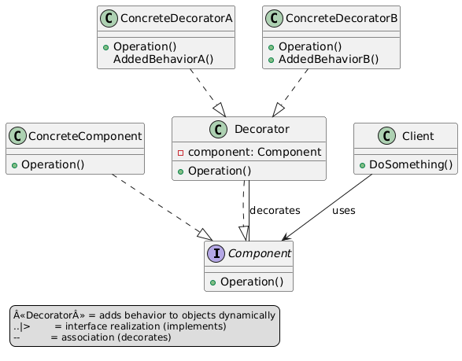

### 3. Facade
**Purpose:** Provide a unified interface to a set of interfaces in a subsystem. Facade defines a higher-level interface that makes the subsystem easier to use.
**Applications:**
- Libraries
- System modules

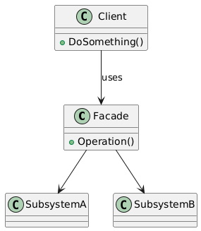

### 4. Composite
**Purpose:** Compose objects into tree structures to represent part-whole hierarchies. Composite lets clients treat individual objects and compositions of objects uniformly.
**Applications:**
- Tree structures
- UI layouts

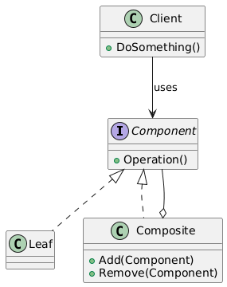

### 5. Proxy
**Purpose:** Provide a surrogate or placeholder for another object to control access to it.
**Applications:**
- Lazy loading
- Security
- Caching

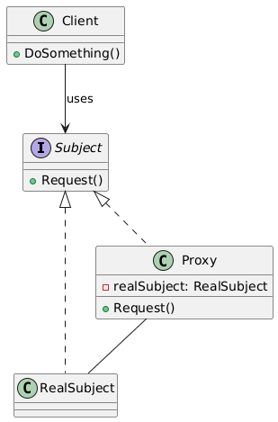

---

> This speed course is designed to provide a quick yet thorough understanding of design patterns. Each module builds on the previous one, ensuring a structured learning experience.
