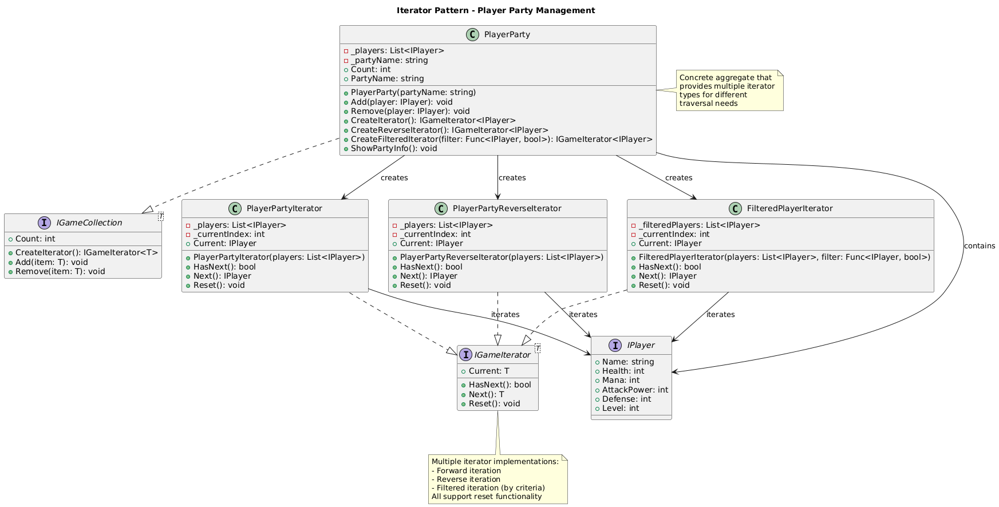

# Behavioral Patterns Summary

*← [Back to All Patterns](README.md) | [PlayerMMO Overview](../README.md)*

---

## 🎭 Behavioral Patterns Overview

Behavioral patterns focus on communication between objects and the assignment of responsibilities. In the PlayerMMO context, these patterns manage game events, player actions, combat algorithms, and state transitions.

---

## 🎯 Pattern Index

### [Command Pattern](Command.md)


**Purpose**: Encapsulate requests as objects to enable undo/redo and queuing  
**Game Context**: Manage player actions with full undo/redo capabilities  
**Key Benefit**: Flexible action management and history tracking

**When to Use**: When you need to queue, log, or undo operations  
**PlayerMMO Example**: Attack, heal, and move commands with undo functionality

---

### [Iterator Pattern](Iterator.md)


**Purpose**: Provide sequential access to collection elements  
**Game Context**: Traverse party members, inventory items, and enemy groups  
**Key Benefit**: Multiple traversal strategies without exposing internal structure

**When to Use**: When you need different ways to traverse collections  
**PlayerMMO Example**: Forward, reverse, and filtered iteration through player parties

---

### [Observer Pattern](Observer.md)


**Purpose**: Define one-to-many dependency for automatic notifications  
**Game Context**: Event system for game state changes and notifications  
**Key Benefit**: Loose coupling between event sources and handlers

**When to Use**: When multiple objects need to react to state changes  
**PlayerMMO Example**: Level-up, death, and item collection event notifications

---

### [State Pattern](State.md)


**Purpose**: Allow object behavior changes based on internal state  
**Game Context**: Player behavior modification based on health and status  
**Key Benefit**: Clean state-dependent behavior without complex conditionals

**When to Use**: When object behavior depends significantly on state  
**PlayerMMO Example**: Healthy, injured, and critical health states affecting combat

---

### [Strategy Pattern](Strategy.md)


**Purpose**: Encapsulate algorithms and make them interchangeable  
**Game Context**: Combat algorithms and attack strategies  
**Key Benefit**: Runtime algorithm selection and easy extensibility

**When to Use**: When you have multiple ways to perform the same task  
**PlayerMMO Example**: Aggressive, defensive, and balanced combat strategies

---

### [Template Method Pattern](TemplateMethod.md)


**Purpose**: Define algorithm skeleton with customizable steps  
**Game Context**: Standardized level progression with customizable elements  
**Key Benefit**: Code reuse while allowing specific customizations

**When to Use**: When algorithms share structure but differ in details  
**PlayerMMO Example**: Level progression framework with customizable challenges

---

## 🔧 Behavioral Pattern Relationships

```
Command ──────── Can use Strategy for different execution approaches
   │
   ├─── Often managed by Observer for action notifications
   │
Strategy ──────── Algorithms can be Commands for complex operations

Observer ──────── Notifies about State changes
   │
State ────────── State transitions can trigger Observer notifications

Template Method ── Can use Strategy for customizable algorithm steps
   │
Iterator ──────── Can traverse collections created by Template Method
```

## 🎮 Game Development Applications

### Event-Driven Architecture
- **Observer**: Central event system for game notifications
- **Command**: Action management with history and undo capabilities
- **State**: Dynamic behavior based on game conditions

### Algorithm Management
- **Strategy**: Interchangeable combat and AI algorithms
- **Template Method**: Standardized game flows with customization points

### Collection Management
- **Iterator**: Flexible traversal of game collections (parties, inventories, enemy groups)

### PlayerMMO Implementation Benefits
- **Responsive Gameplay**: Observer pattern enables real-time UI updates
- **Flexible Combat**: Strategy pattern allows dynamic combat behavior
- **Reusable Frameworks**: Template Method provides consistent game structure
- **State Management**: State pattern handles complex player status effects
- **Action History**: Command pattern enables save/load and undo systems

## 📚 Learning Path

**Start Here**: [Strategy](Strategy.md) - Clear algorithm encapsulation concept  
**Then**: [Observer](Observer.md) - Essential event-driven programming  
**Next**: [Command](Command.md) - Action encapsulation with practical benefits  
**Continue**: [State](State.md) - State-dependent behavior management  
**Next**: [Template Method](TemplateMethod.md) - Framework design patterns  
**Finally**: [Iterator](Iterator.md) - Advanced collection traversal strategies

---

## 🔗 Integration with Other Patterns

- **Creational Patterns**: Factories often create objects that use behavioral patterns
- **Structural Patterns**: Composite structures frequently use Iterator for traversal
- **Cross-Pattern**: Many behavioral patterns work together (Observer + State, Command + Strategy)

---

*Behavioral patterns are essential for building responsive, flexible game systems. They enable clean separation of concerns and make systems easier to extend and maintain.*

[← Back to All Patterns](README.md) | [PlayerMMO Overview](../README.md)
