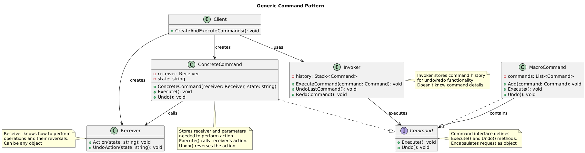

# Command Pattern Summary

## 📖 Overview
The Command pattern encapsulates a request as an object, allowing you to parameterize clients with different requests, queue operations, and support undo operations.

## 🎯 Purpose
- Encapsulate requests as objects
- Enable undo/redo functionality
- Support queuing and logging of operations
- Decouple invoker from receiver

## 📋 Generic Implementation Guidelines

### Standard Structure
1. **Command Interface**
   ```csharp
   interface ICommand {
       void Execute();
       void Undo();
   }
   ```

2. **Concrete Commands**
   ```csharp
   class ConcreteCommand : ICommand {
       private Receiver receiver;
       private string state;
       
       public ConcreteCommand(Receiver receiver, string state) {
           this.receiver = receiver;
           this.state = state;
       }
       
       public void Execute() {
           receiver.Action(state);
       }
       
       public void Undo() {
           receiver.UndoAction(state);
       }
   }
   ```

3. **Invoker**
   ```csharp
   class Invoker {
       private Stack<ICommand> history = new Stack<ICommand>();
       
       public void ExecuteCommand(ICommand command) {
           command.Execute();
           history.Push(command);
       }
       
       public void UndoLastCommand() {
           if (history.Count > 0) {
               var command = history.Pop();
               command.Undo();
           }
       }
   }
   ```

4. **Receiver**
   ```csharp
   class Receiver {
       public void Action(string state) {
           // Perform action
       }
       
       public void UndoAction(string state) {
           // Reverse action
       }
   }
   ```

5. **Client Usage**
   ```csharp
   var receiver = new Receiver();
   var command = new ConcreteCommand(receiver, "data");
   var invoker = new Invoker();
   
   invoker.ExecuteCommand(command);  // Execute
   invoker.UndoLastCommand();        // Undo
   ```

### When to Use
- Need to parameterize objects with operations
- Want to queue, specify, and execute requests at different times
- Need to support undo operations
- Want to structure system around high-level operations built on primitive operations

## 🏗️ Implementation in PlayerMMO

### Key Components
- **ICommand**: Command interface with Execute/Undo
- **AttackCommand, HealCommand, DefendCommand**: Concrete commands
- **GameInvoker**: Command invoker with history
- **IPlayer, IMonster**: Receivers of the commands

### Code Structure
```
PlayerMMO/Command/
├── Pattern/
│   ├── ICommand.cs
│   ├── AttackCommand.cs
│   ├── HealCommand.cs
│   ├── DefendCommand.cs
│   └── GameInvoker.cs
├── Program.cs
└── command.puml
```

## 🎮 Game Integration
- **BaseGame Classes Used**: IPlayer, IMonster
- **Game Context**: Game action system with undo capability for moves
- **Demo Features**: Attack/heal/defend commands, undo functionality, command history

### Actual Implementation Mapping
| Generic Component | PlayerMMO Implementation | Purpose |
|------------------|-------------------------|---------|
| ICommand | ICommand | Command interface |
| ConcreteCommand | AttackCommand, HealCommand, DefendCommand | Specific game actions |
| Invoker | GameInvoker | Executes and manages commands |
| Receiver | IPlayer, IMonster | Objects that receive actions |
| Execute() | Execute() | Performs the game action |
| Undo() | Undo() | Reverses the game action |
| Client | Program.cs demo | Uses invoker to execute commands |

### Real Usage Example
```csharp
// Create game objects
var player = new BasePlayer("Hero", 50, 10, 20, 100, 1);
var monster = new Monster("Goblin", 5, 15, 80, 1);
var invoker = new GameInvoker();

// Create and execute commands
var attackCommand = new AttackCommand(player, monster);
var healCommand = new HealCommand(player, 20);
var defendCommand = new DefendCommand(player, 5);

// Execute actions
invoker.ExecuteCommand(attackCommand);  // Player attacks monster
invoker.ExecuteCommand(healCommand);    // Player heals self
invoker.ExecuteCommand(defendCommand);  // Player raises defense

// Undo actions (Last In, First Out)
invoker.UndoLastCommand();  // Undo defend (defense restored)
invoker.UndoLastCommand();  // Undo heal (health restored)
invoker.UndoLastCommand();  // Undo attack (both health values restored)

// Commands store previous state for perfect undo
// AttackCommand: stores previous health of both player and target
// HealCommand: stores previous health before healing
// DefendCommand: stores previous defense value
```

## ✨ Key Benefits
- **Undo/Redo**: Perfect state restoration for any command
- **Macro Commands**: Can combine multiple commands
- **Queuing**: Commands can be stored and executed later
- **Logging**: Command history provides game replay capability
- **Decoupling**: Invoker doesn't need to know command details

## 🔧 Advanced Features
```csharp
// Macro command example
var macroCommand = new List<ICommand> {
    new AttackCommand(player, monster1),
    new AttackCommand(player, monster2),
    new HealCommand(player, 30)
};

// Execute all commands in sequence
foreach(var cmd in macroCommand) {
    invoker.ExecuteCommand(cmd);
}

// Undo entire macro
for(int i = 0; i < macroCommand.Count; i++) {
    invoker.UndoLastCommand();
}
```

## 🔗 Related Patterns
- **Memento**: Can be used to store command state
- **Composite**: For macro commands
- **Strategy**: Commands can use different strategies

## 📊 UML Diagrams

### Generic Pattern Structure


### PlayerMMO Implementation


---
[← Back to Main Pattern Summary](./README.md)
