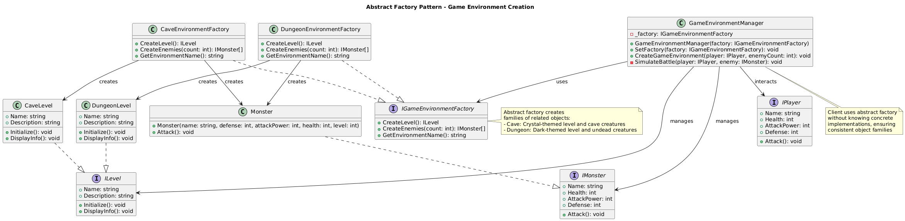
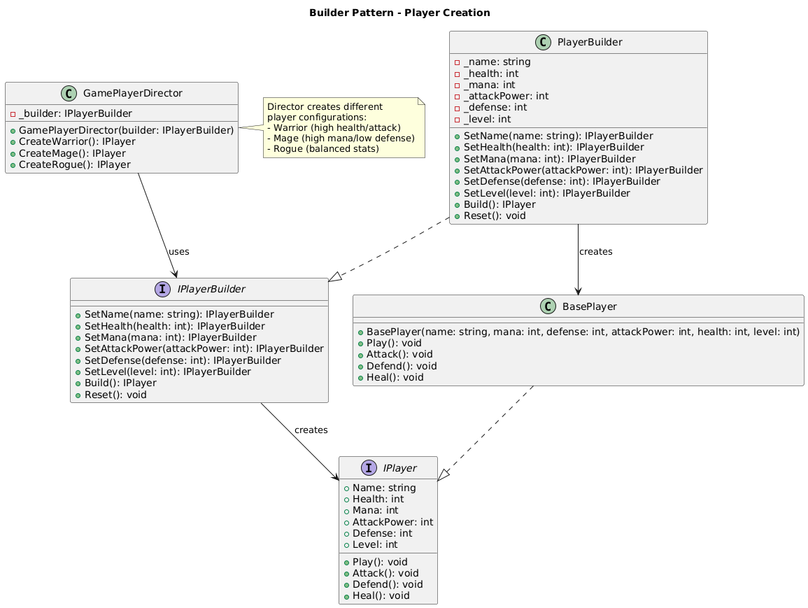
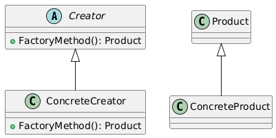
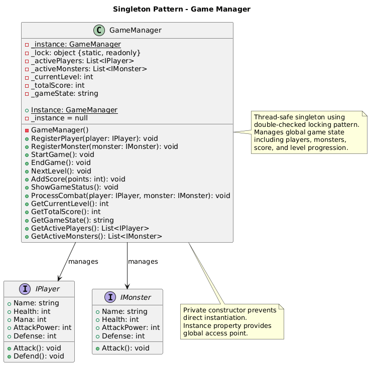

# Creational Patterns Summary

*← [Back to All Patterns](README.md) | [PlayerMMO Overview](../README.md)*

---

## 🏗️ Creational Patterns Overview

Creational patterns abstract the instantiation process, making systems independent of how objects are created, composed, and represented. In the PlayerMMO context, these patterns handle the creation of game entities, environments, and configurations.

---

## 🎯 Pattern Index

### [Abstract Factory Pattern](AbstractFactory.md)


**Purpose**: Create families of related or dependent objects  
**Game Context**: Generate complete game environments (caves, dungeons) with all associated elements  
**Key Benefit**: Ensures consistency across related object families

**When to Use**: When you need to create groups of objects that work together  
**PlayerMMO Example**: Cave environments with cave monsters, cave terrain, and cave items

---

### [Builder Pattern](Builder.md)  


**Purpose**: Construct complex objects step by step  
**Game Context**: Create customized player characters with optional attributes  
**Key Benefit**: Flexible object creation with fluent interface

**When to Use**: When object creation involves many optional parameters  
**PlayerMMO Example**: Player creation with customizable name, level, equipment, and skills

---

### [Factory Method Pattern](FactoryMethod.md)


**Purpose**: Create objects without specifying exact classes  
**Game Context**: Generate different player types through specialized creators  
**Key Benefit**: Extensible object creation system

**When to Use**: When creation logic varies based on context  
**PlayerMMO Example**: Different player classes (Warrior, Mage, Rogue, Paladin)

---

### [Singleton Pattern](Singleton.md)


**Purpose**: Ensure only one instance exists with global access  
**Game Context**: Manage global game state and configuration  
**Key Benefit**: Controlled access to shared resources

**When to Use**: When exactly one instance is needed system-wide  
**PlayerMMO Example**: Game configuration and state management

---

## 🔧 Creational Pattern Relationships

```
Factory Method ──┐
                 ├── Often combined for comprehensive object creation
Abstract Factory ┘

Builder ────────── Can use Factory Method for creating components

Singleton ──────── Often applied to Factory implementations
```

## 🎮 Game Development Applications

### Object Creation Strategies
- **Simple Objects**: Use Factory Method for straightforward type selection
- **Complex Objects**: Use Builder for step-by-step construction with many options
- **Object Families**: Use Abstract Factory for related object groups
- **Shared Resources**: Use Singleton for global state and configuration

### PlayerMMO Implementation Benefits
- **Consistent Creation**: All patterns ensure proper object initialization
- **Extensibility**: Easy to add new player types, environments, or configurations
- **Flexibility**: Builder allows customization without constructor complexity
- **Resource Management**: Singleton prevents duplicate game state instances

## 📚 Learning Path

**Start Here**: [Singleton](Singleton.md) - Simplest pattern with clear benefits  
**Then**: [Factory Method](FactoryMethod.md) - Core object creation pattern  
**Next**: [Builder](Builder.md) - Advanced construction with many options  
**Finally**: [Abstract Factory](AbstractFactory.md) - Complex object family creation

---

## 🔗 Integration with Other Patterns

- **Behavioral Patterns**: Creational patterns often create objects that use Strategy, Command, or State patterns
- **Structural Patterns**: Created objects frequently participate in Composite hierarchies or are enhanced with Decorators

---

*Creational patterns form the foundation of flexible object-oriented design. Mastering these patterns enables you to build systems that are easy to extend and maintain.*

[← Back to All Patterns](README.md) | [PlayerMMO Overview](../README.md)
