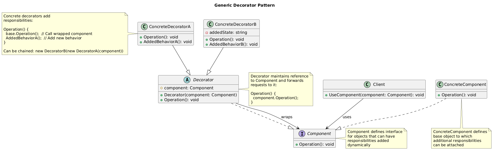

# Decorator Pattern Summary

## 📖 Overview
The Decorator pattern allows behavior to be added to objects dynamically without altering their structure by placing these objects inside special wrapper objects that contain the behaviors.

## 🎯 Purpose
- Add responsibilities to objects dynamically
- Provide flexible alternative to subclassing for extending functionality
- Wrap objects with additional behavior layers
- Compose behavior by stacking decorators

## 📋 Generic Implementation Guidelines

### Standard Structure
1. **Component Interface**
   ```csharp
   interface IComponent {
       string Operation();
   }
   ```

2. **Concrete Component**
   ```csharp
   class ConcreteComponent : IComponent {
       public string Operation() {
           return "ConcreteComponent";
       }
   }
   ```

3. **Base Decorator**
   ```csharp
   abstract class BaseDecorator : IComponent {
       protected IComponent component;
       
       public BaseDecorator(IComponent component) {
           this.component = component;
       }
       
       public virtual string Operation() {
           return component.Operation();
       }
   }
   ```

4. **Concrete Decorators**
   ```csharp
   class ConcreteDecoratorA : BaseDecorator {
       public ConcreteDecoratorA(IComponent component) : base(component) { }
       
       public override string Operation() {
           return $"DecoratorA({base.Operation()})";
       }
   }
   
   class ConcreteDecoratorB : BaseDecorator {
       public ConcreteDecoratorB(IComponent component) : base(component) { }
       
       public override string Operation() {
           return $"DecoratorB({base.Operation()})";
       }
       
       // Additional method specific to this decorator
       public string ExtraOperation() {
           return "Extra functionality from DecoratorB";
       }
   }
   ```

5. **Client Usage**
   ```csharp
   // Base component
   IComponent component = new ConcreteComponent();
   Console.WriteLine(component.Operation()); // "ConcreteComponent"
   
   // Add decorators
   component = new ConcreteDecoratorA(component);
   Console.WriteLine(component.Operation()); // "DecoratorA(ConcreteComponent)"
   
   component = new ConcreteDecoratorB(component);
   Console.WriteLine(component.Operation()); // "DecoratorB(DecoratorA(ConcreteComponent))"
   ```

### When to Use
- Want to add responsibilities to objects without subclassing
- Need to add functionality that can be withdrawn
- Extension by subclassing is impractical or impossible
- Want to compose behavior dynamically

## 🏗️ Implementation in PlayerMMO

### Key Components
- **IWeapon**: Base weapon interface for all weapons and decorators
- **BaseWeapon**: Simple weapon implementation
- **WeaponDecorator**: Abstract base decorator for weapon enhancements
- **Concrete Decorators**: Fire enhancement, ice enhancement, critical hit enhancement
- **Stacking system**: Multiple enhancements can be applied to same weapon

### Code Structure
```
PlayerMMO/Decorator/
├── ItemsDecorator/
│   ├── IWeapon.cs
│   ├── BaseWeapon.cs
│   ├── WeaponDecorator.cs
│   ├── FireEnhancement.cs
│   ├── IceEnhancement.cs
│   └── CriticalHitEnhancement.cs
├── Program.cs
└── Decorator.puml
```

## 🎮 Game Integration
- **BaseGame Classes Used**: IPlayer, IMonster
- **Game Context**: Weapon enhancement system for dynamic item upgrades
- **Demo Features**: Stackable enhancements, damage calculations, special effects

### Actual Implementation Mapping
| Generic Component | PlayerMMO Implementation | Purpose |
|------------------|-------------------------|---------|
| IComponent | IWeapon | Base weapon interface |
| ConcreteComponent | BaseWeapon | Simple weapon implementation |
| BaseDecorator | WeaponDecorator | Abstract weapon enhancement |
| ConcreteDecoratorA | FireEnhancement | Fire damage enhancement |
| ConcreteDecoratorB | IceEnhancement | Ice effect enhancement |
| | CriticalHitEnhancement | Critical hit enhancement |
| Operation() | Attack(), GetDamage() | Weapon operations |
| Client | Program.cs demo | Game using enhanced weapons |

### Real Usage Example
```csharp
// Start with basic weapon
IWeapon basicSword = new BaseWeapon("Iron Sword", 20);
Console.WriteLine($"{basicSword.GetName()}: {basicSword.GetDamage()} damage");
// Output: "Iron Sword: 20 damage"

// Add fire enhancement
IWeapon fireSword = new FireEnhancement(basicSword);
Console.WriteLine($"{fireSword.GetName()}: {fireSword.GetDamage()} damage");
// Output: "Iron Sword with Fire Enhancement: 25 damage"

// Stack ice enhancement on top of fire
IWeapon magicalSword = new IceEnhancement(fireSword);
Console.WriteLine($"{magicalSword.GetName()}: {magicalSword.GetDamage()} damage");
// Output: "Iron Sword with Fire Enhancement with Ice Enhancement: 32 damage"

// Add critical hit enhancement
IWeapon ultimateSword = new CriticalHitEnhancement(magicalSword);
Console.WriteLine($"{ultimateSword.GetName()}: {ultimateSword.GetDamage()} damage");
// Output: "Iron Sword with Fire Enhancement with Ice Enhancement with Critical Hit: 42 damage"

// Combat demonstration
var player = new BasePlayer("Hero");
var monster = new BaseMonster("Dragon", 5);

Console.WriteLine("\n=== Combat with Enhanced Weapon ===");
int damage = ultimateSword.Attack();
monster.Health -= damage;

Console.WriteLine($"Hero attacks Dragon with {ultimateSword.GetName()}");
Console.WriteLine($"Damage dealt: {damage}");
Console.WriteLine($"Dragon health remaining: {monster.Health}");

// Dynamic enhancement during gameplay
Console.WriteLine("\n=== Dynamic Enhancement ===");
IWeapon playerWeapon = new BaseWeapon("Steel Dagger", 15);

// Player finds fire gem
Console.WriteLine("Player finds Fire Gem!");
playerWeapon = new FireEnhancement(playerWeapon);
Console.WriteLine($"Weapon upgraded: {playerWeapon.GetName()}");

// Player completes ice dungeon
Console.WriteLine("Player completes Ice Dungeon!");
playerWeapon = new IceEnhancement(playerWeapon);
Console.WriteLine($"Weapon upgraded: {playerWeapon.GetName()}");

// Boss drops critical enhancement
Console.WriteLine("Boss drops Critical Enhancement!");
playerWeapon = new CriticalHitEnhancement(playerWeapon);
Console.WriteLine($"Final weapon: {playerWeapon.GetName()}");
Console.WriteLine($"Final damage: {playerWeapon.GetDamage()}");

// Benefits demonstrated:
// - Weapons can be enhanced dynamically during gameplay
// - Multiple enhancements stack naturally
// - Original weapon behavior is preserved
// - No need to create separate classes for every combination
// - Easy to add/remove enhancements
// - Flexible enhancement system supports any combination

// Collection of enhanced weapons
var weaponShop = new List<IWeapon> {
    new FireEnhancement(new BaseWeapon("Fire Sword", 25)),
    new IceEnhancement(new BaseWeapon("Ice Spear", 22)),
    new CriticalHitEnhancement(
        new FireEnhancement(
            new BaseWeapon("Legendary Blade", 30)
        )
    )
};

foreach (var weapon in weaponShop) {
    Console.WriteLine($"Shop: {weapon.GetName()} - {weapon.GetDamage()} damage");
}
```

## ✨ Key Benefits
- **Runtime Composition**: Add functionality at runtime
- **Single Responsibility**: Each decorator has one enhancement
- **Flexible Combination**: Stack decorators in any order
- **Open/Closed Principle**: Open for extension, closed for modification

## 🔧 Advanced Decorator Features
```csharp
// Decorator with conditional behavior
public class ConditionalFireEnhancement : WeaponDecorator {
    private readonly Func<bool> condition;
    
    public ConditionalFireEnhancement(IWeapon weapon, Func<bool> condition) 
        : base(weapon) {
        this.condition = condition;
    }
    
    public override int Attack() {
        int baseDamage = base.Attack();
        
        if (condition()) {
            Console.WriteLine("🔥 Fire enhancement activated!");
            return baseDamage + 10;
        }
        
        return baseDamage;
    }
}

// Usage: Fire only works in cold environments
var conditionalWeapon = new ConditionalFireEnhancement(
    basicSword, 
    () => CurrentEnvironment.Temperature < 0
);

// Decorator with state tracking
public class ChargeableEnhancement : WeaponDecorator {
    private int charges;
    private readonly int maxCharges;
    
    public ChargeableEnhancement(IWeapon weapon, int maxCharges) 
        : base(weapon) {
        this.maxCharges = maxCharges;
        this.charges = maxCharges;
    }
    
    public override int Attack() {
        int baseDamage = base.Attack();
        
        if (charges > 0) {
            charges--;
            Console.WriteLine($"⚡ Lightning strike! ({charges} charges left)");
            return baseDamage + 15;
        }
        
        return baseDamage;
    }
    
    public void Recharge() {
        charges = maxCharges;
        Console.WriteLine("🔋 Weapon recharged!");
    }
}

// Decorator with removal capability
public interface IRemovableDecorator {
    IWeapon RemoveDecorator();
}

public class RemovableFireEnhancement : WeaponDecorator, IRemovableDecorator {
    public RemovableFireEnhancement(IWeapon weapon) : base(weapon) { }
    
    public IWeapon RemoveDecorator() {
        return weapon; // Return the wrapped weapon
    }
    
    public override string GetName() {
        return $"{weapon.GetName()} [Removable Fire]";
    }
}

// Decorator composition helper
public static class WeaponEnhancer {
    public static IWeapon Enhance(IWeapon weapon, params Type[] enhancementTypes) {
        IWeapon enhanced = weapon;
        
        foreach (var type in enhancementTypes) {
            enhanced = (IWeapon)Activator.CreateInstance(type, enhanced);
        }
        
        return enhanced;
    }
}

// Usage
var autoEnhanced = WeaponEnhancer.Enhance(
    basicSword,
    typeof(FireEnhancement),
    typeof(IceEnhancement),
    typeof(CriticalHitEnhancement)
);
```

## 🔗 Related Patterns
- **Composite**: Both use recursive composition but for different purposes
- **Adapter**: Both wrap objects but for different reasons
- **Strategy**: Both provide alternatives but decorator adds behavior
- **Chain of Responsibility**: Similar structure but different intent

## 📊 UML Diagrams

### Generic Pattern Structure


### PlayerMMO Implementation


---
[← Back to Main Pattern Summary](./README.md)
