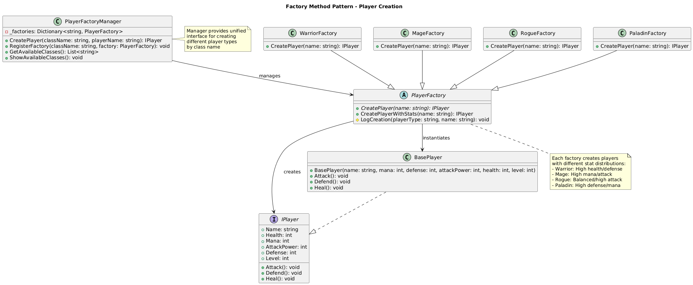

# Factory Method Pattern Summary

## 📖 Overview
The Factory Method pattern defines an interface for creating objects but lets subclasses decide which class to instantiate. It delegates object creation to subclasses while maintaining a common interface.

## 🎯 Purpose
- Delegate object creation to subclasses
- Eliminate the need to bind application-specific classes into code
- Provide a common interface for object creation
- Support the Open/Closed Principle for new product types

## 📋 Generic Implementation Guidelines

### Standard Structure
1. **Creator (Abstract Factory)**
   ```csharp
   abstract class Creator {
       public abstract IProduct FactoryMethod();
       
       public void SomeOperation() {
           var product = FactoryMethod();
           // Use product
       }
   }
   ```

2. **Concrete Creators**
   ```csharp
   class ConcreteCreatorA : Creator {
       public override IProduct FactoryMethod() {
           return new ConcreteProductA();
       }
   }
   
   class ConcreteCreatorB : Creator {
       public override IProduct FactoryMethod() {
           return new ConcreteProductB();
       }
   }
   ```

3. **Product Interface**
   ```csharp
   interface IProduct {
       void Operation();
   }
   ```

4. **Client Usage**
   ```csharp
   Creator creator = new ConcreteCreatorA();
   IProduct product = creator.FactoryMethod();
   product.Operation();
   ```

### When to Use
- Class can't anticipate the class of objects it must create
- Class wants its subclasses to specify the objects it creates
- Classes delegate responsibility to helper subclasses
- Need to localize knowledge of which helper subclass is delegate

## 🏗️ Implementation in PlayerMMO

### Key Components
- **PlayerFactory**: Abstract factory class
- **WarriorFactory, MageFactory, RogueFactory, PaladinFactory**: Concrete factories
- **PlayerFactoryManager**: Manager for factory registration and access
- **BasePlayer**: Product being created

### Code Structure
```
PlayerMMO/Factory/
├── Pattern/
│   ├── PlayerFactory.cs
│   ├── WarriorFactory.cs
│   ├── MageFactory.cs
│   ├── RogueFactory.cs
│   ├── PaladinFactory.cs
│   └── PlayerFactoryManager.cs
├── Program.cs
└── factory_method.puml
```

## 🎮 Game Integration
- **BaseGame Classes Used**: IPlayer, BasePlayer
- **Game Context**: Creating different player class types with unique stat distributions
- **Demo Features**: Multiple player classes, factory registration, dynamic creation

### Actual Implementation Mapping
| Generic Component | PlayerMMO Implementation | Purpose |
|------------------|-------------------------|---------|
| Creator | PlayerFactory | Abstract player factory |
| ConcreteCreatorA | WarriorFactory | Creates warrior players |
| ConcreteCreatorB | MageFactory | Creates mage players |
| ConcreteCreatorC | RogueFactory | Creates rogue players |
| ConcreteCreatorD | PaladinFactory | Creates paladin players |
| IProduct | IPlayer | Player interface |
| ConcreteProduct | BasePlayer | Concrete player implementation |
| Client | PlayerFactoryManager | Manages and uses factories |

### Real Usage Example
```csharp
// Register factories
var manager = new PlayerFactoryManager();
manager.RegisterFactory("Warrior", new WarriorFactory());
manager.RegisterFactory("Mage", new MageFactory());
manager.RegisterFactory("Rogue", new RogueFactory());
manager.RegisterFactory("Paladin", new PaladinFactory());

// Create players by class name
var warrior = manager.CreatePlayer("Warrior", "Conan");     // High health/defense
var mage = manager.CreatePlayer("Mage", "Gandalf");         // High mana/attack
var rogue = manager.CreatePlayer("Rogue", "Ezio");          // Balanced/high attack
var paladin = manager.CreatePlayer("Paladin", "Arthur");    // High defense/mana

// Each factory creates players with different stat distributions
// Warrior: Health: 200, Mana: 50, Attack: 25, Defense: 20
// Mage: Health: 100, Mana: 200, Attack: 30, Defense: 10
// Rogue: Health: 150, Mana: 100, Attack: 35, Defense: 15
// Paladin: Health: 180, Mana: 120, Attack: 20, Defense: 25
```

## ✨ Key Benefits
- **Extensibility**: Easy to add new player classes
- **Encapsulation**: Each factory encapsulates creation logic
- **Polymorphism**: Client works with abstract factory interface
- **Single Responsibility**: Each factory responsible for one player type

## 🔗 Related Patterns
- **Abstract Factory**: Uses multiple Factory Methods
- **Template Method**: Factory Method is often called within Template Methods
- **Prototype**: Alternative to Factory Method for object creation

## 📊 UML Diagrams

### Generic Pattern Structure


### PlayerMMO Implementation


---
[← Back to Main Pattern Summary](./README.md)
