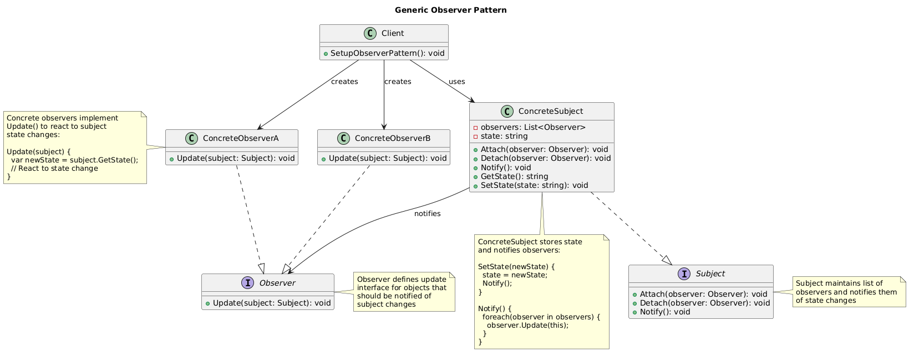

# Observer Pattern Summary

## 📖 Overview
The Observer pattern defines a one-to-many dependency between objects so that when one object changes state, all its dependents are notified and updated automatically.

## 🎯 Purpose
- Establish one-to-many dependency between objects
- Notify multiple objects automatically of state changes
- Maintain loose coupling between subject and observers
- Support broadcast communication

## 📋 Generic Implementation Guidelines

### Standard Structure
1. **Subject Interface**
   ```csharp
   interface ISubject {
       void Attach(IObserver observer);
       void Detach(IObserver observer);
       void Notify();
   }
   ```

2. **Observer Interface**
   ```csharp
   interface IObserver {
       void Update(ISubject subject);
   }
   ```

3. **Concrete Subject**
   ```csharp
   class ConcreteSubject : ISubject {
       private List<IObserver> observers = new List<IObserver>();
       private string state;
       
       public void Attach(IObserver observer) {
           observers.Add(observer);
       }
       
       public void Detach(IObserver observer) {
           observers.Remove(observer);
       }
       
       public void Notify() {
           foreach (var observer in observers) {
               observer.Update(this);
           }
       }
       
       public string GetState() => state;
       
       public void SetState(string newState) {
           state = newState;
           Notify(); // Automatically notify observers
       }
   }
   ```

4. **Concrete Observer**
   ```csharp
   class ConcreteObserver : IObserver {
       private string observerState;
       
       public void Update(ISubject subject) {
           if (subject is ConcreteSubject concreteSubject) {
               observerState = concreteSubject.GetState();
               // React to state change
               Console.WriteLine($"Observer updated with state: {observerState}");
           }
       }
   }
   ```

5. **Client Usage**
   ```csharp
   var subject = new ConcreteSubject();
   var observer1 = new ConcreteObserver();
   var observer2 = new ConcreteObserver();
   
   subject.Attach(observer1);
   subject.Attach(observer2);
   
   subject.SetState("New State"); // Both observers notified
   ```

### When to Use
- Need to notify multiple objects of state changes
- Want loose coupling between subject and observers
- Number of observers varies and is determined at runtime
- Need to broadcast changes to interested parties

## 🏗️ Implementation in PlayerMMO

### Key Components
- **ISubject**: Subject interface for observable objects
- **IObserver**: Observer interface for notification recipients
- **GameEventManager**: Concrete subject managing game events
- **PlayerObserver, ScoreObserver, InventoryObserver**: Concrete observers
- **Game events**: Level completion, player death, item pickup, etc.

### Code Structure
```
PlayerMMO/Observer/
├── Pattern/
│   ├── ISubject.cs
│   ├── IObserver.cs
│   ├── GameEventManager.cs
│   ├── PlayerObserver.cs
│   ├── ScoreObserver.cs
│   └── InventoryObserver.cs
├── Program.cs
└── observer.puml
```

## 🎮 Game Integration
- **BaseGame Classes Used**: IPlayer, IMonster
- **Game Context**: Event system for game state changes and notifications
- **Demo Features**: Player events, score tracking, inventory updates, achievement system

### Actual Implementation Mapping
| Generic Component | PlayerMMO Implementation | Purpose |
|------------------|-------------------------|---------|
| ISubject | ISubject | Game event subject interface |
| IObserver | IObserver | Game event observer interface |
| ConcreteSubject | GameEventManager | Central event manager |
| ConcreteObserver | PlayerObserver | Tracks player state changes |
| | ScoreObserver | Monitors score and achievements |
| | InventoryObserver | Watches item collection |
| State | GameEvent data | Event information and context |
| Client | Program.cs demo | Sets up event system |

### Real Usage Example
```csharp
// Create event manager (subject)
var eventManager = new GameEventManager();

// Create observers for different aspects
var playerObserver = new PlayerObserver();      // Health, level changes
var scoreObserver = new ScoreObserver();        // Points, achievements  
var inventoryObserver = new InventoryObserver(); // Item collection

// Register observers
eventManager.Attach(playerObserver);
eventManager.Attach(scoreObserver);
eventManager.Attach(inventoryObserver);

// Game events automatically notify all observers
eventManager.PlayerLevelUp(player, 2);    // All observers notified
// PlayerObserver: "Player Hero reached level 2!"
// ScoreObserver: "Achievement unlocked: Level Up!"
// InventoryObserver: "New items available at level 2"

eventManager.PlayerDied(player, monster);  // Death notifications
// PlayerObserver: "Hero has fallen in battle!"
// ScoreObserver: "Game Over - Final Score: 150 points"
// InventoryObserver: "Items dropped upon death"

eventManager.ItemCollected(player, "Magic Sword"); // Item events
// PlayerObserver: "Hero's attack power increased!"
// ScoreObserver: "10 points awarded for rare item"
// InventoryObserver: "Magic Sword added to inventory"

// Dynamic observer management
eventManager.Detach(inventoryObserver);     // Stop inventory tracking
eventManager.MonsterDefeated(player, monster); // Only player and score observers notified

// Observer benefits:
// - Automatic UI updates when game state changes
// - Achievement system triggered by player actions
// - Logging system that tracks all events
// - Statistics collection without modifying core game logic
```

## ✨ Key Benefits
- **Loose Coupling**: Subject doesn't know concrete observer types
- **Dynamic Relationships**: Observers can be added/removed at runtime
- **Broadcast Communication**: One event notifies multiple systems
- **Separation of Concerns**: Event handling separated from core logic

## 🔧 Event System Features
```csharp
// Game event types
public enum GameEventType {
    PlayerLevelUp,
    PlayerDied,
    MonsterDefeated,
    ItemCollected,
    LevelCompleted,
    AchievementUnlocked
}

// Rich event data
public class GameEvent {
    public GameEventType Type { get; set; }
    public IPlayer Player { get; set; }
    public IMonster Monster { get; set; }
    public string ItemName { get; set; }
    public int Points { get; set; }
    public DateTime Timestamp { get; set; }
}

// Filtered observers (only interested in specific events)
public class BossDefeatObserver : IObserver {
    public void Update(ISubject subject) {
        if (subject is GameEventManager manager) {
            var lastEvent = manager.GetLastEvent();
            if (lastEvent.Type == GameEventType.MonsterDefeated && 
                lastEvent.Monster.Level >= 5) {
                // Special handling for boss defeats
                Console.WriteLine("🏆 BOSS DEFEATED! Epic victory!");
            }
        }
    }
}
```

## 🔗 Related Patterns
- **Mediator**: Both manage object communication but differently
- **Singleton**: Subject often implemented as singleton
- **Command**: Commands can be used as event notifications

## 📊 UML Diagrams

### Generic Pattern Structure


### PlayerMMO Implementation


---
[← Back to Main Pattern Summary](./README.md)
