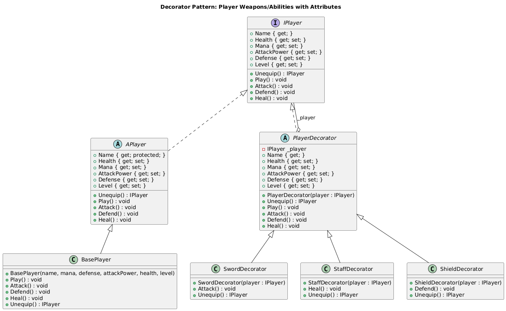

# Structural Patterns Summary

*← [Back to All Patterns](README.md) | [PlayerMMO Overview](../README.md)*

---

## 🏛️ Structural Patterns Overview

Structural patterns deal with object composition, creating relationships between objects to form larger structures. In the PlayerMMO context, these patterns handle legacy system integration, hierarchical game structures, dynamic enhancements, and system coordination.

---

## 🎯 Pattern Index

### [Adapter Pattern](Adapter.md)


**Purpose**: Make incompatible interfaces work together  
**Game Context**: Integrate legacy weapon systems with modern game engines  
**Key Benefit**: Seamless integration of existing code with new systems

**When to Use**: When you need to use existing classes with incompatible interfaces  
**PlayerMMO Example**: Legacy weapon data adapted to new weapon interface

---

### [Composite Pattern](Composite.md)


**Purpose**: Compose objects into tree structures for part-whole hierarchies  
**Game Context**: Build hierarchical game structures like inventories and party formations  
**Key Benefit**: Uniform treatment of individual objects and compositions

**When to Use**: When you need to represent part-whole hierarchies  
**PlayerMMO Example**: Nested inventory containers and party group structures

---

### [Decorator Pattern](Decorator.md)


**Purpose**: Add behavior to objects dynamically without altering structure  
**Game Context**: Enhance weapons and items with stackable upgrades  
**Key Benefit**: Flexible enhancement system without subclass explosion

**When to Use**: When you need to add responsibilities to objects dynamically  
**PlayerMMO Example**: Fire, ice, and critical hit enhancements on weapons

---

### [Facade Pattern](Facade.md)


**Purpose**: Provide simplified interface to complex subsystem  
**Game Context**: Coordinate multiple game engines through unified interface  
**Key Benefit**: Hide complexity and provide easy-to-use API

**When to Use**: When you want to provide simple interface to complex subsystem  
**PlayerMMO Example**: Game operations that coordinate audio, graphics, and input systems

---

### [Proxy Pattern](Proxy.md)


**Purpose**: Provide placeholder or surrogate to control access to another object  
**Game Context**: Manage game resource loading with caching and access control  
**Key Benefit**: Lazy loading, caching, and access control without changing client code

**When to Use**: When you need to control access to objects or add behavior transparently  
**PlayerMMO Example**: Game asset loading with permission checks and caching

---

## 🔧 Structural Pattern Relationships

```
Adapter ──────── Often used with Facade to integrate legacy systems
   │
Facade ────────── Can use Adapter internally for subsystem integration
   │
   ├─── May use Proxy for subsystem access control
   │
Proxy ─────────── Can wrap objects enhanced by Decorator
   │
Decorator ──────── Can be applied to Composite components
   │
Composite ──────── Individual components may be Adapters or Proxies
```

## 🎮 Game Development Applications

### System Integration
- **Adapter**: Legacy code integration and interface compatibility
- **Facade**: Simplified game engine coordination and API design

### Dynamic Enhancement
- **Decorator**: Runtime item and character enhancement systems
- **Proxy**: Resource management and access control

### Hierarchical Structures
- **Composite**: Game world organization, inventory systems, party management

### PlayerMMO Implementation Benefits
- **Legacy Support**: Adapter enables reuse of existing game assets and code
- **Resource Efficiency**: Proxy provides lazy loading and caching for game assets
- **Flexible Enhancement**: Decorator allows unlimited item enhancement combinations
- **System Coordination**: Facade simplifies complex game engine interactions
- **Hierarchical Management**: Composite enables complex game structure organization

## 📚 Learning Path

**Start Here**: [Adapter](Adapter.md) - Clear interface compatibility concept  
**Then**: [Facade](Facade.md) - System simplification and coordination  
**Next**: [Decorator](Decorator.md) - Dynamic behavior enhancement  
**Continue**: [Composite](Composite.md) - Hierarchical structure management  
**Finally**: [Proxy](Proxy.md) - Advanced access control and resource management

---

## 🔗 Integration with Other Patterns

- **Creational Patterns**: Factories often create objects that participate in structural patterns
- **Behavioral Patterns**: Structural patterns provide the foundation for behavioral pattern interactions
- **Cross-Pattern**: Structural patterns frequently work together (Facade + Adapter, Composite + Decorator)

---

## 🛠️ Common Structural Pattern Combinations

### Game Engine Architecture
```csharp
// Facade coordinates multiple adapted subsystems
var gameEngine = new GameFacade(
    new AudioAdapter(legacyAudioSystem),    // Adapter
    new GraphicsProxy(expensiveRenderer),   // Proxy
    new InputSystem()
);

// Enhanced game objects in composite structures
var enhancedWeapon = new CriticalHitDecorator(   // Decorator
    new FireDecorator(                            // Decorator
        new BasicWeapon("Sword")                  // Base component
    )
);

var inventory = new InventoryComposite();         // Composite
inventory.Add(enhancedWeapon);                   // Add decorated item
```

### Resource Management System
```csharp
// Proxy controls access to expensive resources
var resourceProxy = new GameResourceProxy(expensiveResource);

// Adapter makes legacy resources compatible  
var adaptedResource = new ResourceAdapter(legacyResource);

// Facade provides simple interface to complex resource management
var resourceManager = new ResourceFacade(
    resourceProxy,
    adaptedResource,
    cachingSystem,
    permissionSystem
);
```

---

*Structural patterns are essential for building maintainable, scalable game architectures. They enable you to integrate diverse systems, manage complexity, and create flexible enhancement systems.*

[← Back to All Patterns](README.md) | [PlayerMMO Overview](../README.md)
