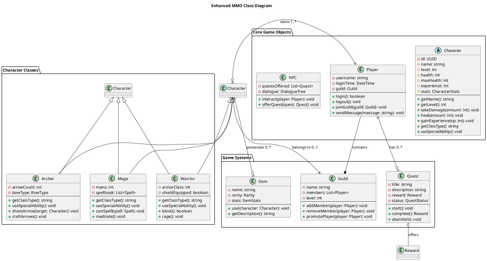
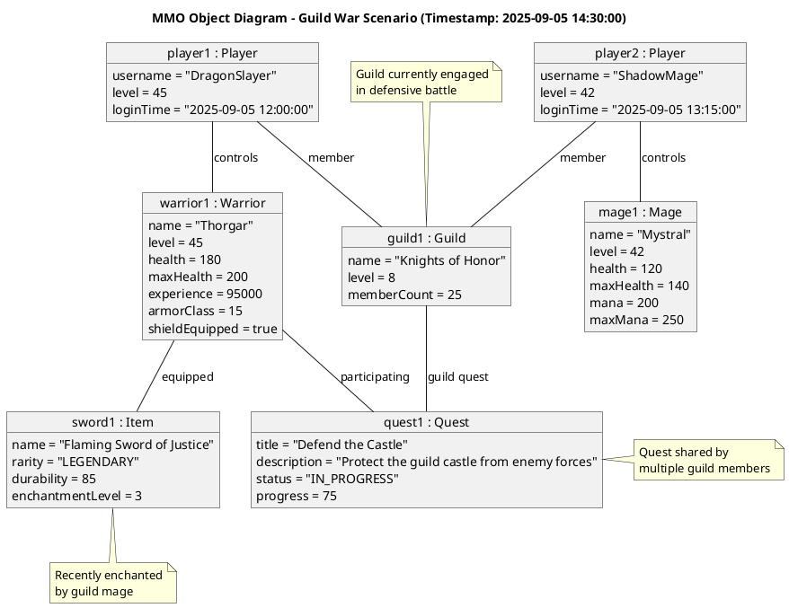
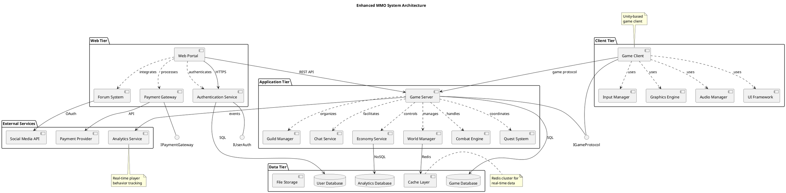
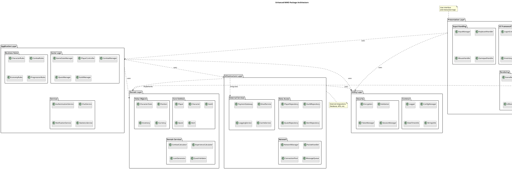
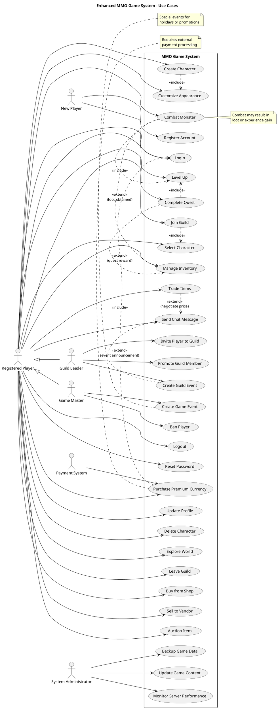
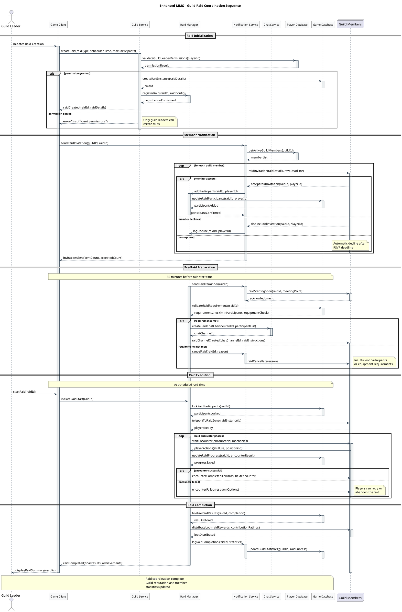

# 📊 Comprehensive UML Modeling Guide

> **Complete guide to software modeling with UML diagrams - From fundamentals to advanced techniques**

This comprehensive guide covers all essential UML diagram types with practical examples, best practices, and real-world applications. Each diagram type is demonstrated through a consistent MMO (Massively Multiplayer Online) game context to show practical software modeling scenarios.

---

## 🎯 UML Modeling Overview

### What is UML?
**Unified Modeling Language (UML)** is a standardized visual modeling language used to specify, visualize, construct, and document software systems. UML provides a comprehensive set of diagrams for different aspects of system design and behavior.

### Why Use UML?
- **🎨 Visual Communication**: Complex systems become easier to understand through diagrams
- **📋 Documentation**: Standardized way to document system architecture and behavior
- **🔧 Design Validation**: Identify design issues before implementation
- **👥 Team Collaboration**: Common language for developers, architects, and stakeholders
- **📈 System Analysis**: Better understanding of requirements and system interactions

### UML Diagram Categories

| Category | Focus | Diagrams Covered |
|----------|-------|------------------|
| **📐 Static (Structural)** | System structure and organization | Class, Object, Component, Deployment, Package |
| **🔄 Dynamic (Behavioral)** | System behavior and interactions | Use Case, Activity, Sequence, State, Timing |

---

## 📐 Static (Structural) Diagrams

Static diagrams model the structure of a system, showing the static aspects like classes, objects, components, and their relationships.

### 1. 🏗️ Class Diagram
**Purpose**: Models the static structure of classes, their attributes, methods, and relationships  
**Primary Use Cases**: 
- Object-oriented design and architecture
- Database schema design
- API interface documentation
- Design pattern implementation


#### Key Elements
- **Classes**: Rectangles with name, attributes, and methods
- **Relationships**: Inheritance, association, aggregation, composition
- **Multiplicity**: Cardinality of relationships (1..*, 0..1, etc.)
- **Visibility**: Public (+), Private (-), Protected (#), Package (~)

#### Best Practices
- **Keep it focused**: Don't include every class in one diagram
- **Show key relationships**: Focus on important associations and inheritance
- **Use consistent naming**: Follow naming conventions for clarity
- **Group related classes**: Use packages or separate diagrams for cohesion

<details>
<summary>📄 Enhanced PlantUML Example</summary>



</details>

---

### 2. 🎯 Object Diagram
**Purpose**: Shows instances of classes and their relationships at a specific point in time  
**Primary Use Cases**:
- Debugging and testing scenarios
- Example system states
- Configuration documentation
- Runtime system snapshots


#### Key Elements
- **Objects**: Instances with actual values
- **Links**: Actual relationships between objects
- **State Information**: Specific attribute values at a point in time

#### Best Practices
- **Show realistic scenarios**: Use actual data that represents real system states
- **Focus on key relationships**: Don't overcomplicate with every possible link
- **Document timing**: Specify when this object state exists
- **Use for validation**: Verify that class design supports required scenarios

<details>
<summary>📄 Enhanced PlantUML Example</summary>



</details>

---

### 3. 🧩 Component Diagram
**Purpose**: Illustrates the organization and dependencies among software components  
**Primary Use Cases**:
- System architecture design
- Microservices architecture
- Module dependency analysis
- Deployment planning


#### Key Elements
- **Components**: Modular parts of the system
- **Interfaces**: Provided and required interfaces
- **Dependencies**: How components rely on each other
- **Ports**: Connection points for communication

#### Best Practices
- **Show logical grouping**: Group related components into packages
- **Minimize dependencies**: Reduce coupling between components
- **Define clear interfaces**: Specify what each component provides/requires
- **Consider scalability**: Design for future growth and changes

<details>
<summary>📄 Enhanced PlantUML Example</summary>



</details>

---

### 4. 🌐 Deployment Diagram
**Purpose**: Shows the physical deployment of artifacts on nodes (hardware/software)  
**Primary Use Cases**:
- Infrastructure planning
- Cloud architecture design
- Performance optimization
- Security architecture


#### Key Elements
- **Nodes**: Physical or virtual machines
- **Artifacts**: Deployable software components
- **Communication**: Network connections and protocols
- **Execution Environment**: Runtime platforms (OS, containers, etc.)

#### Best Practices
- **Show actual infrastructure**: Represent real deployment scenarios
- **Include protocols**: Specify communication methods (HTTP, TCP, etc.)
- **Consider scalability**: Show load balancing and clustering
- **Document constraints**: Include hardware/software requirements

<details>
<summary>📄 Enhanced PlantUML Example</summary>

```plantuml
@startuml Enhanced_MMO_Deployment_Diagram
title Enhanced MMO Production Deployment Architecture

node "Player Devices" {
    artifact "Game Client.exe" as ClientApp
    artifact "Launcher.exe" as Launcher
    node "Windows/Mac/Linux" as PlayerOS
    
    PlayerOS : CPU: Various
    PlayerOS : RAM: 4GB+ 
    PlayerOS : GPU: DirectX 11+
    
    ClientApp ..> PlayerOS : runs on
    Launcher ..> PlayerOS : runs on
}

cloud "Content Delivery Network" {
    artifact "Game Assets" as CDN
    artifact "Client Updates" as Updates
    CDN : Provider: CloudFlare
    CDN : Regions: Global
}

node "Load Balancer Cluster" {
    artifact "NGINX" as LB1
    artifact "NGINX" as LB2
    LB1 : Mode: Active
    LB2 : Mode: Standby
}

cloud "Web Server Cluster" {
    node "Web Server 1" {
        artifact "Portal.war" as Portal1
        artifact "Auth Service" as Auth1
        node "Apache Tomcat" as Tomcat1
        
        Portal1 ..> Tomcat1 : deployed on
        Auth1 ..> Tomcat1 : deployed on
    }
    
    node "Web Server 2" {
        artifact "Portal.war" as Portal2
        artifact "Auth Service" as Auth2
        node "Apache Tomcat" as Tomcat2
        
        Portal2 ..> Tomcat2 : deployed on
        Auth2 ..> Tomcat2 : deployed on
    }
}

cloud "Game Server Cluster" {
    node "Game Server 1" {
        artifact "GameServer.jar" as GS1
        artifact "World Manager" as World1
        node "JVM 17" as JVM1
        node "Ubuntu 22.04" as OS1
        
        GS1 : Max Players: 1000
        GS1 : World Region: North
        OS1 : CPU: 16 cores
        OS1 : RAM: 32GB
        
        GS1 ..> JVM1 : runs on
        World1 ..> JVM1 : runs on
        JVM1 ..> OS1 : runs on
    }
    
    node "Game Server 2" {
        artifact "GameServer.jar" as GS2
        artifact "World Manager" as World2
        node "JVM 17" as JVM2
        node "Ubuntu 22.04" as OS2
        
        GS2 : Max Players: 1000
        GS2 : World Region: South
        OS2 : CPU: 16 cores
        OS2 : RAM: 32GB
        
        GS2 ..> JVM2 : runs on
        World2 ..> JVM2 : runs on
        JVM2 ..> OS2 : runs on
    }
}

cloud "Database Cluster" {
    node "Primary DB Server" {
        artifact "PostgreSQL 15" as PrimaryDB
        node "Ubuntu Server" as DBServer1
        
        PrimaryDB : Mode: Master
        PrimaryDB : Storage: 2TB SSD
        DBServer1 : CPU: 8 cores
        DBServer1 : RAM: 64GB
        
        PrimaryDB ..> DBServer1 : runs on
    }
    
    node "Replica DB Server" {
        artifact "PostgreSQL 15" as ReplicaDB
        node "Ubuntu Server" as DBServer2
        
        ReplicaDB : Mode: Read Replica
        ReplicaDB : Storage: 2TB SSD
        DBServer2 : CPU: 8 cores
        DBServer2 : RAM: 64GB
        
        ReplicaDB ..> DBServer2 : runs on
    }
}

node "Cache Cluster" {
    artifact "Redis Cluster" as Redis
    Redis : Nodes: 6
    Redis : Replication: 3x
    Redis : Memory: 96GB total
}

node "Monitoring & Analytics" {
    artifact "Grafana" as Monitor
    artifact "Elasticsearch" as Logs
    artifact "Analytics Engine" as Analytics
}

' Network connections with protocols
ClientApp =[#blue]=> CDN : HTTPS/443
ClientApp =[#green]=> LB1 : TCP/7777\n(Game Protocol)
Launcher =[#blue]=> CDN : HTTPS/443

LB1 =[#blue]=> Portal1 : HTTP/8080
LB1 =[#blue]=> Portal2 : HTTP/8080
LB1 =[#green]=> GS1 : TCP/7777
LB1 =[#green]=> GS2 : TCP/7777

Portal1 =[#red]=> PrimaryDB : TCP/5432
Portal2 =[#red]=> ReplicaDB : TCP/5432
GS1 =[#red]=> PrimaryDB : TCP/5432
GS2 =[#red]=> PrimaryDB : TCP/5432

GS1 =[#orange]=> Redis : TCP/6379
GS2 =[#orange]=> Redis : TCP/6379

PrimaryDB =[#purple]=> ReplicaDB : TCP/5432\n(Replication)

GS1 =[#gray]=> Monitor : HTTP/3000
GS2 =[#gray]=> Monitor : HTTP/3000

note top of CDN : Global asset distribution\nfor fast downloads
note right of "Game Server Cluster" : Auto-scaling based\non player load
note bottom of "Database Cluster" : Master-slave replication\nwith automatic failover

@enduml
```

</details>

---

### 5. 📦 Package Diagram
**Purpose**: Shows how classes and interfaces are grouped into packages and their dependencies  
**Primary Use Cases**:
- Modular design visualization
- Dependency management
- Architecture layering
- Code organization


#### Key Elements
- **Packages**: Logical groupings of related classes
- **Dependencies**: How packages depend on each other
- **Visibility**: Public vs private package elements
- **Layering**: Architectural layers and their relationships

#### Best Practices
- **Minimize dependencies**: Reduce coupling between packages
- **Avoid circular dependencies**: Design clear dependency hierarchies
- **Group by functionality**: Package related classes together
- **Define clear interfaces**: Specify package boundaries

<details>
<summary>📄 Enhanced PlantUML Example</summary>



</details>

---

## 🔄 Dynamic (Behavioral) Diagrams

Dynamic diagrams model the behavior of a system, showing how objects interact over time and how the system responds to events.

### 1. 👤 Use Case Diagram
**Purpose**: Represents the functional requirements of a system from a user's perspective  
**Primary Use Cases**:
- Requirements gathering and analysis
- Stakeholder communication
- System scope definition
- Testing scenario identification


#### Key Elements
- **Actors**: Users or external systems
- **Use Cases**: System functionality
- **Relationships**: Include, extend, generalization
- **System Boundary**: What's inside vs outside the system

#### Best Practices
- **Focus on user goals**: Use cases should represent user objectives
- **Keep it simple**: Don't include implementation details
- **Show key relationships**: Include/extend where meaningful
- **Define clear boundaries**: Specify what's in scope

<details>
<summary>📄 Enhanced PlantUML Example</summary>



</details>

---

### 2. 🔄 Activity Diagram
**Purpose**: Models the workflow of a system or process, showing the flow of activities  
**Primary Use Cases**:
- Business process modeling
- Algorithm design
- Workflow documentation
- System behavior analysis


#### Key Elements
- **Activities**: Steps in the process
- **Decisions**: Branch points with conditions
- **Parallel Activities**: Concurrent execution
- **Swimlanes**: Responsible parties/systems

#### Best Practices
- **Show clear flow**: Use arrows to indicate sequence
- **Handle all conditions**: Include all decision branches
- **Use swimlanes**: Clarify responsibilities
- **Keep it focused**: Don't try to show everything in one diagram

<details>
<summary>📄 Enhanced PlantUML Example</summary>

```plantuml
@startuml Enhanced_MMO_Activity_Diagram
title Enhanced MMO Player Journey - Complete Game Session

|#lightblue|Player|
start
:Launch Game;
:Enter Credentials;

if (Authentication Successful?) then (yes)
    |#lightgreen|Authentication Service|
    :Validate User;
    :Load Player Data;
    
    |Player|
    :Select Character;
    
    |#lightyellow|Game Server|
    :Load Character Data;
    :Initialize World State;
    
    |Player|
    partition "Main Game Loop" {
        repeat
            :Choose Activity;
            
            switch (Activity Type?)
            case (Exploration)
                |#lightcoral|World Manager|
                :Generate Random Encounter;
                
                if (Monster Encountered?) then (yes)
                    |Player|
                    :Choose Combat Action;
                    
                    switch (Combat Action?)
                    case (Attack)
                        |#lightpink|Combat Engine|
                        :Calculate Damage;
                        :Apply Damage;
                        
                        if (Monster Defeated?) then (yes)
                            |#lightgreen|Loot System|
                            :Generate Loot;
                            :Award Experience;
                            
                            |Player|
                            if (Level Up?) then (yes)
                                :Allocate Skill Points;
                                :Update Character Stats;
                            endif
                        else (no)
                            if (Player Defeated?) then (yes)
                                :Respawn at Safe Location;
                                :Apply Death Penalty;
                            endif
                        endif
                        
                    case (Defend)
                        |Combat Engine|
                        :Calculate Defense;
                        :Reduce Damage Taken;
                        
                    case (Use Skill)
                        |Combat Engine|
                        :Validate Skill Requirements;
                        :Apply Skill Effects;
                        :Update Cooldowns;
                        
                    case (Flee)
                        |Combat Engine|
                        :Calculate Escape Chance;
                        if (Escape Successful?) then (yes)
                            :Return to Exploration;
                        else (no)
                            :Take Damage;
                        endif
                    endswitch
                    
                else (no)
                    |Player|
                    :Continue Exploring;
                    :Discover Location/Item;
                endif
                
            case (Quest Management)
                |#lightsalmon|Quest System|
                :Display Available Quests;
                
                |Player|
                if (Accept Quest?) then (yes)
                    |Quest System|
                    :Add Quest to Journal;
                    :Set Quest Objectives;
                    
                    |Player|
                    :Work on Quest Objectives;
                    
                    if (Quest Completed?) then (yes)
                        |Quest System|
                        :Validate Completion;
                        :Award Rewards;
                        :Update Quest Status;
                    endif
                endif
                
            case (Social Interaction)
                |#lightsteelblue|Chat Service|
                :Join Chat Channel;
                
                |Player|
                :Send Messages;
                
                if (Guild Invitation?) then (yes)
                    |#mediumpurple|Guild System|
                    :Process Guild Invitation;
                    
                    |Player|
                    if (Accept Invitation?) then (yes)
                        |Guild System|
                        :Add Player to Guild;
                        :Update Guild Roster;
                        :Grant Guild Benefits;
                    endif
                endif
                
            case (Trading)
                |#lightcyan|Economy System|
                :Open Trading Interface;
                
                |Player|
                :Select Items to Trade;
                :Set Trade Terms;
                
                if (Trade Partner Found?) then (yes)
                    |Economy System|
                    :Validate Trade Items;
                    :Execute Trade;
                    :Update Inventories;
                    :Log Transaction;
                endif
                
            case (Character Management)
                |Player|
                :Open Character Screen;
                :Manage Equipment;
                :Allocate Skill Points;
                :Review Statistics;
                
            endswitch
            
        repeat while (Continue Playing?) is (yes)
        
        -> no;
    }
    
    |Player|
    :Save Game Progress;
    
    |Game Server|
    :Persist Character Data;
    :Update Statistics;
    :Log Session Data;
    
else (no)
    |Authentication Service|
    :Log Failed Attempt;
    :Display Error Message;
    stop
endif

|Player|
:Logout;
stop

note right of "Combat Engine" : Advanced combat system with\nmultiple mechanics and strategies
note bottom of "Quest System" : Dynamic quest generation\nand progress tracking
note top of "Guild System" : Social features enabling\nplayer cooperation

@enduml
```

</details>

---

### 3. 📞 Sequence Diagram
**Purpose**: Shows how objects interact in a particular sequence over time  
**Primary Use Cases**:
- API design and documentation
- Interaction modeling between system components
- Protocol definition
- Debugging system interactions


#### Key Elements
- **Lifelines**: Objects participating in the interaction
- **Messages**: Communications between objects
- **Activation**: When objects are actively processing
- **Time Ordering**: Vertical arrangement shows sequence

#### Best Practices
- **Focus on key interactions**: Don't show every possible message
- **Use consistent naming**: Clear, descriptive message names
- **Show return values**: Include important return messages
- **Group related interactions**: Use frames for complex scenarios

<details>
<summary>📄 Enhanced PlantUML Example</summary>



</details>

---

### 4. 🔄 State Diagram
**Purpose**: Describes the states and transitions of an object throughout its lifecycle  
**Primary Use Cases**:
- Finite state machine design
- Object lifecycle modeling
- Behavior specification
- System state management


#### Key Elements
- **States**: Conditions or situations of an object
- **Transitions**: Changes between states
- **Events**: Triggers that cause transitions
- **Guards**: Conditions that must be true for transitions

#### Best Practices
- **Identify key states**: Focus on meaningful object conditions
- **Define clear transitions**: Specify what triggers state changes
- **Handle all events**: Include transitions for all possible events
- **Use guards wisely**: Add conditions only when necessary

<details>
<summary>📄 Enhanced PlantUML Example</summary>

```plantuml
@startuml Enhanced_MMO_Character_State_Diagram
title Enhanced MMO Character State Machine

[*] --> Offline : Character Created

state Offline {
    [*] --> Disconnected
    Disconnected : Character exists but\nplayer is not logged in
    Disconnected : - Data persisted in database
    Disconnected : - No active game session
    
    Disconnected --> [*] : Character Deleted
}

Offline --> LoginScreen : Player Logs In
LoginScreen : Authenticating player credentials
LoginScreen : and loading character data

LoginScreen --> Offline : Login Failed
LoginScreen --> CharacterSelect : Login Successful

state CharacterSelect {
    [*] --> SelectingCharacter
    SelectingCharacter : Player choosing from\navailable characters
    SelectingCharacter --> CreatingCharacter : Create New Character
    CreatingCharacter : Customizing appearance\nand initial attributes
    CreatingCharacter --> SelectingCharacter : Character Created
}

CharacterSelect --> InGame : Character Selected

state InGame {
    [*] --> Spawning
    
    Spawning : Loading world data and\nplacing character in world
    Spawning --> Idle : Spawn Complete
    
    state Active {
        [*] --> Idle
        
        Idle : Character standing still\nwaiting for player input
        Idle : - Health/Mana regenerating
        Idle : - Can receive messages
        
        Idle --> Moving : Move Command
        Idle --> Casting : Cast Spell
        Idle --> Attacking : Attack Command
        Idle --> Trading : Open Trade
        Idle --> Crafting : Start Crafting
        
        Moving : Character traveling\nthrough the world
        Moving : - Position updating
        Moving : - Triggering area events
        Moving --> Idle : Stop Moving
        Moving --> Combat : Encounter Enemy
        
        Casting : Performing spell or skill
        Casting : - Mana consumption
        Casting : - Animation playing
        Casting --> Idle : Spell Complete
        Casting --> Interrupted : Damage Taken / Cancel
        
        Attacking : Engaging in combat
        Attacking : - Damage calculations
        Attacking : - Animation sequences
        Attacking --> Combat : Enter Combat Mode
        
        Trading : Exchanging items with\nother players or NPCs
        Trading : - Item validation
        Trading : - Economic transactions
        Trading --> Idle : Trade Complete
        Trading --> Idle : Trade Cancelled
        
        Crafting : Creating items from\nraw materials
        Crafting : - Resource consumption
        Crafting : - Skill checks
        Crafting --> Idle : Crafting Complete
        Crafting --> Idle : Crafting Failed
        
        Interrupted : Spell/action cancelled
        Interrupted --> Idle : Recovery Complete
    }
    
    state Combat {
        [*] --> Engaging
        
        Engaging : Initiating combat with\nenemy or other player
        Engaging --> Fighting : Combat Started
        
        Fighting : Active combat state
        Fighting : - Health/Mana tracking
        Fighting : - Skill cooldowns active
        Fighting : - Combat mechanics enabled
        
        Fighting --> Victory : Enemy Defeated
        Fighting --> Defeat : Character Defeated
        Fighting --> Fleeing : Escape Attempt
        Fighting --> Fighting : Continue Combat
        
        Victory : Combat won successfully
        Victory : - Experience gained
        Victory : - Loot obtained
        Victory --> Idle : Return to Normal
        
        Defeat : Character has been defeated
        Defeat : - Health reduced to 0
        Defeat : - Death penalties applied
        Defeat --> Dead : Death Confirmed
        
        Fleeing : Attempting to escape combat
        Fleeing --> Idle : Escape Successful
        Fleeing --> Fighting : Escape Failed [enemy catches up]
    }
    
    state StatusEffects {
        [*] --> Normal
        
        Normal : No status effects active
        Normal --> Poisoned : Poison Applied
        Normal --> Stunned : Stun Applied
        Normal --> Buffed : Buff Applied
        Normal --> Cursed : Curse Applied
        
        Poisoned : Taking damage over time
        Poisoned : - Health decreasing
        Poisoned : - Green visual effect
        Poisoned --> Normal : Poison Expires / Cured
        Poisoned --> Dead : Health Reaches 0
        
        Stunned : Cannot perform actions
        Stunned : - Movement disabled
        Stunned : - Skills disabled
        Stunned --> Normal : Stun Expires / Removed
        
        Buffed : Enhanced abilities active
        Buffed : - Improved stats
        Buffed : - Special effects
        Buffed --> Normal : Buff Expires / Dispelled
        
        Cursed : Negative effects active
        Cursed : - Reduced stats
        Cursed : - Penalty effects
        Cursed --> Normal : Curse Removed / Expires
    }
    
    state Dead {
        [*] --> DeathScreen
        
        DeathScreen : Character has died
        DeathScreen : - Death statistics shown
        DeathScreen : - Resurrection options available
        
        DeathScreen --> Resurrecting : Choose Resurrection
        DeathScreen --> Offline : Quit Game
        
        Resurrecting : Being brought back to life
        Resurrecting : - Animation playing
        Resurrecting : - Stats being restored
        Resurrecting --> Idle : Resurrection Complete
    }
    
    Active --> Combat : Enter Combat
    Combat --> Active : Exit Combat
    Active --> StatusEffects : Status Effect Applied
    StatusEffects --> Active : All Effects Cleared
    Active --> Dead : Health Reaches 0
    Dead --> Active : Resurrected
    StatusEffects --> Dead : Death from Status Effect
}

InGame --> CharacterSelect : Switch Character
InGame --> Offline : Logout

' Concurrent regions shown with dashed lines
Active ||-- StatusEffects

' Event labels on transitions
Offline --> LoginScreen : playerLogin(credentials)
LoginScreen --> InGame : characterSelected(characterId)
Idle --> Moving : moveCommand(direction)
Moving --> Idle : stopMoving()
Fighting --> Victory : enemyDefeated()
Fighting --> Defeat : characterHealth <= 0
Poisoned --> Dead : health <= 0 [poison damage]
DeathScreen --> Resurrecting : resurrect() [player choice]

note right of Combat : Combat state includes\ncomplex sub-states for\ndifferent combat phases

note bottom of StatusEffects : Multiple status effects\ncan be active simultaneously\n(composite state)

note top of InGame : Main gameplay state with\nmultiple concurrent regions\nfor different aspects

@enduml
```

</details>

---

### 5. ⏱️ Timing Diagram
**Purpose**: Visualizes the behavior of objects over time, focusing on timing constraints  
**Primary Use Cases**:
- Real-time system design
- Performance analysis
- Protocol timing verification
- System synchronization


#### Key Elements
- **Lifelines**: Objects being observed over time
- **States**: Different conditions of objects
- **Time Constraints**: Timing requirements and durations
- **Events**: Points where state changes occur

#### Best Practices
- **Focus on timing**: Emphasize temporal relationships
- **Show constraints**: Include timing requirements
- **Use realistic timescales**: Reflect actual system timing
- **Highlight critical paths**: Show time-sensitive sequences

<details>
<summary>📄 Enhanced PlantUML Example</summary>

```plantuml
@startuml Enhanced_MMO_Timing_Diagram
title Enhanced MMO Real-time Combat Timing Analysis

robust "Player Input" as Input
robust "Network Latency" as Network  
robust "Server Processing" as Server
robust "Combat State" as Combat
robust "Animation System" as Animation
robust "Audio System" as Audio
robust "UI Feedback" as UI

scale 50 as 100 pixels

' Initial states at time 0
@0
Input is Idle
Network is Stable
Server is Ready
Combat is Waiting
Animation is Idle
Audio is Silent
UI is Normal

' Player initiates attack at 50ms
@50
Input is AttackPressed
note top of Input : Player presses\nattack button

' Network transmission (average 30ms latency)
@80
Network is Transmitting
Input is Released

' Server receives and processes attack
@110
Network is Stable
Server is Processing
note right of Server : Validating attack:\n- Range check\n- Cooldown check\n- Mana cost

' Server completes processing and sends response
@150
Server is Ready
Combat is Attacking
Network is Transmitting

' Client receives combat confirmation
@180
Network is Stable
Animation is Playing
Audio is PlayingEffect
UI is ShowingDamage

note bottom of Animation : Attack animation\nstarts playing\n(duration: 800ms)

' Animation reaches impact frame
@400
Combat is ImpactFrame
Audio is PlayingImpact
UI is ShowingCritical

note right of Combat : Critical hit frame\nDamage calculation peak

' Animation continues
@600
Combat is Recovery
Audio is PlayingEffect

' Animation completes
@980
Animation is Idle
Combat is Waiting
Audio is Silent
UI is Normal

' Cooldown period
@1480
Input is Idle

note top of Input : Attack cooldown\ncomplete (500ms)

' Enemy counter-attack sequence
@1500
Server is Processing
Combat is EnemyAttacking

@1530
Network is Transmitting

@1560
Network is Stable
Animation is PlayingHit
Audio is PlayingDamage
UI is ShowingDamageReceived

note bottom of UI : Player takes damage\nHealth bar updates

@1860
Animation is Idle
Audio is Silent
UI is Normal
Combat is Waiting

' Performance constraints
@0 <-> @180 : {Network Response < 200ms}
@50 <-> @150 : {Server Processing < 100ms}  
@180 <-> @980 : {Animation Duration = 800ms}
@980 <-> @1480 : {Attack Cooldown = 500ms}

' Critical timing annotations
highlight 50 to 180 #lightblue : Input to Feedback Delay
highlight 150 to 400 #lightgreen : Server to Impact Timing
highlight 400 to 600 #lightyellow : Critical Hit Window
highlight 1500 to 1560 #lightcoral : Enemy Response Time

note bottom : Performance Requirements:\n- Input lag < 200ms total\n- Server processing < 100ms\n- Animation sync ±50ms\n- Audio sync ±20ms

@enduml
```

</details>

---

## 🎯 Advanced UML Modeling Techniques

### 🔄 Pattern Integration
Many UML diagrams work together to provide complete system documentation:

- **Use Case + Activity**: Use cases define what the system does, activities show how
- **Class + Sequence**: Classes define structure, sequences show interactions
- **Component + Deployment**: Components show logical organization, deployment shows physical
- **State + Timing**: States define object behavior, timing shows temporal constraints

### 📊 Modeling Best Practices

#### 1. **Progressive Refinement**
- Start with high-level diagrams (use case, component)
- Add detail gradually (class, sequence)
- Refine based on feedback and requirements

#### 2. **Audience-Appropriate Detail**
- **Stakeholders**: Use case and activity diagrams
- **Architects**: Component and deployment diagrams  
- **Developers**: Class and sequence diagrams
- **Testers**: State and activity diagrams

#### 3. **Consistency Across Diagrams**
- Use same naming conventions
- Maintain consistent abstractions
- Cross-reference between diagrams
- Validate diagram compatibility

#### 4. **Tool Integration**
- Use tools that support diagram linking
- Maintain traceability between models
- Generate code from diagrams where possible
- Keep diagrams and code synchronized

### 🛠️ UML Tools and Technologies

#### **Popular UML Tools**
- **PlantUML**: Text-based, version control friendly
- **Enterprise Architect**: Professional modeling suite
- **Lucidchart**: Web-based collaborative modeling
- **Draw.io**: Free web-based diagramming
- **Visual Paradigm**: Comprehensive modeling platform

#### **Integration Approaches**
- **Documentation-Driven**: UML guides implementation
- **Code-First**: Generate diagrams from code
- **Round-Trip**: Synchronize models and code
- **Living Documentation**: Auto-update from code changes

---

## 📚 Summary and Next Steps

### 🎯 Key Takeaways

1. **Static Diagrams** model system structure and organization
2. **Dynamic Diagrams** model system behavior and interactions  
3. **Progressive Detail** allows different stakeholder needs
4. **Consistency** across diagrams ensures coherent documentation
5. **Tool Support** enhances productivity and maintenance

### 🚀 Practical Application

- **Start Small**: Begin with use case and class diagrams
- **Iterate Often**: Refine diagrams based on feedback
- **Maintain Currency**: Keep diagrams updated with system changes
- **Focus on Value**: Create diagrams that solve real communication needs
- **Integrate with Development**: Make UML part of your development workflow

### 📖 Further Learning

- **UML 2.5 Specification**: Official OMG documentation
- **Design Patterns**: Apply UML to document pattern implementations
- **Domain-Driven Design**: Use UML for domain modeling
- **Architecture Documentation**: Document system architecture with UML

---

*This comprehensive guide provides the foundation for effective software modeling using UML. The consistent MMO game context demonstrates how different diagram types complement each other to create complete system documentation.*

```
@startuml MMO_DeploymentDiagram
title MMO Deployment Diagram (Expanded)

node "Player Client" {
	[Game UI]
	[Updater]
}

node "Load Balancer" {
}

node "Web Server" {
	[Auth Service]
	[Payment Gateway]
}

node "Game Server Cluster" {
	node "Game Server 1" {
		[World Service]
	}
}
@enduml
```

</details>

### 3. Class Diagram
**Purpose:** Describes the structure of a system by showing its classes, attributes, and relationships.  
**Use Cases:** Object-oriented design, database schema design.


<details>
<summary>PlantUML Code</summary>

```
@startuml MMO_ClassDiagram
title MMO Class Diagram (Expanded)

class Player {
  +username: string
  +level: int
  +login()
  +logout()
  +selectCharacter()
}

class Character {
  +name: string
  +classType: string
  +hp: int
  +xp: int
  +attack()
  +defend()
  +useSkill(skill: Skill)
}
@enduml
```

</details>

### 4. Object Diagram
**Purpose:** Represents instances of classes and their relationships at a specific point in time.  
**Use Cases:** Debugging, example scenarios.


<details>
<summary>PlantUML Code</summary>

```
@startuml MMO_ObjectDiagram
title MMO Object Diagram (Expanded)

object player1 as "Player: Zed101" {
  username = "Zed101"
  level = 42
}
object archer1 as "Archer: Elora" {
  name = "Elora"
  classType = "Archer"
  hp = 120
  xp = 5000
}
object bard1 as "Bard: Lyra" {
  name = "Lyra"
  classType = "Bard"
  hp = 100
  xp = 4200
}
@enduml
```

</details>

### 5. Packages Diagram
**Purpose:** Shows how classes and interfaces are grouped into packages.  
**Use Cases:** Modular design, dependency management.


<details>
<summary>PlantUML Code</summary>

```
@startuml MMO_PackagesDiagram
title MMO Packages Diagram (Expanded)

package "UI" {
  class LoginScreen
  class CharacterSelect
  class GameHUD
}

package "Logic" {
  class PlayerManager
  class CombatManager
  class QuestManager
}

package "Network" {
  class NetworkManager
  class PacketHandler
}
@enduml
```

</details>
---
## 🔄 Dynamic Diagrams

### 1. Activity Diagram
**Purpose:** Models the workflow of a system or process.  
**Use Cases:** Business process modeling, algorithm design.


<details>
<summary>PlantUML Code</summary>

```
@startuml Refined_Archer_Activity_Diagram

|Player|
start
:Log In;
:Select Character;

partition Exploration {
    repeat
        :Explore World;

        if (Encounter Monster?) then (yes)
            :Combat (Attack / Defend / Flee);
            if (Victory?) then (yes)
                :Loot & Gain XP;
                :Check Level Up;
                if (Level Up?) then (yes)
@enduml
```

</details>

### 2. Sequence Diagram
**Purpose:** Shows how objects interact in a particular sequence.  
**Use Cases:** API design, interaction modeling.


<details>
<summary>PlantUML Code</summary>

```
@startuml mmo_purchase
skinparam participant {
  BackgroundColor #f9f9f9
  BorderColor #333
  FontSize 12
}
skinparam sequence {
  ArrowColor #225588
  LifeLineBorderColor #225588
  LifeLineBackgroundColor #ddeeff
}

actor User
participant "MMO Website" as MMO
participant "PayPal" as PayPal
participant "Game Server" as Server
@enduml
```

</details>

### 3. State Diagram
**Purpose:** Describes the states and transitions of an object.  
**Use Cases:** Finite state machines, lifecycle modeling.


<details>
<summary>PlantUML Code</summary>

```
@startuml Archer_State_Diagram
[*] --> Idle : spawn

Idle --> Exploring : start exploring
Exploring --> Encountering : encounter monster
Encountering --> Attacking : choose to attack
Encountering --> Defending : gets attacked

Attacking --> Fighting : attack successful
Defending --> Fighting : defense successful
Fighting --> Exploring : victory
Fighting --> Down : defeated

Down --> Idle : Bard heals
Down --> [*] : perma-death
@enduml
```

</details>

### 4. Use Case Diagram
**Purpose:** Represents the functional requirements of a system.  
**Use Cases:** Requirement analysis, stakeholder communication.


<details>
<summary>PlantUML Code</summary>

```
@startuml MMO_UC_Diagram
left to right direction

actor Player
actor Archer
actor Bard
@enduml
```

</details>

### 5. Time Diagram
**Purpose:** Visualizes the behavior of objects over time.  
**Use Cases:** Real-time systems, performance analysis.


<details>
<summary>PlantUML Code</summary>

```
@startuml
robust "Archer" as A

@0
A is Idle

@20
A is Exploring

@35
A is Encountering

@45
A is Attacking

@60
A is Fighting

@80
A is Exploring
@enduml
```

</details>
---

> All diagrams are generated from their corresponding PlantUML files for consistency and easy updates.
