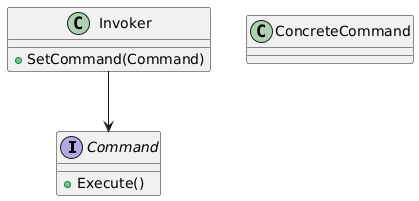

# 📚 Software Design Patterns Course Overview

This course provides an overview of the main categories of design patterns in software engineering, their purpose, and typical applications.

---
## Module 0: How to read UML

## Module 1: 🏗️ Creational Patterns
**Goal:** Simplify and structure object creation.

### Lessons:

1. **Singleton**
   - **Purpose:** Ensure only one instance of a class exists.
   - **Applications:** Configuration management, logging, database connections.
   
   

2. **Factory Method**
   - **Purpose:** Let subclasses decide which object to instantiate.
   - **Applications:** UI components, file format parsers.
   
   

3. **Abstract Factory**
   - **Purpose:** Create families of related objects without specifying concrete classes.
   - **Applications:** GUI toolkits, cross-platform applications.
   
   

4. **Builder**
   - **Purpose:** Separate the construction of a complex object from its representation.
   - **Applications:** Document generation, HTML/XML builders.
   
   

---

## Module 2: 🤝 Behavioral Patterns
**Goal:** Manage object behavior and communication.

### Lessons:

1. **Observer**
   - **Purpose:** Allow objects to react automatically to changes in another object.
   - **Applications:** Event systems, GUI buttons, notifications.
   
   

2. **Strategy**
   - **Purpose:** Define a family of algorithms and make them interchangeable.
   - **Applications:** Sorting algorithms, payment methods.
   
   

3. **Command**
   - **Purpose:** Encapsulate a request as an object.
   - **Applications:** Undo/redo functionality, macro recording.
   
   

4. **State**
   - **Purpose:** Change an object's behavior depending on its internal state.
   - **Applications:** Game player states, workflow systems.
   
   

5. **Template Method**
   - **Purpose:** Define the structure of an algorithm but let subclasses override steps.
   - **Applications:** Document processing, report generation.
   
   

6. **Iterator**
   - **Purpose:** Provide a way to traverse a collection.
   - **Applications:** Collections, data structures.
   
   

---

## Module 3: 🧩 Structural Patterns
**Goal:** Flexibly combine objects and classes.

### Lessons:

1. **Adapter**
   - **Purpose:** Make interfaces compatible between otherwise incompatible classes.
   - **Applications:** Legacy code integration, API conversion.
   
   

2. **Decorator**
   - **Purpose:** Dynamically add behavior to an object.
   - **Applications:** UI components (scrollbars, borders), logging.
   
   

3. **Facade**
   - **Purpose:** Provide a simplified interface to a complex subsystem.
   - **Applications:** Libraries, system modules.
   
   

4. **Composite**
   - **Purpose:** Treat hierarchical objects uniformly.
   - **Applications:** Tree structures, UI layouts.
   
   

5. **Proxy**
   - **Purpose:** Control access to an object.
   - **Applications:** Lazy loading, security, caching.
   
   

---
